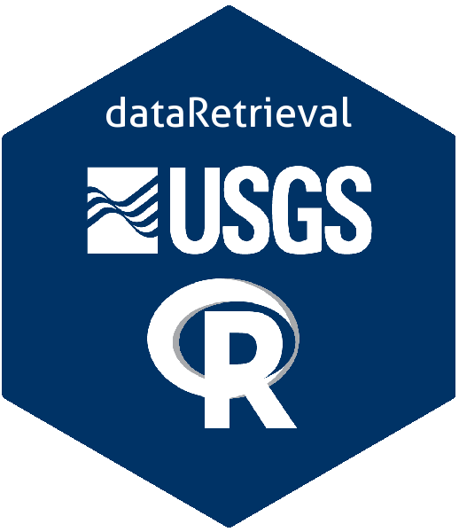

```{r setup, include=FALSE}
knitr::opts_chunk$set(
  collapse = TRUE,
  comment = "#>",
  fig.path = "man/figures/",
  warning = FALSE,
  message = FALSE,
  fig.height = 7,
  fig.width = 7
)
```


# dataRetrieval 

[](https://cran.r-project.org/package=EGRET)
[](https://cran.r-project.org/package=dataRetrieval)
[](https://cran.r-project.org/package=dataRetrieval)

The `dataRetrieval` package was created to simplify the process of loading hydrologic data into the R environment. It is designed to retrieve the major data types of U.S. Geological Survey (USGS) hydrology data that are available on the Web, as well as data from the Water Quality Portal (WQP), which currently houses water quality data from the Environmental Protection Agency (EPA), U.S. Department of Agriculture (USDA), and USGS. Direct USGS data is obtained from a service called the National Water Information System (NWIS). 

For complete tutorial information, see:

[https://rconnect.usgs.gov/dataRetrieval/](https://rconnect.usgs.gov/dataRetrieval/)

[https://waterdata.usgs.gov/blog/dataretrieval/](https://waterdata.usgs.gov/blog/dataretrieval/)


# Sample Workflow

## USGS

```{r workUSGS, eval=FALSE}
library(dataRetrieval)
# Choptank River near Greensboro, MD
siteNumber <- "01491000"
ChoptankInfo <- readNWISsite(siteNumber)
parameterCd <- "00060"

# Raw daily data:
rawDailyData <- readNWISdv(
  siteNumber, parameterCd,
  "1980-01-01", "2010-01-01"
)

# Sample data Nitrate:
parameterCd <- "00618"
qwData <- readNWISqw(
  siteNumber, parameterCd,
  "1980-01-01", "2010-01-01"
)

pCode <- readNWISpCode(parameterCd)
```

## Water Quality Portal

```{r WQP, eval=FALSE}
specificCond <- readWQPqw(
  siteNumbers = "WIDNR_WQX-10032762",
  parameterCd = "Specific conductance",
  startDate = "2011-05-01",
  endDate = "2011-09-30"
)
```

## Network Linked Data Index

```{r NLDI, eval=FALSE}
features <- findNLDI(
  nwis = "01491000",
  nav = "UT",
  find = c("basin", "wqp")
)
```

# Installation of dataRetrieval

To install the `dataRetrieval` package, you must be using R 3.0 or greater and run the following command:

```{r eval=FALSE}
install.packages("dataRetrieval")
```

To get cutting-edge changes, install from GitHub using the `remotes` packages:

```{r eval=FALSE}
library(remotes)
install_github("DOI-USGS/dataRetrieval",
               build_vignettes = TRUE, 
               build_opts = c("--no-resave-data",
                              "--no-manual"))
```


# Reporting bugs

Please consider reporting bugs and asking questions on the Issues page:
[https://github.com/DOI-USGS/dataRetrieval/issues](https://github.com/DOI-USGS/dataRetrieval/issues)


# Citing dataRetrieval

```{r cite, eval=TRUE}
citation(package = "dataRetrieval")
```

# Package Support

The Water Mission Area of the USGS supports the development and maintenance of `dataRetrieval`, and most likely further into the future. Resources are available primarily for maintenance and responding to user questions. Priorities on the development of new features are determined by the `dataRetrieval` development team. This software was last released with USGS record: IP-147158.

```{r disclaimer, child="DISCLAIMER.md", eval=TRUE}
```


