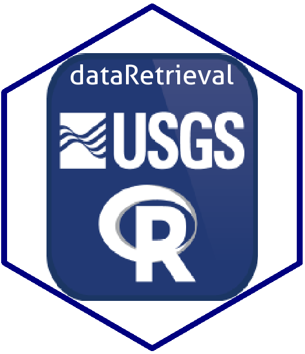

dataRetrieval 
=====================================================================================

[](https://travis-ci.org/USGS-R/dataRetrieval) [](https://coveralls.io/github/USGS-R/dataRetrieval?branch=master) [](https://owi.usgs.gov/R/packages.html#research) [](https://cran.r-project.org/package=dataRetrieval) [](https://cran.r-project.org/package=dataRetrieval) [](https://cran.r-project.org/package=dataRetrieval)

Retrieval functions for USGS and EPA hydrologic and water quality data. For tutorial information, see:

[https://owi.usgs.gov/R/dataRetrieval.html](https://owi.usgs.gov/R/dataRetrieval.html)

Reporting bugs
-----------

Please consider reporting bugs and asking questions on the Issues page:
[https://github.com/USGS-R/dataRetrieval/issues](https://github.com/USGS-R/dataRetrieval/issues)

Follow `@USGS_R` on Twitter for updates on USGS R packages:

[](https://twitter.com/USGS_R)

Citing dataRetrieval
--------------

``` r
citation(package = "dataRetrieval")

># To cite dataRetrieval in publications, please
># use:
># 
>#   De Cicco, L.A., Hirsch, R.M., Lorenz, D.,
>#   Watkins, W.D., 2018, dataRetrieval: R packages
>#   for discovering and retrieving water data
>#   available from Federal hydrologic web
>#   services, doi:10.5066/P9X4L3GE
># 
># A BibTeX entry for LaTeX users is
># 
>#   @Manual{,
>#     author = {Laura A. {De Cicco} and David Lorenz and Robert M. Hirsch and William Watkins},
>#     title = {dataRetrieval: R packages for discovering and retrieving water data available from U.S. federal hydrologic web services},
>#     publisher = {U.S. Geological Survey},
>#     address = {Reston, VA},
>#     version = {2.7.4},
>#     institution = {U.S. Geological Survey},
>#     year = {2018},
>#     url = {https://code.usgs.gov/water/dataRetrieval},
>#   }
```

Package Support
-----------

The Water Mission Area of the USGS supports the development and maintenance of `dataRetrieval`, and most likely further into the future. Resources are available primarily for maintenance and responding to user questions. Priorities on the development of new features are determined by the `dataRetrieval` development team.

[](https://www.usgs.gov/)

Installation
-----------

To install the dataRetrieval package, you must be using R 3.0 or greater and run the following command:

```R
install.packages("dataRetrieval")
```

To get inter-CRAN release updates, use the command:
```r
install.packages("dataRetrieval",repos="https://owi.usgs.gov/R")
```

To get cutting-edge changes, install from GitHub using the `devtools` packages:

```r
library(devtools)
install_github("USGS-R/dataRetrieval")
```


Disclaimer
-----------

This software is in the public domain because it contains materials that originally came from the U.S. Geological Survey, an agency of the United States Department of Interior. For more information, see the [official USGS copyright policy](https://www2.usgs.gov/visual-id/credit_usgs.html#copyright)

Although this software program has been used by the U.S. Geological Survey (USGS), no warranty, expressed or implied, is made by the USGS or the U.S. Government as to the accuracy and functioning of the program and related program material nor shall the fact of distribution constitute any such warranty, and no responsibility is assumed by the USGS in connection therewith.

This software is provided "AS IS."

 [
    
  ](http://creativecommons.org/publicdomain/zero/1.0/)

