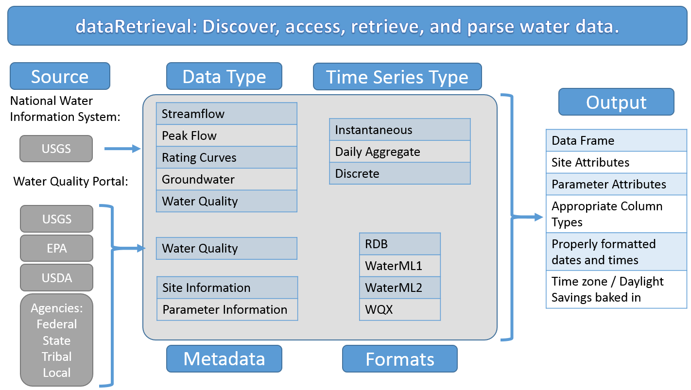
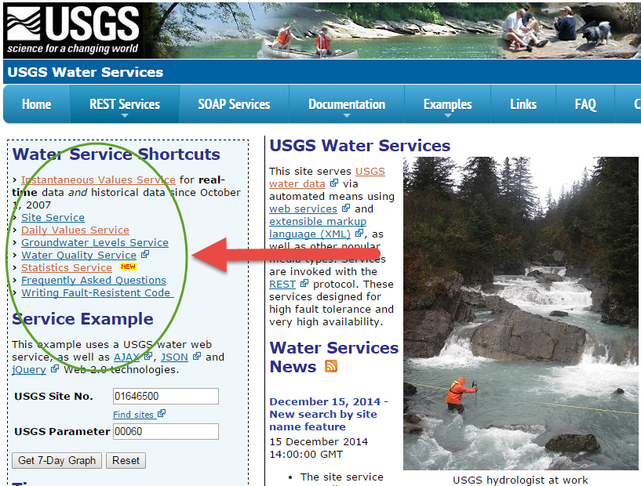

```{r setup, include=FALSE}
knitr::opts_chunk$set(echo = FALSE)
```

## Introduction

What is `dataRetrieval`?

* R-package to get USGS/EPA water data into R

Where does the data come from?

* US Geological Survey water data
    + National Water Information System (NWIS)
* Water Quality Portal
    + USGS
    + EPA (EPA Storage and Retrieval Data Warehouse = STORET)
    + USDA
    + more being added....

What does `dataRetrieval` do to the data?

* 

How to discover data?

* Examples will be provided


## Overview


## Installation

`dataRetrieval` is available on the CRAN repository. The CRAN version is the most stable and user-tested:

```{r echo=TRUE, eval=FALSE}
install.packages("dataRetrieval")
```

Bug fixes and feature upgrades are vetted through a version of `dataRetrieval` that is available on a USGS-maintained R repository. To install from that repository:

```{r echo=TRUE, eval=FALSE}
install.packages("dataRetrieval", 
                 repos=c("https://owi.usgs.gov/R",
                         getOption("repos")))
```

More information can be found at [https://owi.usgs.gov/R/gran.html](https://owi.usgs.gov/R/gran.html).

Finally, the absolute cutting-edge version of `dataRetrieval` can be installed using the `devtools` package which pulls from GitHub:

```{r echo=TRUE, eval=FALSE}
library(devtools)
install_github("USGS-R/dataRetrieval")
```

## dataRetrieval Help

Once the `dataRetrieval` package has been installed, it needs to be loaded in order to use any of the functions:

```{r echo=TRUE, eval=TRUE}
library(dataRetrieval)
```

There is a vignette that covers the full scope of the `dataRetrieval` package. It can be accessed with the following command:

```{r echo=TRUE, eval=FALSE}
vignette("dataRetrieval",package = "dataRetrieval")
```

Additionally, each function has a help file. These can be accessed by typing a question mark, followed by the function name in the R console:

```{r echo=TRUE, eval=FALSE}
?readNWISuv
```

Each function's help file has working examples to demonstrate the usage. The examples may have comments "## Not run". These examples CAN be run, they just are not run by the CRAN maintainors due to the external service calls.

Finally, if there are still questions that the vignette and help files don't answer, please post an issue on the `dataRetrieval` GitHub page:

<center>[https://github.com/USGS-R/dataRetrieval/issues](https://github.com/USGS-R/dataRetrieval/issues)</center>

## US Geological Survey Water National Water Information System (NWIS) Overview 

|Unit Data|
|---------|
|Data reported at the frequency it is collected – e.g. 15 minute|
|Includes current real-time data|


|Daily Data|
|----------|
|Data aggregated to a daily statistic such as mean, min, or max|
|Includes, streamflow, groundwater levels, and water quality sensors|
|These data can can go back many decades|


|Discrete Data|Meta Data|
|-------------|---------|
|Water quality data|Site information|
|Groundwater level|Parameter information|
|Rating curves| |
|Surfacewater measurements| |
|Peak flow| |


## USGS Basic Web Retrievals

The USGS uses various codes for basic retrievals

* Site ID (often 8 or 15-digits)
* Parameter Code (5 digits)
    + Full list:
    + [http://help.waterdata.usgs.gov/code/parameter_cd_query?fmt=rdb&inline=true&group_cd=%](http://help.waterdata.usgs.gov/code/parameter_cd_query?fmt=rdb&inline=true&group_cd=%)
* Statistic Code (for daily values)
    + Full list:
    + [http://help.waterdata.usgs.gov/code/stat_cd_nm_query?stat_nm_cd=%25&fmt=html](http://help.waterdata.usgs.gov/code/stat_cd_nm_query?stat_nm_cd=%25&fmt=html)


Here are some examples of common codes:
<div class="columns-2">

```{r echo=FALSE, eval=TRUE}
library(knitr)
library(pander)

df <- data.frame(pCode = c("00060","00065","00010","00400"),
                 shName = c("Discharge","Gage Height","Temperature","pH"))

names(df) <- c("Parameter Codes", "Short Name")

pander(df)

```

```{r echo=FALSE, eval=TRUE}
df <- data.frame(pCode = c("00001","00002","00003","00008"),
                 shName = c("Maximum","Minimum","Mean","Median"))

names(df) <- c("Statistic Codes", "Short Name")

pander(df)
```

</div>

## USGS Basic Web Retrievals: Parameter Code

`dataRetrieval` includes a data set `parameterCdFile` that allows you to explore the USGS parameter codes. For example, to find all the parameter codes with the word "phosphorus" in the name:

```{r echo=TRUE, eval=TRUE}
parameterCdFile <- parameterCdFile
names(parameterCdFile)

phosCds <- parameterCdFile[grep("phosphorus",
                                parameterCdFile$parameter_nm,
                                ignore.case=TRUE),]

nrow(phosCds)
unique(phosCds$parameter_units)

```

## USGS Basic Web Retrievals: Parameter Code (cont.)

```{r echo=FALSE, eval=TRUE}
library(DT)
datatable(phosCds, rownames = FALSE,options = list(pageLength = 8))
```

## USGS Basic Web Retrievals: readNWISuv

Knowing a site number (or site numbers), paremeter code (or codes), and start and end date. Let's start by asking for discharge (parameter code = 00060) data for the Yahara River at Windsor, WI (an inlet to Lake Mendota). 

```{r echo=TRUE, eval=TRUE}
siteNo <- "05427718"
pCode <- "00060"
start.date <- "2014-10-01"
end.date <- "2015-09-30"

yahara <- readNWISuv(siteNumbers = siteNo,
                     parameterCd = pCode,
                     startDate = start.date,
                     endDate = end.date)

```

## USGS Basic Web Retrievals: renameNWISColumns

From the Yahara example, let's look at the data. The column names are:

```{r echo=TRUE, eval=TRUE}
names(yahara)
```


The names of the columns are based on the parameter and statistic codes. In many cases, you can clean up the names with a convenience function renameNWISColumns:

```{r echo=TRUE, eval=TRUE}
yahara <- renameNWISColumns(yahara)
names(yahara)
```

## Explore Data

```{r echo=TRUE, eval=TRUE}
head(yahara)
summary(yahara)
```

## Explore Data (cont.)

The returned data also has several attributes attached to the data frame. To see what the attributes are:

```{r echo=TRUE, eval=TRUE}
names(attributes(yahara))

```

Each `dataRetrieval` return should have the attributes url, siteInfo, and variableInfo. Additional attributes are available depending on the data.

To access the attributes:

```{r echo=TRUE, eval=TRUE}
url <- attr(yahara, "url")
url
```

[Raw Data](`r url`)

##  Explore Data (cont.)

```{r echo=TRUE, eval=TRUE, fig.height=3.5}
library(ggplot2)
ts <- ggplot(data = yahara,
             aes(dateTime, Flow_Inst)) +
      geom_line()
ts
```
    
##  Use attributes for metadata:

```{r echo=TRUE, eval=TRUE, fig.height=3.5}
parameterInfo <- attr(yahara, "variableInfo")
siteInfo <- attr(yahara, "siteInfo")
  
ts <- ts +
      xlab("") +
      ylab(parameterInfo$variableDescription) +
      ggtitle(siteInfo$station_nm)
ts
```


## USGS Basic Web Retrievals (additional functions)

Aside from `readNWISuv`, there are other functions in `dataRetrieval` that take essentially the same 4 inputs (sites, parameter codes, start date, end date), but deliver data from different NWIS services:

```{r echo=FALSE, eval=TRUE}

df <- data.frame(functionName = c("readNWISuv", "readNWISdv",                              "readNWISgwl", "readNWISmeas","readNWISpeak", 
                    "readNWISqw","readNWISrating","readNWISpCode",
                    "readNWISsite"),
                 service = c("Unit", "Daily", "Groundwater Level",
                             "Surface-water", "Peak Flow", 
                             "Water Quality", "Rating Curves",
                             "Parameter Code", "Site"),
                 stringsAsFactors = FALSE)

names(df) <- c("Function Name", "Data")

pander(df)

```

##  USGS Advanced Retrievals: readNWISdata

* A single function exists: `readNWISdata` 
* Allow users to specify the service type in the function call
* Available services:
    + Unit (service = "iv")
    + Daily (service = "dv")
    + Groundwater levels (service = "gwlevels")
    + Surface-water measurements (service = "measurement")
    + Water Quality (service = "qw")
    + Site (service = "site")

```{r eval=FALSE, echo=TRUE}
siteNo <- "05427718"
pCode <- "00060"
start.date <- "2014-10-01"
end.date <- "2015-09-30"

yahara2 <- readNWISdata(siteNumbers = siteNo, parameterCd = pCode,
                     startDate = start.date, endDate = end.date,
                     service = "uv")
```                

##  USGS Advanced Retrievals: Discover Data

This is all great when you know your site numbers.

What do you do when you don't?

NWIS Mapper:
[http://maps.waterdata.usgs.gov/mapper/index.html](http://maps.waterdata.usgs.gov/mapper/index.html)

Environmental Data Discovery and Transformation tool: [http://cida.usgs.gov/enddat/dataDiscovery.jsp](http://cida.usgs.gov/enddat/dataDiscovery.jsp)

For dataRetrieval:
Become familiar with the possibilities of the web services [http://waterservices.usgs.gov/](http://waterservices.usgs.gov/)



##  USGS Advanced Retrievals: readNWISdata

Let's look for long-term USGS phosphorous data in Wisconsin:

```{r echo=TRUE, eval=FALSE}
?readNWISdata

pCode <- c("00662","00665")
phWI <- readNWISdata(stateCd="WI", parameterCd=pCode,
                     service="site", seriesCatalogOutput=TRUE)

library(dplyr)
phWI.1 <- filter(phWI, parm_cd %in% pCode) %>%
            filter(count_nu > 300) %>%
            mutate(period = as.Date(end_date) - as.Date(begin_date)) %>%
            filter(period > 15*365)

```

##  readNWISdata

```{r echo=FALSE, eval=TRUE, message=FALSE}
library(dplyr)
pCode <- c("00662","00665")
phWI <- readNWISdata(stateCd="WI", parameterCd=pCode,
                     service="site",
                     seriesCatalogOutput=TRUE)

phWI.1 <- filter(phWI, parm_cd %in% pCode) %>%
            filter(count_nu > 300) %>%
            mutate(period = as.Date(end_date) - as.Date(begin_date)) %>%
            filter(period > 15*365) %>%
            arrange(-count_nu)

datatable(phWI.1[,c("site_no","station_nm","data_type_cd","begin_date","end_date","count_nu")],rownames = FALSE, 
            options = list(pageLength = 10))
```
 
##  Let's look on a map 

```{r echo=TRUE, eval=TRUE, message=FALSE, fig.height=4}
library(leaflet)
leaflet(data=phWI.1) %>% 
  addProviderTiles("CartoDB.Positron") %>%
  addCircleMarkers(~dec_long_va,~dec_lat_va,
                   color = "red", radius=3, stroke=FALSE,
                   fillOpacity = 0.8, opacity = 0.8,
                   popup=~station_nm)
        
```
    
    
##  More readNWISdata examples     
    
```{r eval=FALSE, echo=TRUE}

dataTemp <- readNWISdata(stateCd="OH", parameterCd="00010", service="dv")

instFlow <- readNWISdata(sites="05114000", service="iv", 
                   parameterCd="00060", 
                   startDate="2014-05-01T00:00Z",endDate="2014-05-01T12:00Z")
                                                   
instFlowCDT <- readNWISdata(sites="05114000", service="iv", 
                   parameterCd="00060", 
                   startDate="2014-05-01T00:00",endDate="2014-05-01T12:00",
                   tz="America/Chicago")

bBoxEx <- readNWISdata(bBox=c(-83,36.5,-81,38.5), parameterCd="00010")

waterYear <- readNWISdata(bBox=c(-83,36.5,-81,38.5), parameterCd="00010", 
                  service="dv", startDate="2013-10-01", endDate="2014-09-30")

wiGWL <- readNWISdata(stateCd="WI",service="gwlevels")
meas <- readNWISdata(state_cd="WI",service="measurements",format="rdb_expanded")


```
    
## Water Quality Portal (WQP)

[Water Quality Portal](http://www.waterqualitydata.us/)

* Multiple agencies
    + USGS data comes from the NWIS database
    + EPA data comes from the STORET database (this includes many state, tribal, NGO, and academic groups)

* WQP brings data from all these oranizations together and provides it in a single format

* Much more verbose output than NWIS

* To get non-NWIS data, need to use CharacteristicName instead of parameter code.


## Water Quality Portal Basic Retrieval: readWQPqw

Much like the convenience functions for NWIS, there's a simple function for retrievals if the site number and parameter code or characteristic name is known.

```{r echo=TRUE, eval=TRUE}
sitePH <- phWI.1$site_no[1]

nwisQW <- readNWISqw(sitePH, "00665")
ncol(nwisQW)

wqpQW <- readWQPqw(paste0("USGS-",sitePH),"00665")
ncol(wqpQW)

```

Explore these results in RStudio.

## Censored Data: NWIS

Censored data is particularly important for water quality data. Two examples of censored data are:
*  Left-censored - the data is less than the detection level of the measurement technique
*  Right-censored - the data is greater than the upper-limit of the measurement technique

NWIS data makes identifing this data easy using the column result_cd. 

```{r eval=TRUE, echo=FALSE}
subNWIS <- select(nwisQW, startDateTime, result_va,remark_cd)
datatable(subNWIS,rownames = FALSE, 
            options = list(pageLength = 5))

```

## Censored Data: WQP

There's a little more work for WQP data. The following table has renamed the columns for space considerations.

```{r eval=TRUE, echo=FALSE}
subWQP <- select(wqpQW, ActivityStartDateTime, DetectionQuantitationLimitMeasure.MeasureValue,ResultMeasureValue,ResultDetectionConditionText) %>%
  rename(value=ResultMeasureValue) %>%
  rename(dateTime = ActivityStartDateTime) %>%
  rename(detectionText = ResultDetectionConditionText) %>%
  rename(detectionLimit = DetectionQuantitationLimitMeasure.MeasureValue)
datatable(subWQP,rownames = FALSE, 
            options = list(pageLength = 5))

```

Non-NWIS data might have different ways to indicate censoring.

## Water Quality Portal Retrieval: readWQPdata

The true value of the Water Quality Portal is to explore water quality data from different sources. 

Become familiar with the possibilities of the web services [http://www.waterqualitydata.us/](http://www.waterqualitydata.us/)

There's not a function in WQP that returns period of record information like we did above via NWIS data...(that feature may be implemented in the future)

The following function returns sites that have collected phosphorus data in Wisconsin. There's no way to know if that site has collected one sample, or thousands.

```{r echo=TRUE, eval=FALSE}

phosSites <- whatWQPsites(statecode="WI",characteristicName="Phosphorus")
  
```

## Water Quality Portal Retrieval: readWQPdata

So, to get that information, you need to actually get that data.

```{r echo=TRUE, eval=FALSE}
phosData <- readWQPdata(statecode="WI",characteristicName="Phosphorus")
unique(phosData$ResultMeasure.MeasureUnitCode)
  
```

```{r echo=FALSE, eval=TRUE}
phosData <- readRDS("img/phosData.rds")
unique(phosData$ResultMeasure.MeasureUnitCode)
```

Use a little `dplyr` to get some information:

```{r eval=TRUE, echo=TRUE}
siteInfo <- attr(phosData, "siteInfo")

wiSummary <- phosData %>%
  filter(ResultMeasure.MeasureUnitCode %in% c("mg/l","mg/l as P")) %>%
  group_by(MonitoringLocationIdentifier) %>%
  summarise(count=n(),
            start=min(ActivityStartDateTime),
            end=max(ActivityStartDateTime),
            max = max(ResultMeasureValue, na.rm = TRUE)) %>%
  filter(count > 300) %>%
  arrange(-count) %>%
  left_join(siteInfo, by = "MonitoringLocationIdentifier")

```


## Water Quality Portal Retrieval: readWQPdata (cont.)

Code for map on next slide:

```{r echo=FALSE, eval=TRUE}
col_types <- c("darkblue","dodgerblue","green4","gold1","orange","brown","red")
leg_vals <- unique(as.numeric(quantile(wiSummary$max, probs=c(0,0.01,0.1,0.25,0.5,0.75,0.9,.99,1), na.rm=TRUE)))
pal = colorBin(col_types, wiSummary$max, bins = leg_vals)
rad <-3*seq(1,4,length.out = 16)
wiSummary$sizes <- rad[as.numeric(cut(wiSummary$count, breaks=16))]
          
leaflet(data=wiSummary) %>% 
  addProviderTiles("CartoDB.Positron") %>%
  addCircleMarkers(~dec_lon_va,~dec_lat_va,
                   fillColor = ~pal(max),
                   radius = ~sizes,
                   fillOpacity = 0.8, opacity = 0.8,stroke=FALSE,
                   popup=~station_nm) %>%
  addLegend(position = 'bottomleft',
            pal=pal,
            values=~max,
            opacity = 0.8,
            labFormat = labelFormat(digits = 1), #transform = function(x) as.integer(x)),
            title = 'Max Value')

```

## Water Quality Portal Retrieval: readWQPdata (cont.)

```{r echo=TRUE, eval=FALSE}
col_types <- c("darkblue","dodgerblue","green4","gold1","orange","brown","red")
leg_vals <- unique(as.numeric(quantile(wiSummary$max, 
                probs=c(0,0.01,0.1,0.25,0.5,0.75,0.9,.99,1), na.rm=TRUE)))
pal = colorBin(col_types, wiSummary$max, bins = leg_vals)
rad <-3*seq(1,4,length.out = 16)
wiSummary$sizes <- rad[as.numeric(cut(wiSummary$count, breaks=16))]
          
leaflet(data=wiSummary) %>% 
  addProviderTiles("CartoDB.Positron") %>%
  addCircleMarkers(~dec_lon_va,~dec_lat_va,
                   fillColor = ~pal(max),
                   radius = ~sizes,
                   fillOpacity = 0.8, opacity = 0.8,stroke=FALSE,
                   popup=~station_nm) %>%
  addLegend(position = 'bottomleft',
            pal=pal,
            values=~max,
            opacity = 0.8,
            labFormat = labelFormat(digits = 1), 
            title = 'Max Value')

```


##  Time/Time zone discussion

* The arguments for all `dataRetrieval` functions concerning dates (startDate, endDate) can be R Date objects, or character strings, as long as the string is in the form "YYYY-MM-DD"

* In R, one vector (or column in a data frame) can only have __ONE__ timezone attribute
    + Sometimes in a single state, some sites will acknowledge daylight savings and some don't
    + `dataRetrieval` queries could easily span timezones    

* Therefore, `dataRetrieval` converts all date/times to UTC.

* The user can specify a single timezone to override UTC. The allowable tz arguments are listed on the next slide

## Allowable timezones

```{r echo=FALSE, eval=TRUE}
df <- data.frame(tz = c("America/New_York","America/Chicago","America/Denver",
                        "America/Los_Angeles","America/Anchorage","America/Honolulu",
                        "America/Jamaica","America/Managua","America/Phoenix", "America/Metlakatla"),
                 Name = c("Eastern Time","Central Time","Mountain Time","Pacific Time",
                          "Alaska Time","Hawaii Time","Eastern Standard Time(year-round)","Central Standard Time (year-round)","Mountain Standard Time(year-round)","Pacific Standard Time(year-round"),
                 UTC_offset = c("-05:00","-06:00","-07:00","-08:00","-09:00","-10:00","-05:00","-06:00","-07:00","-08:00"),
                 UTC_DST = c("-04:00","-05:00","-06:00","-07:00","-08:00","-09:00","-05:00","-06:00","-07:00","-08:00"))


pander(df)
```


## Verbose and Progress

Use tools from the `httr` package to get data transfer information, and/or a progress bar on long-running retrievals.

```{r echo=TRUE, eval=FALSE}
library(httr)
set_config(verbose())
set_config(progress())
daily <- readNWISdv(siteNo, pCode)
-> GET /nwis/dv/?site=05427718&format=waterml%2C1.1&
  ParameterCd=00060&StatCd=00003&startDT=1851-01-01 
  HTTP/1.1
-> Host: waterservices.usgs.gov
-> User-Agent: libcurl/7.43.0 httr/1.1.0 dataRetrieval/2.5.2
-> Accept-Encoding: gzip, deflate
-> Accept: application/json, text/xml, application/xml, */*
-> 
<- HTTP/1.1 200 OK
<- Date: Wed, 09 Mar 2016 18:10:29 GMT
<- Server: GlassFish Server Open Source Edition  4.1
<- Vary: Accept-Encoding
<- Content-Encoding: gzip
<- Content-Type: text/xml;charset=UTF-8
<- X-UA-Compatible: IE=edge,chrome=1
<- ResponseTime: D=258500 t=1457547029642140
<- Connection: close
<- Transfer-Encoding: chunked
<- 
Downloading: 53 kB
```


## More information:

dataRetrieval

* These slides:
  + [http://usgs-r.github.io/dataRetrieval](http://usgs-r.github.io/dataRetrieval)

* Report issues and ask questions:
  + [https://github.com/USGS-R/dataRetrieval/issues](https://github.com/USGS-R/dataRetrieval/issues)

NWIS

* Water Services:
  + [http://waterservices.usgs.gov/](http://waterservices.usgs.gov/)

* Help:
  + [http://help.waterdata.usgs.gov/](http://help.waterdata.usgs.gov/)

Water Quality Portal

  + [http://www.waterqualitydata.us/](http://www.waterqualitydata.us/)


## Supplemental Slides: Example Data Exploration

Let's work through a problem. Phosphorus ("00665") and Sediment ("80154")

```{r echo=TRUE, eval=TRUE}
pCode <- c("00665","80154") #Phos and Sed
sitesVA <- readNWISdata(stateCd="VA", parameterCd=pCode,
                        service="site", seriesCatalogOutput=TRUE)
sitesVA.1 <- filter(sitesVA, parm_cd %in% pCode) %>%
             filter(data_type_cd == "qw") %>%
             filter(count_nu > 500) %>%
             filter(duplicated(site_no)) %>%
             arrange(desc(count_nu))

```
 
```{r echo=FALSE}

pander(sitesVA.1[,c("site_no","station_nm","begin_date","end_date")])
```
 
 
## Supplemental Slides: Example Data Exploration (cont.)

Get samples that have both parameters:

```{r echo=TRUE, eval = FALSE}
comboData <- readNWISqw(sitesVA.1$site_no[1], 
                        pCode, reshape = TRUE) %>% 
                  filter(!is.na(result_va_00665) & !is.na(result_va_80154))

variableInfo <- attr(comboData, "variableInfo")

plotCombo <- ggplot(data=comboData) +
        geom_point(aes(x=result_va_80154, y=result_va_00665)) +
        scale_y_log10() +
        scale_x_log10() +
        xlab(variableInfo$srsname[variableInfo$parameter_cd == "80154"]) +
        ylab(variableInfo$srsname[variableInfo$parameter_cd == "00665"])
plotCombo

```

## Supplemental Slides: Example Data Exploration (cont.)

Get samples that have both parameters:

```{r echo=FALSE, eval = TRUE}
comboData <- readNWISqw(sitesVA.1$site_no[1], pCode, reshape = TRUE) %>% 
                  renameNWISColumns() %>%
                  filter(!is.na(result_va_00665)) %>%
                  filter(!is.na(result_va_80154)) %>%
                  filter(result_va_00665 > 0) %>%
                  filter(result_va_80154 > 0)

variableInfo <- attr(comboData, "variableInfo")

plotCombo <- ggplot(data=comboData) +
        geom_point(aes(x=result_va_80154, y=result_va_00665)) +
        scale_y_log10() +
        scale_x_log10() +
        xlab(variableInfo$srsname[variableInfo$parameter_cd == "80154"]) +
        ylab(variableInfo$srsname[variableInfo$parameter_cd == "00665"])
plotCombo

```


## Supplemental Slides: Example Data Exploration (cont.)

Run a simple linear regression

```{r echo = TRUE, eval = TRUE}
mod <- lm(log(result_va_00665)~log(result_va_80154),data=comboData)
print(summary(mod))
```

## Supplemental Slides: Example Data Exploration (cont.)

Plot residuals:

```{r echo=TRUE, eval=FALSE}

plotResid <- ggplot() +
        geom_point(aes(x=comboData$sample_dt,
                       y=mod$residuals)) +
        geom_hline(yintercept = 0) +
        xlab("") + ylab("Residuals")
plotResid

```

## Supplemental Slides: Example Data Exploration (cont.)

Plot residuals:

```{r echo=FALSE, eval=TRUE}

plotResid <- ggplot() +
        geom_point(aes(x=comboData$sample_dt,
                       y=mod$residuals)) +
        geom_hline(yintercept = 0) +
        xlab("") + ylab("Residuals")
plotResid

```


##  Supplemental Slides: USGS Basic Web Retrievals: readNWISdv


```{r echo=TRUE, eval=FALSE}
siteNo <- "05427718"
pCode <- "00060"

daily <- readNWISdv(siteNo, pCode, "1990-01-01","2014-12-31")
daily <- renameNWISColumns(daily)
dd <- ggplot(daily, aes(Date,Flow)) +
  xlab("") +
  ylab(attr(daily,"variableInfo")$variableName) +
  geom_line()
dd
```
   
##  Supplemental Slides: USGS Basic Web Retrievals: readNWISdv


```{r echo=FALSE, eval=TRUE}


siteNo <- "05427718"
pCode <- "00060"

daily <- readNWISdv(siteNo, pCode, "1990-01-01","2014-12-31")
daily <- renameNWISColumns(daily)

dd <- ggplot(daily, aes(Date,Flow)) +
  xlab("") +
  ylab(attr(daily,"variableInfo")$variableName) +
  geom_line()
dd
```
    
 
    
    
## Supplemental Slides: Multiple site and parameters

The NWIS functions can be used to get multiple sites and multiple parameters in one call.

```{r echo=TRUE, eval=TRUE}
sites <- c("05427850","05427718") # 2 stations on Yahara
pCodes <- c("00060","00010") #Temperature and discharge

today <- Sys.Date()
last.week <- Sys.Date()-7

multi <- readNWISuv(sites,pCodes, last.week, today)
multi <- renameNWISColumns(multi)

names(multi)

variableInfo <- attr(multi, "variableInfo")
siteInfo <- attr(multi, "siteInfo")

```

## Supplemental Slides: Multiple site and parameters (cont.)

Base R plots:

```{r echo=TRUE, eval=FALSE}
par(mfcol=c(2,1),oma=c(2,1,1,1), mar=c(1,4,0.1,0.1))

site1 <- multi[multi$site_no == sites[1],]
site2 <- multi[multi$site_no == sites[2],]
plot(site1$dateTime, site1$Flow_Inst, type="l",col="red",
     xlab = "",xaxt="n",
     ylab=variableInfo$param_units[variableInfo$parameterCd == "00060"])

lines(site2$dateTime, site2$Flow_Inst)
plot(site1$dateTime, site1$Wtemp_Inst, type="l",col="red",
     xlab = "", 
     ylab=variableInfo$param_units[variableInfo$parameterCd == "00010"])
lines(site2$dateTime, site2$Wtemp_Inst)
legend("topleft", legend = siteInfo$site_no, 
       cex=0.75, col = c("red","black"),lwd = 1)
box()


```

## Supplemental Slides: Multiple site and parameters (cont.)

Base R plots:

```{r echo=FALSE, eval=TRUE}
par(mfcol=c(2,1),oma=c(2,1,1,1), mar=c(1,4,0.1,0.1))

site1 <- multi[multi$site_no == sites[1],]
site2 <- multi[multi$site_no == sites[2],]
plot(site1$dateTime, site1$Flow_Inst, type="l",col="red",
     xlab = "",xaxt="n",
     ylab=variableInfo$param_units[variableInfo$parameterCd == "00060"])

lines(site2$dateTime, site2$Flow_Inst)
plot(site1$dateTime, site1$Wtemp_Inst, type="l",col="red",
     xlab = "", 
     ylab=variableInfo$param_units[variableInfo$parameterCd == "00010"])
lines(site2$dateTime, site2$Wtemp_Inst)
legend("topleft", legend = siteInfo$site_no, 
       cex=0.75, col = c("red","black"),lwd = 1)
box()

```


## Supplemental Slides: Multiple site and parameters (cont.)

ggplot2: Reshape data from "wide" to "long" first using `tidyr` package.

```{r echo=TRUE, eval=TRUE, message=FALSE}
library(tidyr)
library(dplyr)
multi.data <- select(multi, site_no, dateTime, Wtemp_Inst, Flow_Inst)
head(multi.data)

longMulti <- gather(multi.data, variable, value, -site_no, -dateTime)
head(longMulti)
```


## Supplemental Slides: Multiple site and parameters (cont.)

ggplot2: Reshape data from "wide" to "long" first using `tidyr` package.

```{r echo=TRUE, eval=TRUE, fig.height=4}

gp <- ggplot(longMulti, 
             aes(dateTime, value, color=site_no)) +
  geom_line() +
  facet_grid(variable ~ .,scales= "free")
gp

```

## Supplemental Slides: Multiple site and parameters (cont.)

To demonstrate the power of `tidyr` + `dplyr` + `ggplot2` + `dataRetrieval`:

```{r echo=TRUE, eval=FALSE}
sites <- c("05427850","05427718","05428000","05427880") 
pCodes <- c("00060","00010","00055","00065") 

wideMulti <- readNWISuv(sites,pCodes, "2016-03-01","2016-03-08") %>%
         select(-ends_with("_cd"))

siteInfo <- attr(wideMulti, "siteInfo")
paramInfo <- attr(wideMulti, "variableInfo")

longMulti <- gather(wideMulti, variable, value, -site_no, -dateTime) %>%
         mutate(variable = as.factor(variable)) %>%
         mutate(site_no = as.factor(site_no))

levels(longMulti$variable) <- paramInfo$param_units
levels(longMulti$site_no) <- siteInfo$station_nm

gp <- ggplot(longMulti, 
             aes(dateTime, value, color=site_no)) +
  geom_line(size=1.5) + xlab("") + ylab("") +
  facet_grid(variable ~ .,scales= "free") + 
  theme(legend.title=element_blank(),
        legend.position='bottom',legend.direction = "vertical")
gp

```

## Supplemental Slides: Multiple site and parameters (cont.)

To demonstrate the power of `tidyr` + `dplyr` + `ggplot2` + `dataRetrieval`:

```{r echo=FALSE, eval=TRUE, warning=FALSE, fig.height=6}
sites <- c("05427850","05427718","05428000","05427880") 
pCodes <- c("00060","00010","00055","00065") 

wideMulti <- readNWISuv(sites,pCodes, "2016-03-01","2016-03-08") %>%
         select(-ends_with("_cd"))

siteInfo <- attr(wideMulti, "siteInfo")
paramInfo <- attr(wideMulti, "variableInfo")

longMulti <- gather(wideMulti, variable, value, -site_no, -dateTime) %>%
         mutate(variable = as.factor(variable)) %>%
         mutate(site_no = as.factor(site_no))

levels(longMulti$variable) <- paramInfo$unit[which(paste0("X_",paramInfo$variableCode,"_00000") %in% levels(longMulti$variable))]

levels(longMulti$site_no) <- siteInfo$station_nm[which(siteInfo$site_no %in% levels(longMulti$site_no))]

gp <- ggplot(longMulti, 
             aes(dateTime, value, color=site_no)) +
  geom_line() + xlab("") + ylab("") +
  facet_grid(variable ~ .,scales= "free") + 
  theme(legend.title=element_blank(),
        legend.position='bottom',legend.direction = "vertical")
gp

```

