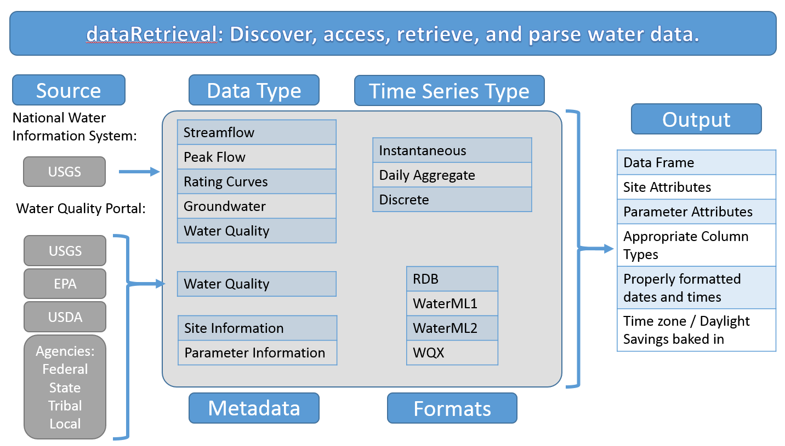

```{r setup, include=FALSE}
knitr::opts_chunk$set(echo = FALSE)
```

## Introduction

What is `dataRetrival`?

* R-package to get USGS/EPA water data into R

Where does the data come from?

* US Geological Survey water data
    + National Water Information System (NWIS)
* Water Quality Portal
    + USGS
    + EPA (EPA Storage and Retrieval Data Warehouse = STORET)
    + USDA
    + more being added....

What does `dataRetrival` do to the data?

* 

How to discover data?

* Examples will be provided


## Overview


## NWIS Overview (US Geological Survey water data)

* Unit Data
    + "Real-time" data
    + Available data from 2007 (big improvement from 120 days!)
  
* Daily Data
    + Data aggregated from the unit data to a daily statistic
    + This data can go back many decades
    
* Discrete Data
    + Water quality data
    + Groundwater level
    + Rating curves
    + Surfacewater measurements
    
* Meta Data
    + Site information
    + Parameter information

## NWIS Links
More information:

[Water Services](http://waterservices.usgs.gov/)

[Help](http://help.waterdata.usgs.gov/)

## Water Quality Portal
[Water Quality Portal](http://www.waterqualitydata.us/)

## Slide with R Output

```{r cars, echo = TRUE}
summary(cars)
```

## Slide with Plot

```{r pressure}
plot(pressure)
```

