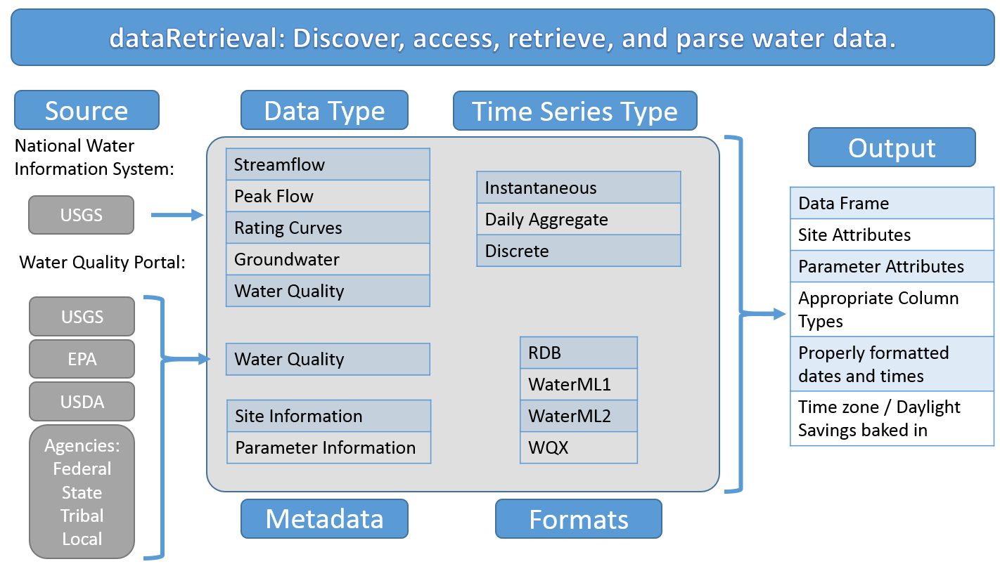

```{r setup, include=FALSE}
knitr::opts_chunk$set(echo = FALSE)
```

## Introduction

What is `dataRetrival`?

* R-package to get USGS/EPA water data into R

Where does the data come from?

* US Geological Survey water data
    + National Water Information System (NWIS)
* Water Quality Portal
    + USGS
    + EPA (EPA Storage and Retrieval Data Warehouse = STORET)
    + USDA
    + more being added....

What does `dataRetrival` do to the data?

* 

How to discover data?

* Examples will be provided


## Overview


## Installation

`dataRetrieval` is available on the CRAN repository. The CRAN version is the most stable and user-tested:

```{r echo=TRUE, eval=FALSE}
install.packages("dataRetrieval")
```

Bug fixes and feature upgrades are vetted through a version of `dataRetrival` that is available on a USGS-maintained R repository. To install from that repository:

```{r echo=TRUE, eval=FALSE}
install.packages("dataRetrieval", 
                 repos=c("http://owi.usgs.gov/R",
                         getOption("repos")))
```

More information can be found [here](http://owi.usgs.gov/R/gran.html).

Finally, the absolute cutting-edge version of `dataRetrival` can be installed using the `devtools` package which pulls from GitHub:

```{r echo=TRUE, eval=FALSE}
library(devtools)
install_github("USGS-R/dataRetrieval")
```

## dataRetrival Help

Once the `dataRetrieval` package has been installed, it needs to be loaded in order to use any of the functions:

```{r echo=TRUE, eval=TRUE}
library(dataRetrieval)
```

There is a vignette that covers the full scope of the `dataRetrieval` package. It can be accessed with the following command:

```{r echo=TRUE, eval=FALSE}
vignette("dataRetrieval",package = "dataRetrieval")
```

Additionally, each function has a help file. These can be accessed by typing a question mark, followed by the function name in the R console:

```{r echo=TRUE, eval=FALSE}
?readNWISuv
```

Each function's help file has working examples to demonstrate the usage. The examples may have comments "## Not run". These examples CAN be run, they just are not run by the CRAN maintainors due to the external service calls.

Finally, if there are still questions that the vignette and help files don't answer, please post an issue on the `dataRetrieval` GitHub page:

<center>[https://github.com/USGS-R/dataRetrieval/issues](https://github.com/USGS-R/dataRetrieval/issues)</center>

## US Geological Survey Water Data Overview

National Water Information System (NWIS)

* Unit Data
    + "Real-time" data
    + Available data from 2007 (big improvement from 120 days!)
  
* Daily Data
    + Data aggregated from the unit data to a daily statistic
    + This data can go back many decades
    
* Discrete Data
    + Water quality data
    + Groundwater level
    + Rating curves
    + Surfacewater measurements
    
* Meta Data
    + Site information
    + Parameter information
    
## USGS Basic Web Retrievals

The USGS uses various codes for basic retrievals

* Site ID (often 8 or 15-digits)
* Parameter Code (5 digits)
    + [More information](http://help.waterdata.usgs.gov/code/parameter_cd_query?fmt=rdb&inline=true&group_cd=%)
* Statistic Code (for daily values)
    + [More information](http://help.waterdata.usgs.gov/code/stat_cd_nm_query?stat_nm_cd=%25&fmt=html)


Here are some examples of common codes:
<div class="columns-2">

```{r echo=FALSE, eval=TRUE}
library(knitr)
library(pander)

df <- data.frame(pCode = c("00060","00065","00010","00400"),
                 shName = c("Discharge","Gage Height","Temperature","pH"))

names(df) <- c("Parameter Codes", "Short Name")

pander(df)

```

```{r echo=FALSE, eval=TRUE}
library(knitr)
library(pander)

df <- data.frame(pCode = c("00001","00002","00003","00008"),
                 shName = c("Maximum","Minimum","Mean","Median"))

names(df) <- c("Statistic Codes", "Short Name")

pander(df)

```

</div>

The next 3 sections will show examples of using a few of `dataRetrieval`'s basic functions.

Following those basic examples, more complicated queries using `dataRetrival`'s more advanced functions will be introduced.

## USGS Basic Web Retrievals: readNWISuv

Knowing a site number (or site numbers), paremeter code (or codes), and start and end date. Let's start by asking for gage height (parameter code = 00065) data for Lake Mendota at Madison, WI (right off Tenney Park on the Yahara River). 

```{r echo=TRUE, eval=TRUE}
siteNo <- "05428000"
pCode <- "00065"
start.date <- "2014-10-01"
end.date <- "2015-09-30"

yahara <- readNWISuv(siteNumbers = siteNo,
                     parameterCd = pCode,
                     startDate = start.date,
                     endDate = end.date)
  
names(yahara)  
  
```

    
## Water Quality Portal

[Water Quality Portal](http://www.waterqualitydata.us/)


## More information:

NWIS

* [Water Services](http://waterservices.usgs.gov/)

* [Help](http://help.waterdata.usgs.gov/)

Water Quality Portal

* [Water Quality Portal](http://www.waterqualitydata.us/)


