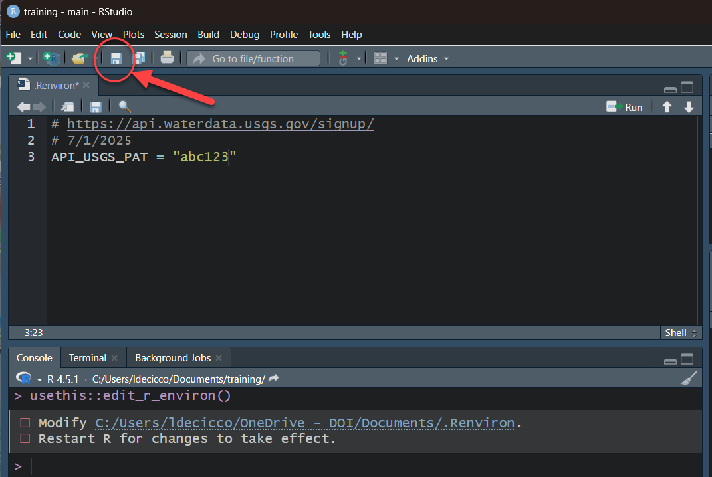
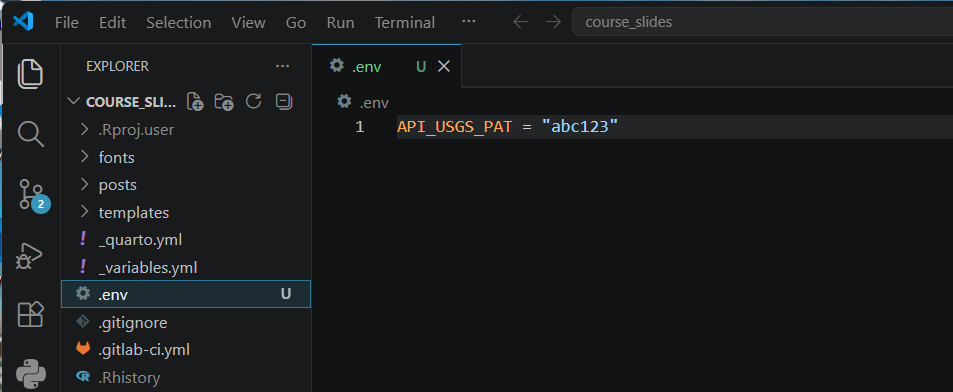
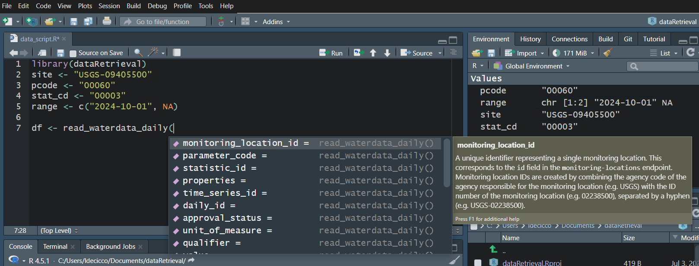
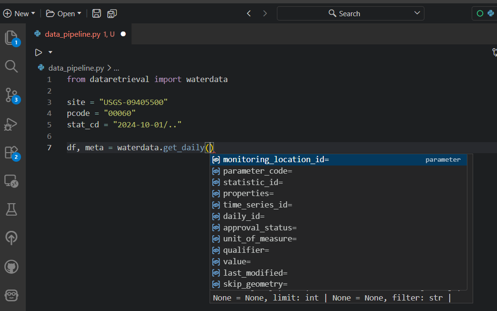
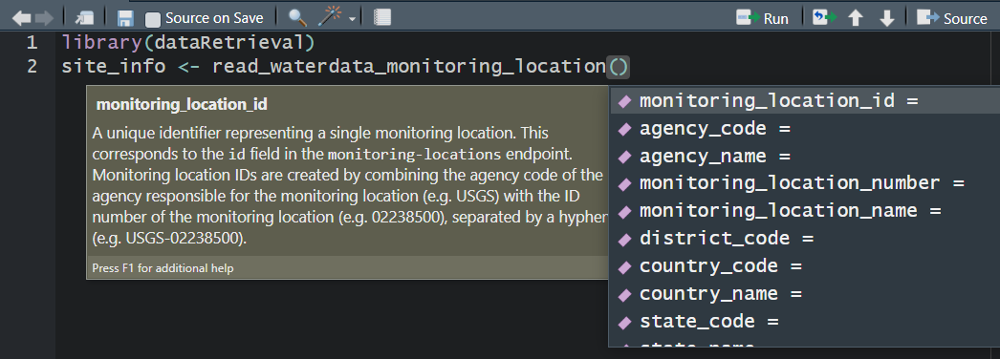
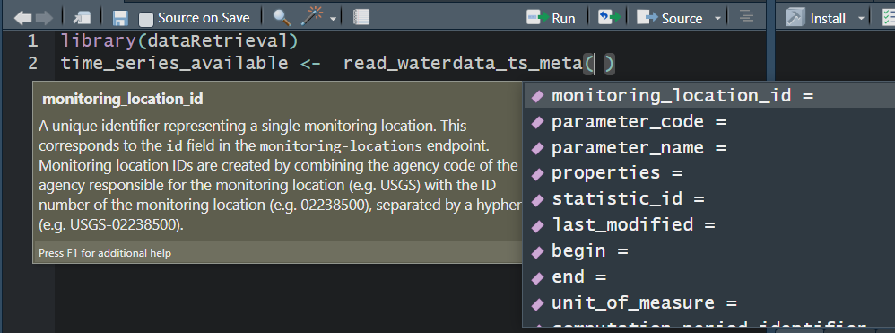
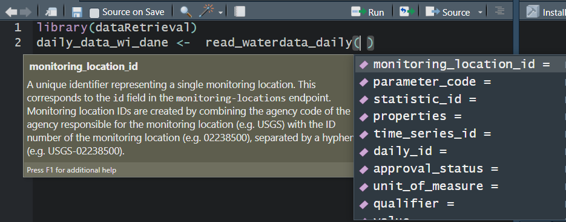
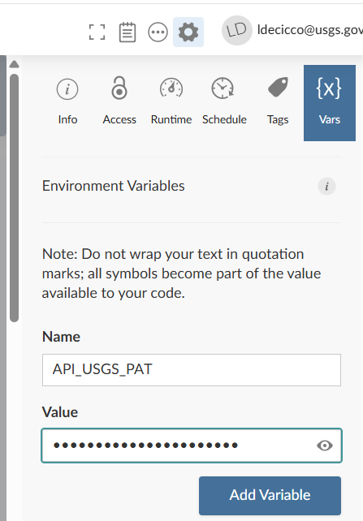
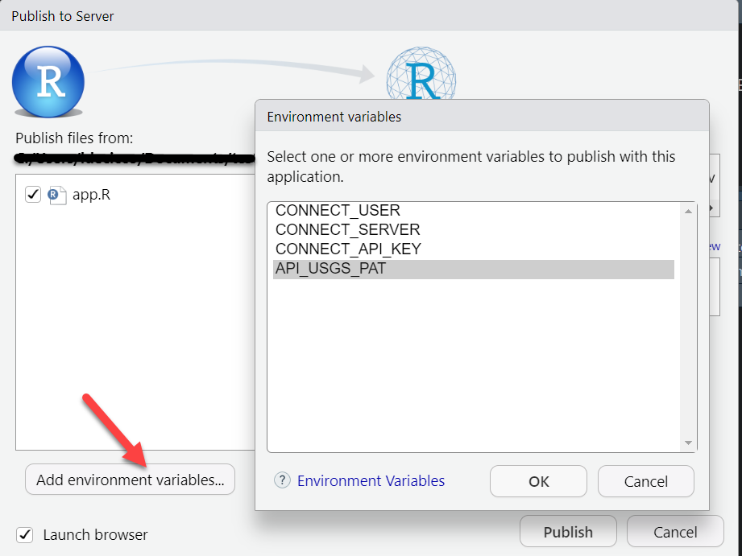
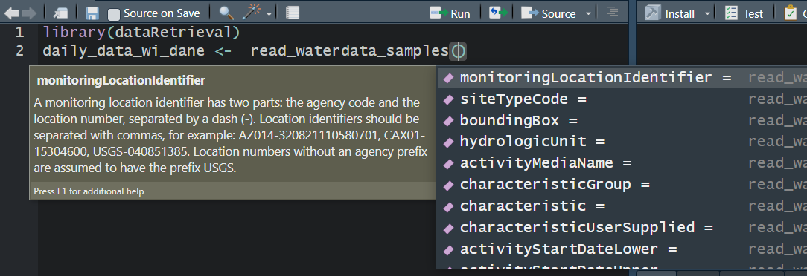

```{r}
#| echo: false
#| include: false
library(dataRetrieval)
library(ggplot2)
library(dplyr)
library(leaflet)
library(DT)
library(reticulate)

theme_set(theme_bw(base_size = 20))
update_geom_defaults("point", list(size = 3, color = "steelblue"))
options(ggplot2.discrete.colour = "viridis")

py_require("dataretrieval")
py_require("panda")
py_require("matplotlib")

evaluate_python <- params$run_python

options(dplyr.summarise.inform = FALSE)
theme_set(theme_bw(base_size = 20))
update_geom_defaults("point", list(size = 3))

dt_me <- function(
  x,
  page_length = 8,
  font = "0.7em",
  escape = TRUE,
  paging = TRUE
) {
  DT::datatable(
    x,
    rownames = FALSE,
    options = list(
      pageLength = page_length,
      info = FALSE,
      searching = FALSE,
      paging = paging,
      lengthChange = FALSE,
      initComplete = htmlwidgets::JS(
        "function(settings, json) {",
        paste0(
          "$(this.api().table().container()).css({'font-size': '",
          font,
          "'});"
        ),
        "}"
      )
    ),
    escape = escape
  )
}
```


## Introduction {background-image="images/hex_logo.png" background-size="15%" background-position="90% 90%" }

In this ~90 minute introduction, the goal is:

- Introduce new `dataRetrieval` functions 

- The intended audience is someone:

  - Seasoned `dataRetrieval` user
  
  - AND/OR intermediate R user
  
  - Familiar with USGS water data

New to `dataRetrieval`? [Introduction to dataRetrieval](https://water.code-pages.usgs.gov/wq-visualizations-tools/training/posts/Water_Quality_Data/A_Discover/A_Discover.html)

::: footer

:::

## Why are we here?  {.smaller}

* NWIS servers are shutting down

  - That means all `readNWIS` functions will eventually stop working

  - Timeline is very uncertain, so we wanted to get information out on replacement functions ASAP.
  
* New `dataRetrieval` functions are available to replace the NWIS functions

  - `read_waterdata_` functions are the modern functions
  
  - They use the new [USGS Water Data APIs](https://api.waterdata.usgs.gov/ogcapi/v0/)
  
::: footer

:::

## Installation

::: {.panel-tabset}

### R

`dataRetrieval` is available on the Comprehensive R Archive Network (CRAN) repository. To install `dataRetrieval` on your computer, open RStudio and run this line of code in the Console:

```{r}
#| echo: true
#| eval: false
install.packages("dataRetrieval")
```

Then each time you open R, you'll need to load the library:

```{r}
#| message: true
library(dataRetrieval)
```

### Python

Whether you are a user or developer we recommend installing `dataretrieval` in a virtual environment. This can be done using something like virtualenv or conda. 

```{bash}
#| echo: true
#| eval: false
pip install dataretrieval
```

or

```{bash}
#| echo: true
#| eval: false
conda install conda-forge::dataretrieval
```

Then each time you open Python, you'll need to load the library:

```{python}
#| eval: !expr evaluate_python
from dataretrieval import waterdata
```

:::

::: footer

:::

## USGS Water Data OGC APIs: Current Functions

Open Geospatial Consortium (OGC), a non-profit international organization that develops and promotes open standards for geospatial information. OGC-compliant interfaces to USGS water data:

* [read_waterdata_monitoring_location](https://doi-usgs.github.io/dataRetrieval/reference/read_waterdata_monitoring_location.html) - Monitoring location information

* [read_waterdata_ts_meta](https://doi-usgs.github.io/dataRetrieval/reference/read_waterdata_ts_meta.html) - Time series availability

* [read_waterdata_parameter_codes](https://doi-usgs.github.io/dataRetrieval/reference/read_waterdata_parameter_codes.html) - Parameter code information

::: footer

:::

## USGS Water Data OGC APIs: Current Functions (cont.) 

* [read_waterdata_field_meta](https://doi-usgs.github.io/dataRetrieval/reference/read_waterdata_field_meta.html) - Field measurement data availability

* [read_waterdata_combined_meta](https://doi-usgs.github.io/dataRetrieval/reference/read_waterdata_combined_meta.html) - Combined time series and field data availability

* [read_waterdata_daily](https://doi-usgs.github.io/dataRetrieval/reference/read_waterdata_daily.html) - Daily data

* [read_waterdata_latest_daily](https://doi-usgs.github.io/dataRetrieval/reference/read_waterdata_latest_daily.html) - Latest daily data

::: footer

:::

## USGS Water Data OGC APIs: Current Functions (cont.) 

* [read_waterdata_continuous](https://doi-usgs.github.io/dataRetrieval/reference/read_waterdata_continuous.html) - Continuous data are collected via automated sensors installed at a monitoring location.

* [read_waterdata_latest_continuous](https://doi-usgs.github.io/dataRetrieval/reference/read_waterdata_latest_continuous.html) - Latest continuous data

* [read_waterdata_field_measurements](https://doi-usgs.github.io/dataRetrieval/reference/read_waterdata_field_measurements.html) - Discrete hydrologic data (gage height, discharge, and readings of groundwater levels)

::: footer

:::

## USGS Water Data OGC APIs: Current Functions (cont.)

* [read_waterdata_channel](https://doi-usgs.github.io/dataRetrieval/reference/read_waterdata_channel.html) - Channel measurements

* [read_waterdata](https://doi-usgs.github.io/dataRetrieval/reference/read_waterdata.html) - Generalized function.

* [read_waterdata_metadata](https://doi-usgs.github.io/dataRetrieval/reference/read_waterdata_metadata.html) - Metadata 

* [read_waterdata_rating](https://water.code-pages.usgs.gov/dataRetrieval/reference/read_waterdata_ratings.html) - Rating Curve Data

* [read_waterdata_peaks](https://water.code-pages.usgs.gov/dataRetrieval/reference/read_waterdata_peaks.html) - Peak Data

::: footer

:::


## USGS Water Data API Token 

* The Water Data APIs limit how many queries a single IP address can make per hour

* You **can** run new `dataRetrieval` functions without a token

* You **might** run into errors quickly. If you (or your IP!) have exceeded the quota, you will see:

```
! HTTP 429 Too Many Requests.
  • You have exceeded your rate limit. Make sure you provided your API key from https://api.waterdata.usgs.gov/signup/, then either try again later or contact us at https://waterdata.usgs.gov/questions-comments/?referrerUrl=https://api.waterdata.usgs.gov for assistance.
```

## USGS Water Data API Token 

1. Request a USGS Water Data API Token: <https://api.waterdata.usgs.gov/signup/>

2. Save it in a safe place (KeyPass or other password management tool)

3. Add it as environment variable

4. Restart 

See next slide for a demonstration.

::: footer

:::

## Water Data API Token: Example {.smaller}

Let's pretend the token sent you was "abc123"

::: {.panel-tabset}

### R

1. Run in R:
```{r}
#| echo: true
#| eval: false
usethis::edit_r_environ()
```

2. Add this line to the file that opens up:

```
API_USGS_PAT = "abc123"
```

3. Save that file

4. Restart R/RStudio.

5. Check that it worked by running (you should see your token printed in the Console):

```{r}
#| eval: false
Sys.getenv("API_USGS_PAT")
```

::: {.callout-note collapse="true"}
Your .Renviorn file should never be pushed to a public repository.
:::

### Python

1. Create a file in your working directory .env

2. Add this line to the .env file:

```
API_USGS_PAT = "abc123"
```
4. Restart your python session

5. Check that it worked by running (you should see your token printed in the Console):

```{python}
#| echo: true
#| eval: false
import os
os.getenv("API_USGS_PAT")
'abc123'
```

::: {.callout-note collapse="true"}
Make sure to add .env file to .gitignore to make sure you do not accidently push it to a public repository.
:::

:::

::: footer

:::

## Water Data API Token: Example 

::: {.panel-tabset}

### R

{width="50%"}

### Python



:::

## Water Data APIs: Initial Tips 

Use your "tab" key!

::: {.panel-tabset}

### R



### Python

{width="60%"}

:::

::: footer

:::

## read_waterdata_monitoring_location 

Replaces `readNWISsite`:



* All the columns that you retrieve, you can also filter on.

* You **should not** specify **all** of these parameters. 

* You **should not** specify **too few** of these parameters.

::: footer

:::

## read_waterdata_monitoring_location {.smaller}

Let's get all the monitoring locations for Dane County, Wisconsin:

::: {.panel-tabset}

### R

```{r}
#| message: true
site_info <- read_waterdata_monitoring_location(
  state_name = "Wisconsin",
  county_name = "Dane County"
)
```

### Python

```{python}
#| eval: !expr evaluate_python

site_info, md = waterdata.get_monitoring_locations(
    state_name="Wisconsin", county_name="Dane County"
)
```

:::


::: {.callout-note collapse="true"}
## Note on county names
`read_waterdata_monitoring_location` requires "County" in the county_name argument. You can check county names using:
```{r}
#| eval: false
counties <- check_waterdata_sample_params(service = "counties")
```
:::

::: footer

:::

## read_waterdata_monitoring_location {.smaller .scrollable}

```{r}
#| echo: false
dt_me(site_info, 7, "0.6em")
```

::: footer

:::

## read_waterdata_monitoring_location {.smaller}

Now that we've seen the whole data set, maybe we realize in the future we can ask for just stream sites, and we only really need a few of those columns:

::: {.panel-tabset}

### R

```{r}
#| message: true
site_info_refined <- read_waterdata_monitoring_location(
  state_name = "Wisconsin",
  county_name = "Dane County",
  site_type = "Stream",
  properties = c(
    "monitoring_location_id",
    "monitoring_location_name",
    "drainage_area",
    "geometry"
  )
)
```

### Python

```{python}
#| eval: !expr evaluate_python
site_info_refined, md = waterdata.get_monitoring_locations(
    state_name="Wisconsin",
    county_name="Dane County",
    site_type="Stream",
    properties=[
        "monitoring_location_id",
        "monitoring_location_name",
        "drainage_area",
        "geometry",
    ],
)
```

:::

::: footer

:::

## Map It with geometry {.smaller}

::: {.panel-tabset}

### R: ggplot2


```{r}
#| output-location: default
library(ggplot2)

ggplot(data = site_info_refined) +
  geom_sf()
```

### Python: matplotlib

```{python}
#| eval: !expr evaluate_python
import matplotlib.pyplot as plt
import geopandas as gpd

site_info_refined.plot()

```

:::

::: footer

:::

## Map It: leaflet

```{r}
#| output-location: slide
library(leaflet)
#default leaflet crs:
leaflet_crs <- "+proj=longlat +datum=WGS84"

leaflet(
  data = site_info_refined |>
    sf::st_transform(crs = leaflet_crs)
) |>
  addProviderTiles("CartoDB.Positron") |>
  addCircleMarkers(popup = ~monitoring_location_name, radius = 3, opacity = 1)
```

## Removing `sf` {.smaller}

* You can post-process the "geometry" column out, or convert it to lat/lon with the `sf` package:

```{r}
no_sf_1 <- site_info_refined |>
  sf::st_drop_geometry()

longitude <- sf::st_coordinates(site_info_refined)[, 1]
latitude <- sf::st_coordinates(site_info_refined)[, 2]
```

* You can declare `skipGeometry=TRUE` in the query to return a plain data frame with no geometry:

::: {.panel-tabset}

### R

```{r}
#| eval: false
no_sf <- read_waterdata_monitoring_location(
  state_name = "Wisconsin",
  county_name = "Dane County",
  site_type = "Stream",
  skipGeometry = TRUE
)
```

### Python

```{python}
#| eval: false
no_sf, md = waterdata.get_monitoring_locations(
    state_name="Wisconsin",
    county_name="Dane County",
    site_type="Stream",
    skip_geometry=True,
)
```

:::

::: footer

:::

## read_waterdata_combined_meta

Combined Time-Series Metadata. *Kind of* replaces `whatNWISdata`:



```{r}
site_ts <- read_waterdata_combined_meta(
  monitoring_location_id = "USGS-02238500"
)
```


::: footer

:::

## read_waterdata_combined_meta {.smaller .scrollable}

```{r}
#| echo: false
dt_me(
  site_ts |>
    sf::st_drop_geometry() |>
    select(
      monitoring_location_id,
      parameter_code,
      statistic_id,
      last_modified,
      begin,
      end,
      data_type,
      combined_meta_id
    ),
  6,
  "0.7em"
)
```

::: footer

:::

## read_waterdata_combined_meta {.smaller}

Let's get all the time series in Dane County, WI with daily mean (statistic_id = "00003") discharge (parameter code = "00060) or temperature (parameter code = "00010):

```{r}
sites_available <- read_waterdata_combined_meta(
  state_name = "Wisconsin",
  county_name = "Dane County",
  parameter_code = c("00060", "00010"),
  statistic_id = c("00003")
)
```

::: {.callout-tip}
Geographic filters are limited to monitoring_location_id and bbox in "waterdata" functions *other* than `read_waterdata_monitoring_location` and `read_waterdata_combined_meta`.

Using `sf::st_bbox()` is a convenient way to take advantage of the spatial features integration.
:::

::: footer

:::

## read_waterdata_combined_meta {.smaller .scrollable}

```{r}
#| echo: false
dt_me(
  sites_available |>
    sf::st_drop_geometry() |>
    filter(!is.na(begin)) |> # public, but "grade" set to unusable
    select(monitoring_location_id, parameter_name, parameter_code, begin, end),
  6,
  "0.7em"
)
```

::: footer

:::


## read_waterdata_daily

Replaces `readNWISdv`:



```{r}
daily <- read_waterdata_daily(
  monitoring_location_id = c("USGS-05406457", "USGS-05427930"),
  parameter_code = c("00060", "00010"),
  statistic_id = "00003",
  time = c("2024-10-01", "2025-07-07")
)
```

::: footer

:::

## read_waterdata_daily {.smaller .scrollable}

```{r}
#| echo: false
dt_me(daily, 6, "0.7em")
```

::: footer

:::

## read_waterdata_daily

```{r}
ggplot(data = daily) +
  geom_point(aes(x = time, y = value, color = approval_status)) +
  facet_grid(parameter_code ~ monitoring_location_id, scale = "free")
```

::: footer

:::

## USGS Water Data APIs Notes: time input {.smaller}

:::: {.columns}

::: {.column width="50%"}

The "time" argument has a few options:

* A single date (or date-time): "2024-10-01" or "2024-10-01T23:20:50Z"

* A bounded interval: c("2024-10-01", "2025-07-02")

* Half-bounded intervals: c("2024-10-01", NA)

* Duration objects: "P1M" for data from the past month or "PT36H" for the last 36 hours

:::

::: {.column width="50%"}

Here are a bunch of valid inputs:

```{r}
#| code-line-numbers: "1-9|10-11|12-15|16-19"
# Ask for exact times:
time = "2025-01-01"
time = as.Date("2025-01-01")
time = "2025-01-01T23:20:50Z"
time = as.POSIXct(
  "2025-01-01T23:20:50Z",
  format = "%Y-%m-%dT%H:%M:%S",
  tz = "UTC"
)
# Ask for specific range
time = c("2024-01-01", "2025-01-01") # or Dates or POSIXs
# Asking beginning of record to specific end:
time = c(NA, "2024-01-01") # or Date or POSIX
# Asking specific beginning to end of record:
time = c("2024-01-01", NA) # or Date or POSIX
# Ask for period
time = "P1M" # past month
time = "P7D" # past 7 days
time = "PT12H" # past hours
```

:::

::::

## read_waterdata_latest_continuous{.smaller}

Most recent observation for each time series of continuous data. 

Continuous data are collected via automated sensors installed at a monitoring location. They are collected at a high frequency and often at a fixed 15-minute interval.

```{r}
latest_uv_data <- read_waterdata_latest_continuous(
  monitoring_location_id = "USGS-01491000",
  parameter_code = "00060",
)

latest_dane_county <- read_waterdata_latest_continuous(
  bbox = sf::st_bbox(site_info),
  parameter_code = "00060"
)

single_ts <- read_waterdata_latest_continuous(
  time_series_id = "202345d175874d2c814648ac9bea5deb"
)
```


::: footer
<https://doi-usgs.github.io/dataRetrieval/reference/read_waterdata_latest_continuous.html>
:::

## read_waterdata_latest_continuous{.smaller .scrollable}

Latest discharge observation (00060) in Dane County, WI:

```{r}
#| echo: false
dt_me(
  latest_dane_county |>
    sf::st_drop_geometry() |>
    select(-time_series_id, -statistic_id),
  6,
  "0.7em"
)
```

::: footer

:::

## Map Latest Discharge Observation: leaflet

```{r}
#| output-location: slide
pal <- colorNumeric("viridis", latest_dane_county$value)
leaflet_crs <- "+proj=longlat +datum=WGS84"
leaflet(
  data = latest_dane_county |>
    sf::st_transform(crs = leaflet_crs)
) |>
  addProviderTiles("CartoDB.Positron") |>
  addCircleMarkers(
    popup = paste(
      latest_dane_county$monitoring_location_id,
      "<br>",
      latest_dane_county$time,
      "<br>",
      latest_dane_county$value,
      latest_dane_county$unit_of_measure
    ),
    color = ~ pal(value),
    radius = 3,
    opacity = 1
  ) |>
  addLegend(
    pal = pal,
    position = "bottomleft",
    title = "Latest Discharge",
    values = ~value
  )
```


## read_waterdata_latest_daily 

Most recent observation for each time series of daily data. 

```{r}
latest_dane_county_daily <- read_waterdata_latest_daily(
  bbox = sf::st_bbox(site_info),
  parameter_code = "00060",
  time = "P14D"
)
```

## Map Latest Daily Discharge: leaflet

```{r}
#| output-location: slide
pal <- colorNumeric("viridis", latest_dane_county_daily$value)
leaflet_crs <- "+proj=longlat +datum=WGS84"
leaflet(
  data = latest_dane_county_daily |>
    sf::st_transform(crs = leaflet_crs)
) |>
  addProviderTiles("CartoDB.Positron") |>
  addCircleMarkers(
    popup = paste(
      latest_dane_county_daily$monitoring_location_id,
      "<br>",
      latest_dane_county_daily$time,
      "<br>",
      latest_dane_county_daily$value,
      latest_dane_county_daily$unit_of_measure
    ),
    color = ~ pal(value),
    radius = 3,
    opacity = 1
  ) |>
  addLegend(
    pal = pal,
    position = "bottomleft",
    title = "Latest Discharge",
    values = ~value
  )
```

## read_waterdata_continuous

Replaces `readNWISuv`:

```{r}
this_week <- read_waterdata_continuous(
  monitoring_location_id = c("USGS-05406457", "USGS-05427930"),
  parameter_code = c("00060", "00010"),
  time = "P7D"
)
```

Currently only allows 3 years of data to be queried at once. 

More information <https://water.code-pages.usgs.gov/dataRetrieval/articles/continuous_pr.html>

::: footer

:::


## read_waterdata

* This function is totally different!

* Uses [CQL2 Queries](https://www.ogc.org/standards/cql2/): Common Query Language (CQL2)

* Great examples here: <https://api.waterdata.usgs.gov/docs/ogcapi/complex-queries/>


::: footer
<https://doi-usgs.github.io/dataRetrieval/reference/read_waterdata.html>
:::

## read_waterdata {.smaller}

Wisconsin and Minnesota sites with a drainage area greater than 1000 mi^2:

```{r}
cql <- '{
  "op": "and",
  "args": [
    {
      "op": "in",
        "args": [
          { "property": "state_name" },
          [ "Wisconsin", "Minnesota" ]
        ]
    },
    {
      "op": ">",
        "args": [
          { "property": "drainage_area" },
          1000
        ]
    }
  ]
}'

sites_mn_wi <- read_waterdata(service = "monitoring-locations", CQL = cql)
```

::: footer

:::

## read_waterdata: Map It

```{r}
#| output-location: slide
pal <- colorNumeric("viridis", sites_mn_wi$drainage_area)
leaflet_crs <- "+proj=longlat +datum=WGS84"
leaflet(
  data = sites_mn_wi |>
    sf::st_transform(crs = leaflet_crs)
) |>
  addProviderTiles("CartoDB.Positron") |>
  addCircleMarkers(
    popup = ~monitoring_location_name,
    color = ~ pal(drainage_area),
    radius = 3,
    opacity = 1
  ) |>
  addLegend(
    pal = pal,
    position = "bottomleft",
    title = "Drainage Area",
    values = ~drainage_area
  )
```


## read_waterdata_metadata {.smaller}

The function `read_waterdata_metadata` gives access to the metadata collections from the USGS Water Data API.

::: {.panel-tabset}

### R

```{r}
#| eval: false
agency_codes <- read_waterdata_metadata("agency-codes")
altitude_datums <- read_waterdata_metadata("altitude-datums")
aquifer_codes <- read_waterdata_metadata("aquifer-codes")
aquifer_types <- read_waterdata_metadata("aquifer-types")
coordinate_accuracy_codes <- read_waterdata_metadata(
  "coordinate-accuracy-codes"
)
coordinate_datum_codes <- read_waterdata_metadata("coordinate-datum-codes")
coordinate_method_codes <- read_waterdata_metadata("coordinate-method-codes")
huc_codes <- read_waterdata_metadata("hydrologic-unit-codes")
national_aquifer_codes <- read_waterdata_metadata("national-aquifer-codes")
parameter_codes <- read_waterdata_metadata("parameter-codes")
reliability_codes <- read_waterdata_metadata("reliability-codes")
site_types <- read_waterdata_metadata("site-types")
statistic_codes <- read_waterdata_metadata("statistic-codes")
topographic_codes <- read_waterdata_metadata("topographic-codes")
time_zone_codes <- read_waterdata_metadata("time-zone-codes")
```

### Python

```{python}
#| eval: false
agency_codes, md1 = waterdata.get_reference_table("agency-codes")
altitude_datums, md2 = waterdata.get_reference_table("altitude-datums")
aquifer_codes, md3 = waterdata.get_reference_table("aquifer-codes")
aquifer_types, md4 = waterdata.get_reference_table("aquifer-types")
coordinate_accuracy_codes, md1 = waterdata.get_reference_table(
    "coordinate-accuracy-codes"
)
coordinate_datum_codes, md1 = waterdata.get_reference_table("coordinate-datum-codes")
coordinate_method_codes, md1 = waterdata.get_reference_table("coordinate-method-codes")
huc_codes, md1 = waterdata.get_reference_table("hydrologic-unit-codes")
national_aquifer_codes, md1 = waterdata.get_reference_table("national-aquifer-codes")
parameter_codes, md1 = waterdata.get_reference_table("parameter-codes")
reliability_codes, md1 = waterdata.get_reference_table("reliability-codes")
site_types, md1 = waterdata.get_reference_tablea("site-types")
statistic_codes, md1 = waterdata.get_reference_table("statistic-codes")
topographic_codes, md1 = waterdata.get_reference_table("topographic-codes")
time_zone_codes, md1 = waterdata.get_reference_table("time-zone-codes")
```

:::

::: footer

:::

## General New Features of Water Data OGC APIs {.smaller}

* Flexible Queries

  - Lots of options to define your query
  
  - Do NOT define all of them
  
  - Do NOT define to few of them

* Flexible Columns Returned

  - Use the properties argument to ask for just the columns you want

* Simple Features

  - Returns a geometry column that allows seamless integration with `sf`
  
* CQL query support


## Lessons Learned

* [Query limits](https://doi-usgs.github.io/dataRetrieval/articles/read_waterdata_functions.html#query-limits)

  - There is a character limit to how big your query can be
  
  - `dataRetrieval` v2.7.25 will automatically chunk up requests of long lists of monitoring_location_id.
  

## Adding API token to CI jobs: GitLab

If you run dataRetrieval calls in a CI job, you'll need to add an API Token to the configuration.

* Go to: Settings -> CI/CD -> Variables -> Add Variable
  
* Key should be API_USGS_PAT, value will be the token
  
* Click on Masked and hidden
  
* Add to your .gitlab-ci.yml file:
  
```
variables:
  API_USGS_PAT: "${API_USGS_PAT}"
```
## Adding API token to CI jobs: GitHub

In GitHub:

* Settings -> Secrets and variables -> Actions -> Secrets

* Secret can be stored in Environment or Repository

* If you created an Environment called "CI_config", your CI yaml will need:

```
    environment: CI_config
    env:
      API_USGS_PAT: ${{ secrets.API_USGS_PAT }}
```

## Adding API token: Posit Connect {.smaller}

You'll want to add a token for any Posit Connect product (Shiny app, Quarto slides, etc.).

:::: {.columns}

::: {.column width="35%"}

{width=225}
:::

::: {.column width="5%"}
OR
:::

::: {.column width="60%"}

{width=600}

:::

::::

::: footer

:::

## Discrete Data {.smaller}

* USGS switched to Aquarius Samples March 11, 2024.

* On that day, the USGS data in the Water Quality Portal was frozen.

* "modern USGS discrete data" = data that includes **pre** and **post** Aquarius Samples conversion.

* The new function `read_waterdata_samples` gets modern USGS discrete data.

  - it is outside the Water Data OGC API ecosystem, so looks and feels a bit different.

* [Water Quality Portal (WQP)](https://www.waterqualitydata.us) also has modern USGS discrete data, but not by default.

* If you only need USGS data, use `read_waterdata_samples`, if you need USGS and non-USGS, use `readWQPdata`.

## read_waterdata_samples

Replaces `readNWISqw`



::: footer
<https://doi-usgs.github.io/dataRetrieval/articles/samples_data.html>
:::

## USGS Samples Data Notes: Data Types and Profiles 

* There are 2 arguments that dictate what kind of data is returned
  - "dataType"  defines what kind of data comes back
  - "dataProfile" defines what columns from that type come back

## Data Types and Profiles {.smaller}

```{r}
#| echo: false
df <- tibble(
  dataType = c(
    "results",
    "locations",
    "activities",
    "projects",
    "organizations"
  ),
  Description = c(
    "Results data and metadata for measures and observations matching your query",
    "Find monitoring locations that have data matching your query",
    "Information about the monitoring activities conducted that produced data",
    "Information on the projects that have results matching your data query",
    "Information about the organizations that have provided data that matches your query"
  ),
  dataProfile = c(
    'fullphyschem<br>basicphyschem<br>fullbio<br> basicbio<br>narrow<br>resultdetectionquantitationlimit<br>labsampleprep<br>count',
    'site<br>count',
    'sampact<br>actmetric<br>actgroup<br>ncount',
    'project<br>projectmonitoringlocationweight',
    'organization<br>count'
  )
)

dt_me(df, escape = FALSE, paging = FALSE)
```


::: footer

:::

## read_waterdata_samples

::: {.panel-tabset}

### R

```{r}
site <- "USGS-01631000"
pcode <- "00660"

qw_data <- read_waterdata_samples(
  monitoringLocationIdentifier = site,
  usgsPCode = pcode,
  dataType = "results",
  dataProfile = "basicphyschem"
)
ncol(qw_data)
```

### Python

```{python}
#| eval: !expr evaluate_python
site = "USGS-01631000"
pcode = "00660"

qw_data, md = waterdata.get_samples(
    monitoringLocationIdentifier=site,
    usgsPCode=pcode,
    service="results",
    profile="basicphyschem",
)
qw_data.shape[1]
```

:::

That's a LOT of columns that come back. 

::: footer
<https://doi-usgs.github.io/dataRetrieval/articles/samples_data.html>
:::

## Discrete data censoring 

Let's pull just a few columns out and look at those:

::: {.panel-tabset}

### R

```{r}
library(dplyr)

qw_data_slim <- qw_data |>
  select(
    Date = Activity_StartDate,
    Result_Measure,
    DL_cond = Result_ResultDetectionCondition,
    DL_val = DetectionLimit_MeasureA,
    DL_type = DetectionLimit_TypeA
  ) |>
  mutate(
    Result = if_else(!is.na(DL_cond), DL_val, Result_Measure),
    Detected = if_else(!is.na(DL_cond), "Not Detected", "Detected")
  ) |>
  arrange(Detected)
```

* What is `|>`? It's a pipe! It says take 'this thing' and put it in 'that thing'. You'll also see `%>%` in code, it is also a pipe - they are basically the same. 

### Python

```{python}
#| eval: !expr evaluate_python
import numpy as np

qw_data_slim = (
    qw_data.rename(
        columns={
            "Activity_StartDate": "Date",
            "Result_ResultDetectionCondition": "DL_cond",
            "DetectionLimit_MeasureA": "DL_val",
            "DetectionLimit_TypeA": "DL_type",
        }
    )[["Date", "Result_Measure", "DL_cond", "DL_val", "DL_type"]]
    .assign(
        Result=lambda x: np.where(
            x["DL_cond"].notna(), x["DL_val"], x["Result_Measure"]
        )
    )
    .assign(
        Detected=lambda x: np.where(x["DL_cond"].notna(), "Not Detected", "Detected")
    )
    .sort_values(by="Detected", ascending=False)
)
```

:::

::: footer

:::

## Discrete data censoring information {.smaller}

```{r}
#| echo: false
dt_me(qw_data_slim, page_length = 8, font = "0.7em")
```

::: footer

:::


## summarize_waterdata_samples {.smaller .scrollable}

A summary service exists for 1 site at a time (so in this case, monitoringLocationIdentifier cannot be a vector of sites):

```{r}
data_at_site <- summarize_waterdata_samples(
  monitoringLocationIdentifier = "USGS-04183500"
)
```

```{r}
#| echo: false
dt_me(
  data_at_site |>
    arrange(desc(resultCount)),
  page_length = 4
)
```

::: footer

:::

## Water Quality Portal

If you use `readWQPqw`, add "legacy=FALSE" to get modern USGS data:

```{r}
#| eval: false
pHsites_legacy <- readWQPqw("USGS-05406450", "pH", legacy = FALSE)
```

If you use `readWQPdata`, add 'service = "ResultWQX3"':

```{r}
#| eval: false
pHData_wqx3 <- readWQPdata(
  siteid = "USGS-04024315",
  characteristicName = "pH",
  service = "ResultWQX3",
  dataProfile = "basicPhysChem"
)
```

## HELP! {.smaller}

* There’s a lot of new information and changes being presented. There are going to be scripts that have been passed down through the years that will start breaking once the NWIS servers are decommissioned.

* Check back on the documentation often: <https://doi-usgs.github.io/dataRetrieval/>

* Peruse the "Additional Articles" - when we find common issues people have with converting their old workflows, we will try to add articles to clarify new workflows. 

* If you have additional questions, email comptools@usgs.gov. 

::: footer

:::

## More Information {.smaller}

- dataRetrieval repository:
  - <https://github.com/DOI-USGS/dataRetrieval>

- Documentation: 
  - <https://doi-usgs.github.io/dataRetrieval>

- Contact:
  - Computational Tools Email: comptools@usgs.gov

- Bug reports can be reported here:
  - <https://github.com/DOI-USGS/dataRetrieval/issues>

:::: footer 

::: {style="font-size: 80%;"}

Any use of trade, firm, or product name is for descriptive purposes only and does not imply endorsement by the U.S. Government.
:::

::::

