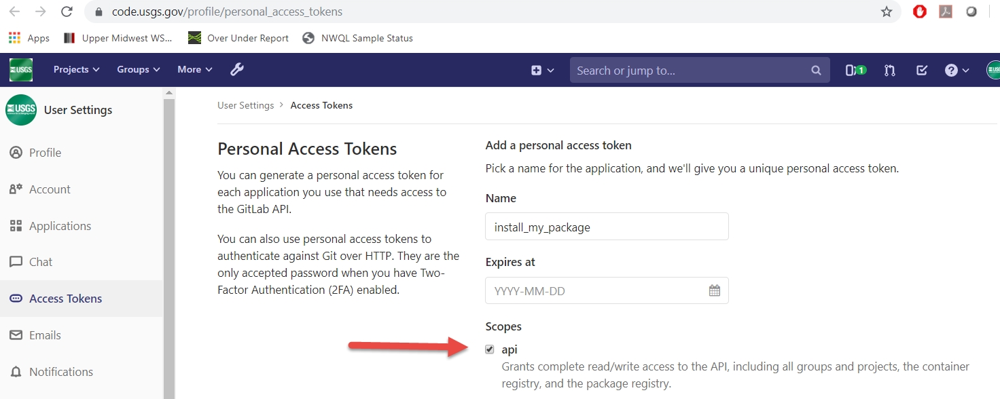

```{r setup, include=FALSE}
library(knitr)

opts_chunk$set(echo = TRUE,
               warning = FALSE,
               message = FALSE)
```


# Package development

This article will walk through adding a function to the package. It will use a git-branching workflow, but it is not a full git tutorial. This is also not a complete guide to R package development (a comprehensive guide is [R Packages](https://r-pkgs.org/)), instead this is meant as more of a checklist for the general steps. Several references are included at the bottom for more information on [R-package](https://r-pkgs.org/) development and [git](https://happygitwithr.com/) workflows.

# Initial Setup

This section will describe the steps necessary to get started. These steps will only need to be done once. 

## Required installations

There are several programs that are needed before any work can begin. With admin access to your computer, you can install all of these, otherwise create a ticket with your IT group with the following requests. The links provided assume a Windows computer. Adjustments might be needed for Mac or Linux OS: 

 * [R](https://cran.r-project.org/bin/windows/base/)
 
 * [RStudio](https://www.rstudio.com/products/rstudio/download/)
 
 * [Rtools](https://cran.r-project.org/bin/windows/Rtools/)
 
 * [Git](https://git-scm.com/downloads)
 
 * [MikTex](https://miktex.org/) - optional for Windows users to use LaTeX. 
 
Once those have been installed, the following R packages will be needed for R-package development work:

```{r eval=FALSE}
install.packages(c("devtools", "rmarkdown"))
```

# GitHub versus GitLab

dataRetrieval is a publicly available package. The public is urged to report issues and ask questions on our GitHub page: 
[GitHub Issues](https://github.com/DOI-USGS/dataRetrieval/issues)

The public is welcome to fork the [GitHub repository](https://github.com/DOI-USGS/dataRetrieval) and can submit pull requests. Since dataRetrieval is used by so many people, any proposed changes would be thoroughly reviewed before being considered. 

The bulk of dataRetrieval development is on [code.usgs.gov/water/dataRetrieval](https://code.usgs.gov/water/dataRetrieval). This is the USGS GitLab system. Throughout this document, it will be referred to both as code.usgs.gov and GitLab. Once updates and bug fixes are tested on GitLab, they will be pushed up to the GitHub repository. The remaining instructions are assuming the developer is using GitLab.


## code.usgs.gov (GitLab) setup

We are walking through a project that is managed on code.usgs.gov. code.usgs.gov is the USGS enterprise GitLab home. Some people will either refer it as either code.usgs.gov or simply "GitLab". These instructions will generally refer to code.usgs.gov as GitLab unless it's specific to our USGS version of GitLab (for example, how to log in). If you have questions on how to use code.usgs.gov, general advice about GitLab will often suffice (so Googling for answers is a great first step!)

The first step to collaborating via code.usgs.gov is to log in. For USGS/DOI employees, that means using:

```{r echo=FALSE, out.width="60%"}
knitr::include_graphics("login.png")
```

## Personal Access Token

This step only needs to be done once per computer setup. So if you've done it before you can skip this step.

You'll need to set up a Personal Access Token. Go to [https://code.usgs.gov/-/profile/personal_access_tokens](https://code.usgs.gov/-/profile/personal_access_tokens) and create a new token selecting the api scope:

```{r echo=FALSE, out.width="60%"}

```

After clicking the green "Create personal access token", you will see a screen like this:
```{r echo=FALSE, out.width="60%"}

```

Save your token in a safe place (KeyPass for instance) so you don’t need to constantly regenerate tokens. You will need this token for authenticating when doing a git pull (in a few steps....).

## Local project setup

The easiest way to set up work on this package is to create a new Project within RStudio. These are the steps needed to get the files from GitLab (code.usgs.gov) to your computer.

1. Create a new project -> Version Control -> Git

```{r echo=FALSE, out.width="50%"}
knitr::include_graphics("new_project.png")
```

2. Navigate to the landing page for the repository, and copy the HTTPS URL from code.usgs.gov Clone button:

```{r echo=FALSE, out.width="50%"}
knitr::include_graphics("https_clone.png")
```

3. Paste the HTTPS git address in Repository URL:

```{r echo=FALSE, out.width="50%"}
knitr::include_graphics("git_repository.png")
```

4. You may need to log in (if you've logged in before, there will not be a log in prompt and you can skip this step). Use your full email for your user name, and the personal access token for your password. NOT your AD password!

```{r echo=FALSE, out.width="60%"}

```

If you attempt to use HTTPS and are not even prompted for a password, but you receive a failed authentication error message, then you probably at one point in the past provided an incorrect username/password and Windows (or MacOS) chose to store that password in their built-in credential manager. On Windows, this is called Credential Manager. On Mac, this is called Keychain. Clear that credential and try again.

## Setup local build

### Initial Installation

Click "Install and Restart" from Build tab in the upper right of your RStudio window. If there are packages that this package depends on and they are not installed on your computer, you will get a warning. Install those packages manually and try the "Install and Restart" again. If successful, you will see something like:

```{r echo=FALSE, out.width="50%"}

```

The most common problem at this stage will be that you might not have all the packages that are listed in either the Depends or Imports of the DESCRIPTION file. If you see a message like this:

```{r echo=FALSE, out.width="50%"}

```

Read which package is missing from your computer and install, or you can use the `remotes` package:

```{r eval=FALSE}
remotes::install_deps()
```

### Set up roxygen options

Turn on the option to use Roxygen to build help pages. Click on the More button in the "Build" tab, then choose "Configure Build Tools". 

```{r echo=FALSE, out.width="60%"}

```

Click the radio button to "Generate documentation with Roxygen". Then click the Configure button and check all the options:

```{r echo=FALSE, out.width="50%"}
knitr::include_graphics("doc_all.png")
```

If you do not have some LaTeX software installed (on Windows that would be MikTex for instance), you will want to include `--no-manual` in your check options. 

```{r echo=FALSE, out.width="50%"}

```


Click "OK" to exit out of all of the configuration options. You are now set to start working on the package! 

# R-package development

We're now setup to start contributing to the R-package! This next section will walk through adding a new function to the package. 

## Project management

It's a great idea to figure out from the start how you want to manage the work. Since you are already working in GitLab, consider using GitLab Issues. You can create custom labels, assign roles, set up specific templates, and provide due dates. Discussions of the issues can include screenshots, formatted code snippets, and general markdown formatting options. It's a great idea to spend some time defining specific tasks before beginning work. Issues can be referred to by number in git commits, which adds some nice feedback during the coding process.

## Set up a new git branch

Before starting anything new, try to always remember to pull any changes that have happened on the repo. In the "Git" tab, click the down arrow which triggers a "git pull":

```{r echo=FALSE, out.width="50%"}

```

Create a new branch. This will let you work on your idea without risking adding in-development work into the "main" branch of the repository. As a good rule-of-thumb, consider creating a new branch for each "Issue". 

```{r echo=FALSE, out.width="50%"}
knitr::include_graphics("new_branch.png")
```


## Building a new function

You have all the details for a new function, great! Here are some steps to get it fully incorporated into the package so others can use it. See [R Packages](https://r-pkgs.org/) for complete details.

Follow the style and guidelines agreed upon by the package development team. For example, I typically create Roxygen above the function definition, explicitly call dependent functions with the notation `package::function_I_need`, and prefer more whitespace and linebreaks than other developers. I would either discuss these style preferences with my collaborators or create a project-specific style guideline. 

Here is an example of some of a new function which follows our package guidelines. Save this as an R file in the "R" folder of the package.

```
#' My fancy new function
#' 
#' This is my fancy new function. It's really great.
#' 
#' @param excited_flag logical. This sets our output
#' to excited or not
#' @export
#' @examples 
#' my_fancy_function(excited_flag = TRUE)
#' my_fancy_function(excited_flag = FALSE)
my_fancy_function <- function(excited_flag){
  
  checkmate::assert_logical(excited_flag)
  
  if(excited_flag){
    say <- "HI!"
  } else {
    say <- "hi"
  }
  return(say)
}

```

## Local Package Check 

Check the package to make sure the function works properly, and doesn't add any new Errors, Warnings, Notes.

```{r echo=FALSE, out.width="50%"}

```

Note sometimes this can take a long time. The package will be checked automatically on code.usgs.gov with the CI pipeline, but it is still a good idea to run the check locally especially when setting up a new function initially.

## Creating tests

It's also important to create tests to check that your functions do exactly what you expect them to do. Use the [testthat](https://testthat.r-lib.org/) package to create these tests. Navigate to the tests/testthat folder and create some new tests for your new function. As much as possible, the tests should check every part of your function.

```
context("Test my fancy function")
test_that("My fancy function", {

  excited <- my_fancy_function(excited_flag = TRUE)
  not_excited <- my_fancy_function(excited_flag = FALSE)
  
  expect_type(excited, type = "character")
  expect_equal(excited, "HI!")
  expect_equal(not_excited, "hi")
  expect_error(my_fancy_function(excited_flag = "what?"))
})
```

In the "Build" tab, under "More", test the full package

```{r echo=FALSE, out.width="50%"}
knitr::include_graphics("test.png")
```

## Adding the function to vignettes, README, report template.

If the function should be advertised in the general workflow, consider adding it to the README. This is the first place users will read when they come to the code repository.

The function could be added to a section of a vignette, or an entirely new vignette could be written.

In some packages, there is a report template that is in the "inst/templates" folder. Consider if function would make sense in a generalized report.

## Push up to code.usgs.gov

This can be done in stages. If you've done everything correctly, you should be ready to commit at least the R script, the generated Rd documentation file, the testthat changes, and the updates to the NAMESPACE. 

1. In the Git tab, click the down arrow to "Pull". If you haven't made any changes on this branch yet, you should get a message "Already up to date".

2. In the same Git tab, click the radio buttons next to the files you are either adding or modifying. This should include the R script for the function, the test file(s), the Rd documentation, and the updated NAMESPACE. It could also include changes to the README, vignettes, inst/template/report.Rmd, etc. Then click the "Commit" button:

```{r echo=FALSE, out.width="75%"}

```

3. Write a message to help you remember what this commit was all about. Glance at the "Diffs" shown below. When everything looks good, click "Commit". 

```{r echo=FALSE, out.width="75%"}
knitr::include_graphics("commit2.png")
```

4. Click the up arrow to "Push" the changes up to the feature branch in GitLab (code.usgs.gov).

## Gitlab CI Pipeline

The repository should have a file already set up called .gitlab-ci.yml. This file organizes automatic checks on the package via a "pipeline". Usually there is a setup phase that installs all the required package, then a check phase to check the package. I like to add separate testing and test coverage checks. Before the merge request is merged, the pipeline should come back with no errors:

```{r echo=FALSE, out.width="75%"}

```

This helps assure that the changes are not causing any failures on an independent platform.

## Merge request

So far, you have pushed a specific branch up to code.usgs.gov. It's not set to go directly to the "main" branch. If you open the repository, you may see a message like this:

```{r echo=FALSE, out.width="75%"}
knitr::include_graphics("create_merge.png")
```

Click on that "Create merge request" to initiate a "merge request". 

```{r echo=FALSE, out.width="75%"}

```

Fill in some more information on what is being included in this merge request. You could assign someone to do a peer review of your code. This is a great place for review. It is a good idea to discuss with your collaborators if you want guidelines set up to decide who has the responsibility to perform the merge (that is...click the Merge button).

### Merge Reports

There are a few things to check when the pipeline has finished. The first main goal is that the package passes all the checks. The next thing to check is  the test coverage. When you write tests in the "testthat" folder, you are checking that the code is doing what it's suppose to be doing. We can also check how well your code is covered by tests. This is called "test coverage". There are programs that can analyze each line of your code and determine which lines are being tested, and which lines are not. A high percentage of test coverage is one metric of good testing. However, it is also important to write good and meaningful tests. If you only test that a function didn't fail, you still don't know if the function produced meaningful output.

The test coverage should be as good if not better than the coverage currently in the canonical "main" branch. In the following screenshot, the test coverage on the "main" branch is 92.11%. The pull request is set to increase that coverage by 0.11% to 92.22%. If you notice the test coverage decreasing, you will want to look at your test suite and see where you can add tests to make sure your package is working properly. This screenshot also shows where to get a full report on the tests in your package. 

```{r echo=FALSE, out.width="75%"}
knitr::include_graphics("more_tests.png")
```

Another report that GitLab can produced is found in the "Changes" tab in the merge request. There are green and red vertical lines on the file diffs. These vertical lines indicate the code is covered by a test (green line), or that there is no test (thicker red line).

```{r echo=FALSE, out.width="75%"}
knitr::include_graphics("test_included.png")
```

This can be useful for finding parts of your code that are not covered by tests.

If the Pipeline has passed and the code review was satisfactory, clicking the Merge button will move all your changes into the "main" branch. 

# Clean up local enviornment

Congratulations, you contributed to the package! The next steps should always be done after the merge request is completed so you don't continue to work on the specific feature branch. 

## Switch back to "main" branch

In the upper right corner of the Git window in RStudio, you can click a dropdown to get back to the "main" branch.

```{r echo=FALSE, out.width="50%"}
knitr::include_graphics("back_to_main.png")
```

## Delete local feature branch

The way code.usgs.gov is set up, the branch should be automatically deleted *ON* code.usgs.gov. You will still want to delete the feature branch locally. Go to the Terminal in the lower left corner in RStudio, and type `git branch -d my_fancy_branch` (or whatever you named your branch).

```{r echo=FALSE, out.width="50%"}

```


# References

* [R Packages](https://r-pkgs.org/)

* [Happy with Git](https://happygitwithr.com/)

* [testthat](https://testthat.r-lib.org/)

* [R markdown](https://r4ds.had.co.nz/r-markdown.html)

* [USGS Software Policy](https://www.usgs.gov/products/software/software-management)

# Disclaimer

This software is preliminary or provisional and is subject to revision. It is being provided to meet the need for timely best science. The software has not received final approval by the U.S. Geological Survey (USGS). No warranty, expressed or implied, is made by the USGS or the U.S. Government as to the functionality of the software and related material nor shall the fact of release constitute any such warranty. The software is provided on the condition that neither the USGS nor the U.S. Government shall be held liable for any damages resulting from the authorized or unauthorized use of the software.

Any use of trade, firm, or product names is for descriptive purposes only and does not imply endorsement by the U.S. Government.
