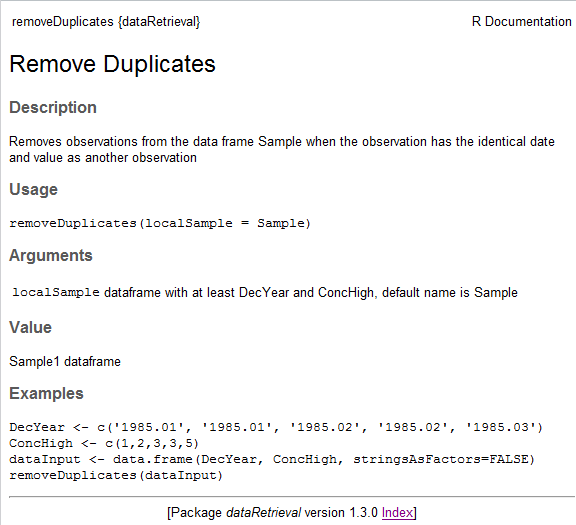

```{r setup, include=FALSE, message=FALSE}
library(knitr)
library(dataRetrieval)

options(continue=" ")
options(width=60)
knitr::opts_chunk$set(echo = TRUE,
                      warning = FALSE,
                      message = FALSE,
                      fig.height = 7,
                      fig.width = 7)
```

The `dataRetrieval` package was created to simplify the process of loading hydrologic data into the R environment. It is designed to retrieve the major data types of U.S. Geological Survey (USGS) hydrologic data that are available on the Web, as well as data from the Water Quality Portal (WQP), which currently houses water quality data from the Environmental Protection Agency (EPA), U.S. Department of Agriculture (USDA), and USGS. Direct USGS data is obtained from a service called the National Water Information System (NWIS). 

For information on getting started in R and installing the package, see [Getting Started](#getting-started-in-r). Any use of trade, firm, or product names is for descriptive purposes only and does not imply endorsement by the U.S. Government.

A quick workflow for USGS `dataRetrieval` functions:

```{r workflow, echo=TRUE,eval=FALSE}
library(dataRetrieval)
# Choptank River near Greensboro, MD
siteNumber <- "01491000" 
ChoptankInfo <- readNWISsite(siteNumber)
parameterCd <- "00060"

#Raw daily data:
rawDailyData <- readNWISdv(siteNumber,parameterCd,
                      "1980-01-01","2010-01-01")

# Sample data Nitrate:
parameterCd <- "00618"
qwData <- readNWISqw(siteNumber,parameterCd,
                      "1980-01-01","2010-01-01")

pCode <- readNWISpCode(parameterCd)

```

USGS data are made available through the National Water Information System (NWIS).

Table 1 describes the functions available in the `dataRetrieval` package.

```{r echo=FALSE}
Functions <- c("readNWISdata",
               "readNWISdv",
               "readNWISqw",
               "readNWISuv",
               "readNWISrating",
               "readNWISmeas",
               "readNWISpeak",
               "readNWISgwl",
               "readNWISuse",
               "readNWISstat",
               "readNWISpCode",
               "readNWISsite",
               "whatNWISsites",
               "whatNWISdata",
               "readWQPdata",
               "readWQPqw",
               "whatWQPsites",
               "whatWQPdata",
               "readWQPsummary",
               "whatWQPmetrics",
               "whatWQPsamples")
Arguments <- c("service, tz='UTC', ...", #readNWISdata
               "statCd='00003'", #readNWISdv
               "expanded=TRUE, tz='UTC'", #readNWISqw
               "tz='UTC'", #readNWISuv
               "type='base", #readNWISrating
               "tz='UTC'", #readNWISmeas
               "", #readNWISpeak
               "tz='UTC'", #readNWISgwl
               "stateCd, countyCd, years='ALL', categories='ALL'", #readNWISuse
               "statReportType='daily', statType='mean'",#readNWISstat
               "", #readNWISpCode
               "", #readNWISsite
               "...", #whatNWISsites
               "service, ...", #whatNWISdata
               "...",
               "", #readWQPdata
               "...",
               "...", "...", "...", "...") #whatWQPsites
Description <- c("Data using user-specified queries", #readNWISdata
                 "Daily values", #readNWISdv
                 "Water quality", #readNWISqw
                 "Instantaneous values", #readNWISuv
                 "Rating table for active streamgage", #readNWISrating
                 "Surface-water measurements", #readNWISmeas
                 "Peak flow", #readNWISpeak
                 "Groundwater levels", #readNWISgwl
                 "Water use", #readNWISuse
                 "Statistical service", #readNWISstat
                 "Parameter code information", #readNWISpCode
                 "Site information", #readNWISsite
                 "Site search using user-specified queries",
                 "Data availability",
                 "User-specified queries",
                 "Water quality data",
                 "Site search",
                 "Data availability",
                 "Summary data",
                 "Metric availability",
                 "Sample availability")
Source <- c(rep("NWIS", 14), rep("WQP", 7))
Site <- c("opt.", rep("req.", 7), "", 
          rep("req.", 4), "opt.", "opt.", "req.", rep("opt.", 5))
parameterCd <- c("opt.", rep("req.",3),
                 rep("", 5), "req.", "req.",
                 rep("",2), rep("opt.",2), "req.", rep("", 5))
start <- c("opt.", rep("req.",3),"",
           rep("req.", 3), "", "req.", rep("", 5), "req.", rep("opt.", 5))

data.df <- data.frame(Name = Functions,
                      `Data Returned` = Description,
                      siteNumbers = Site,
                      parameterCd = parameterCd, 
                      `startDate \n endDate` = start,
                      Arguments,
                      Source, stringsAsFactors=FALSE)

kable(data.df, 
      caption="Table 1: dataRetrieval functions")

```

The arguments `startDate` and `endDate` have defaults to request the maximum data.

# USGS Web Retrievals

In this section, examples of National Water Information System (NWIS) retrievals show how to get raw data into R. This data includes [site information](#site-information), measured [parameter information](#parameter-information), historical [daily values](#daily-data), [unit values](#unit-data) (which include real-time data but can also include other sensor data stored at regular time intervals), [water quality data](#water-quality-data), [groundwater level data](#groundwater-level-data), [peak flow data](#peak-flow-data), [rating curve data](#rating-curve-data),  [surface-water measurement data](#surface-water-measurement-data), [water use data](#water-use-data), and [statistics data](#statistics-data). The section [Embedded Metadata](#embedded-metadata) shows instructions for getting metadata that is attached to each returned data frame.

The USGS organizes hydrologic data in a standard structure.  Streamgages are located throughout the United States, and each streamgage has a unique ID (referred in this document and throughout the `dataRetrieval` package as `siteNumber`).  Often (but not always), these ID's are 8 digits for surface-water sites and 15 digits for groundwater sites.  The first step to finding data is discovering this `siteNumber`. There are many ways to do this, one is the [National Water Information System: Mapper](https://maps.waterdata.usgs.gov/mapper/index.html).

Once the `siteNumber` is known, the next required input for USGS data retrievals is the "parameter code".  This is a 5-digit code that specifies the measured parameter being requested.  For example, parameter code 00631 represents "Nitrate plus nitrite, water, filtered, milligrams per liter as nitrogen", with units of "mg/l as N". 

Not every station will measure all parameters. A short list of commonly measured parameters is shown in Table 2.

```{r tableParameterCodes, echo=FALSE}


pCode <- c('00060', '00065', '00010','00045','00400')
shortName <- c("Discharge [ft<sup>3</sup>/s]","Gage height [ft]","Temperature [C]", "Precipitation [in]", "pH")

data.df <- data.frame(pCode, shortName, stringsAsFactors=FALSE)

kable(data.df, 
          caption="Table 2: Common USGS Parameter Codes")


```

Two output columns that may not be obvious are "srsname" and "casrn". Srsname stands for "Substance Registry Services". More information on the srs name can be found [here](https://sor.epa.gov/sor_internet/registry/substreg/home/overview/home.do).

Casrn stands for "Chemical Abstracts Service (CAS) Registry Number". More information on CAS can be found [here](https://www.cas.org/support/documentation/chemical-substances/faqs).

For unit values data (sensor data measured at regular time intervals such as 15 minutes or hourly), knowing the parameter code and `siteNumber` is enough to make a request for data.  For most variables that are measured on a continuous basis, the USGS also stores the historical data as daily values.  These daily values are statistical summaries of the continuous data, e.g. maximum, minimum, mean, or median. The different statistics are specified by a 5-digit statistics code.  

Some common codes are shown in Table 3.

```{r tableStatCodes, echo=FALSE}
StatCode <- c('00001', '00002', '00003','00008')
shortName <- c("Maximum","Minimum","Mean", "Median")

data.df <- data.frame(StatCode, shortName, stringsAsFactors=FALSE)

kable(data.df, 
          caption="Table 3: Commonly used USGS Stat Codes")


```

Examples for using these site numbers, parameter codes, and statistic codes will be presented in subsequent sections.

There are occasions where NWIS values are not reported as numbers, instead there might be text describing a certain event such as "Ice".  Any value that cannot be converted to a number will be reported as NA in this package (not including remark code columns), unless the user sets an argument `convertType` to `FALSE`. In that case, the data is returned as a data frame that is entirely character columns.

## Site Information


### readNWISsite

Use the `readNWISsite` function to obtain all of the information available for a particular USGS site (or sites) such as full station name, drainage area, latitude, and longitude. `readNWISsite` can also access information about multiple sites with a vector input.


```{r getSite, echo=TRUE, eval=FALSE}
siteNumbers <- c("01491000","01645000") 
siteINFO <- readNWISsite(siteNumbers)
```

Site information is obtained from:
[https://waterservices.usgs.gov/rest/Site-Test-Tool.html](https://waterservices.usgs.gov/rest/Site-Test-Tool.html)

Information on the returned data can be found with the `comment` function as described in the [Metadata](#embedded-metadata) section.

```{r siteNames3, echo=TRUE, eval=FALSE}
comment(siteINFO)
```


### whatNWISdata

To discover what data is available for a particular USGS site, including measured parameters, period of record, and number of samples (count), use the `whatNWISdata` function. It is possible to limit the retrieval information to a subset of services. The possible choices for services are: "dv" (daily values), "uv", or "iv" (unit values), "qw" (water-quality), "sv" (sites visits), "pk" (peak measurements), "gw" (groundwater levels), "ad" (sites included in USGS Annual Water Data Reports External Link), "aw" (sites monitored by the USGS Active Groundwater Level Network External Link), and "id" (historical instantaneous values).

In the following example, we limit the retrieved data to only daily data. The default for "service" is `all`, which returns all of the available data for that site. Likewise, there are arguments for parameter code (`parameterCd`) and statistic code (`statCd`) to filter the results. The default for both is to return all possible values (`all`). The returned `count_nu` for "uv" data is the count of days with returned data, not the actual count of returned values.


```{r getSiteExtended, echo=TRUE, eval=FALSE}
# Continuing from the previous example:
# This pulls out just the daily, mean data:

dailyDataAvailable <- whatNWISdata(siteNumbers,
                    service="dv", statCd="00003")


```

```{r echo=FALSE}

tableData <- data.frame(
  siteNumbers = c("01491000","01491000","01645000","01491000","01491000","01491000"),
  srsname = c("Temperature, water","Stream flow, mean daily",
              "Stream flow, mean daily",
              "Specific conductance",
              "Suspended sediment concentration (SSC)",
              "Suspended sediment discharge" ),
  startDate = c("2010-10-01","1948-01-01","1930-09-26","2010-10-01","1980-10-01","1980-10-01"),
  endDate = c("2012-05-09","2017-05-17","2017-05-17","2012-05-09","1991-09-30","1991-09-30"),
  count = c("529","25340","31646","527","4017","4017"),
  units = c("deg C","ft<sup>3</sup>/s","ft<sup>3</sup>/s","uS/cm @25C","mg/l","tons/day"),
  stringsAsFactors = FALSE)


kable(tableData, 
          caption="Table 4: Reformatted version of output from the whatNWISdata function for the Choptank River near Greensboro, MD, and from Seneca Creek at Dawsonville, MD from the daily values service [Some columns deleted for space considerations]")

```

See [Creating Tables](#creating-tables-in-microsoft-software-from-r) for instructions on converting an R data frame to a table in Microsoft&#174; software Excel or Word to display a data availability table similar to Table 4. Excel, Microsoft, PowerPoint, Windows, and Word are registered trademarks of Microsoft Corporation in the United States and other countries.

## Parameter Information

To obtain all of the available information concerning a measured parameter (or multiple parameters), use the `readNWISpCode` function:

```{r label=getPCodeInfo, echo=TRUE, eval=FALSE}
# Using defaults:
parameterCd <- "00618" 
parameterINFO <- readNWISpCode(parameterCd)
```


## Daily Data

To obtain daily records of USGS data, use the `readNWISdv` function. The arguments for this function are `siteNumbers`, `parameterCd`, `startDate`, `endDate`, and `statCd` (defaults to "00003").  If you want to use the default values, you do not need to list them in the function call. Daily data is pulled from [https://waterservices.usgs.gov/rest/DV-Test-Tool.html](https://waterservices.usgs.gov/rest/DV-Test-Tool.html).

The dates (start and end) must be in the format "YYYY-MM-DD" (note: the user must include the quotes).  Setting the start date to "" (no space) will prompt the program to ask for the earliest date, and setting the end date to "" (no space) will prompt for the latest available date.

```{r label=getNWISDaily, echo=TRUE, eval=FALSE}

# Choptank River near Greensboro, MD:
siteNumber <- "01491000"
parameterCd <- "00060"  # Discharge
startDate <- "2009-10-01"  
endDate <- "2012-09-30" 

discharge <- readNWISdv(siteNumber, 
                    parameterCd, startDate, endDate)
```

The column "datetime" in the returned data frame is automatically imported as a variable of class "Date" in R. Each requested parameter has a value and remark code column.  The names of these columns depend on the requested parameter and stat code combinations. USGS daily value qualification codes are often "A" (approved for publication) or "P" (provisional data subject to revision). 

Another example would be a request for mean and maximum daily temperature and discharge in early 2012:

```{r label=getNWIStemperature, echo=TRUE, eval=FALSE}
siteNumber <- "01491000"
parameterCd <- c("00010","00060")  # Temperature and discharge
statCd <- c("00001","00003")  # Mean and maximum
startDate <- "2012-01-01"
endDate <- "2012-05-01"

temperatureAndFlow <- readNWISdv(siteNumber, parameterCd, 
        startDate, endDate, statCd=statCd)

```

```{r label=getNWIStemperature2, echo=FALSE, eval=TRUE}
filePath <- system.file("extdata", package="dataRetrieval")
fileName <- "temperatureAndFlow.RData"
fullPath <- file.path(filePath, fileName)
load(fullPath)

```

The column names can be shortened and simplified using the `renameNWISColumns` function.  This is not necessary, but may streamline subsequent data analysis and presentation. Site information, daily statistic information, and measured parameter information is attached to the data frame as attributes. This is discussed further in the [metadata](#embedded-metadata) section.


```{r label=renameColumns, echo=TRUE}
names(temperatureAndFlow)

temperatureAndFlow <- renameNWISColumns(temperatureAndFlow)
names(temperatureAndFlow)

```

```{r label=attr1, echo=TRUE}
#Information about the data frame attributes:
names(attributes(temperatureAndFlow))

statInfo <- attr(temperatureAndFlow, "statisticInfo")
variableInfo <- attr(temperatureAndFlow, "variableInfo")
siteInfo <- attr(temperatureAndFlow, "siteInfo")

```


An example of plotting the above data:

```{r}
variableInfo <- attr(temperatureAndFlow, "variableInfo")
siteInfo <- attr(temperatureAndFlow, "siteInfo")

par(mar=c(5,5,5,5)) #sets the size of the plot window

plot(temperatureAndFlow$Date, temperatureAndFlow$Wtemp_Max,
  ylab=variableInfo$parameter_desc[1],xlab="" )
par(new=TRUE)
plot(temperatureAndFlow$Date, temperatureAndFlow$Flow,
  col="red",type="l",xaxt="n",yaxt="n",xlab="",ylab="",axes=FALSE
  )
axis(4,col="red",col.axis="red")
mtext(variableInfo$parameter_desc[2],side=4,line=3,col="red")
title(paste(siteInfo$station_nm,"2012"))
legend("topleft", variableInfo$param_units, 
       col=c("black","red"),lty=c(NA,1),pch=c(1,NA))
```


## Unit Data

Any data collected at regular time intervals (such as 15-minute or hourly) are known as "unit values". Many of these are delivered on a real time basis and very recent data (even less than an hour old in many cases) are available through the function `readNWISuv`.  Some of these unit values are available for many years, and some are only available for a recent time period such as 120 days.  Here is an example of a retrieval of such data.  

```{r label=readNWISuv, eval=FALSE}

parameterCd <- "00060"  # Discharge
startDate <- "2012-05-12" 
endDate <- "2012-05-13" 
dischargeUnit <- readNWISuv(siteNumber, parameterCd, 
        startDate, endDate)
dischargeUnit <- renameNWISColumns(dischargeUnit)
```

The retrieval produces a data frame that contains 96 rows (one for every 15 minute period in the day).  They include all data collected from the `startDate` through the `endDate` (starting and ending with midnight locally-collected time). The dateTime column is converted to UTC (Coordinated Universal Time), so midnight EST will be 5 hours earlier in the dateTime column (the previous day, at 7pm).

To override the UTC timezone, specify a valid timezone in the tz argument. Default is "", which will keep the dateTime column in UTC. Other valid timezones are:

```
America/New_York
America/Chicago
America/Denver
America/Los_Angeles
America/Anchorage
America/Honolulu
America/Jamaica
America/Managua
America/Phoenix
America/Metlakatla
```

Data are retrieved from [https://waterservices.usgs.gov/rest/IV-Test-Tool.html](https://waterservices.usgs.gov/rest/IV-Test-Tool.html). There are occasions where NWIS values are not reported as numbers, instead a common example is "Ice".  Any value that cannot be converted to a number will be reported as NA in this package. Site information and measured parameter information is attached to the data frame as attributes. This is discussed further in [metadata](#embedded-metadata) section.


## Water Quality Data

To get USGS water quality data from water samples collected at the streamgage or other monitoring site (as distinct from unit values collected through some type of automatic monitor) we can use the function `readNWISqw`, with the input arguments: `siteNumber`, `parameterCd`, `startDate`, and `endDate`. Additionally, the argument `expanded` is a logical input that allows the user to choose between a simple return of datetimes/qualifier/values (`expanded=FALSE`), or a more complete and verbose output (`expanded=TRUE`). `expanded = TRUE` includes such columns as remark codes, value qualifying text, and detection level for each parameter code. There also includes an argument "reshape", that converts the expanded dataset to a "wide" format (each requested parameter code gets individual columns). The defaults are `expanded=TRUE`, and `reshape=FALSE`. 

```{r label=getQW, echo=TRUE, eval=FALSE}
 
# Dissolved Nitrate parameter codes:
parameterCd <- c("00618","71851")
startDate <- "1985-10-01"
endDate <- "2012-09-30"

dfLong <- readNWISqw(siteNumber, parameterCd, 
      startDate, endDate)

# Or the wide return:
dfWide <- readNWISqw(siteNumber, parameterCd,
      startDate, endDate, reshape=TRUE)

```

Site information and measured parameter information is attached to the data frame as attributes. This is discussed further in the [metadata](#embedded-metadata) section. Additional metadata, such as information about the column names can be found by using the `comment` function, also described in the [metadata](#embedded-metadata) section.

```{r qwmeta, echo=TRUE, eval=FALSE}

comment(dfLong)

```


## Groundwater Level Data

Groundwater level measurements can be obtained with the `readNWISgwl` function. Information on the returned data can be found with the `comment` function, and attached attributes as described in the [metadata](#embedded-metadata) section.

```{r gwlexample, echo=TRUE, eval=FALSE}
siteNumber <- "434400121275801"
groundWater <- readNWISgwl(siteNumber)
```


## Peak Flow Data

Peak flow data are instantaneous discharge or stage data that record the maximum values of these variables during a flood event.  They include the annual peak flood event but can also include records of other peaks that are lower than the annual maximum. Peak discharge measurements can be obtained with the `readNWISpeak` function. Information on the returned data can be found with the `comment` function and attached attributes as described in the [metadata](#embedded-metadata) section.

```{r peakexample, echo=TRUE, eval=FALSE}
siteNumber <- '01594440'
peakData <- readNWISpeak(siteNumber)

```


## Rating Curve Data

Rating curves are the calibration curves that are used to convert measurements of stage to discharge.  Because of changing hydrologic conditions these rating curves change over time. Information on the returned data can be found with the `comment` function and attached attributes as described in the [metadata](#embedded-metadata) section.

Rating curves can be obtained with the `readNWISrating` function.

```{r ratingexample, echo=TRUE, eval=FALSE}
ratingData <- readNWISrating(siteNumber, "base")
attr(ratingData, "RATING")

```


## Surface-Water Measurement Data

These data are the discrete measurements of discharge that are made for the purpose of developing or revising the rating curve.  Information on the returned data can be found with the `comment` function and attached attributes as described in the [metadata](#embedded-metadata) section.

Surface-water measurement data can be obtained with the `readNWISmeas` function.

```{r surfexample, echo=TRUE, eval=FALSE}
surfaceData <- readNWISmeas(siteNumber)

```


## Water Use Data
Retrieves water use data from USGS Water Use Data for the Nation.  See [https://waterdata.usgs.gov/nwis/wu](https://waterdata.usgs.gov/nwis/wu) for more information.  All available use categories for the supplied arguments are retrieved. 

```{r eval=FALSE}
allegheny <- readNWISuse(stateCd = "Pennsylvania",
                         countyCd = "Allegheny")


national <- readNWISuse(stateCd = NULL, 
                        countyCd = NULL, 
                        transform = TRUE)

```

## Statistics Data
Retrieves site statistics from the USGS Statistics Web Service beta.  

```{r eval=FALSE}
discharge_stats <- readNWISstat(siteNumbers=c("02319394"),
                   parameterCd=c("00060"),
                   statReportType="annual") 

```


# Water Quality Portal Web Retrievals

There are additional water quality data sets available from the [Water Quality Data Portal](https://www.waterqualitydata.us/).  These data sets can be housed in either the STORET database (data from EPA), NWIS database (data from USGS), STEWARDS database (data from USDA), and additional databases are slated to be included in the future.  Because only USGS uses parameter codes, a "characteristic name" must be supplied.  The `readWQPqw` function can take either a USGS parameter code, or a more general characteristic name in the parameterCd input argument. The Water Quality Data Portal includes data discovery tools and information on characteristic names. The following example retrieves specific conductance from a DNR site in Wisconsin. 


```{r label=getQWData, echo=TRUE, eval=FALSE}
specificCond <- readWQPqw('WIDNR_WQX-10032762',
                          'Specific conductance',
                          '2011-05-01','2011-09-30')
```

A tool for finding NWIS characteristic names can be found [here](https://www.waterqualitydata.us/public_srsnames/)


# Generalized Retrievals

The previous examples all took specific input arguments: `siteNumber`, `parameterCd` (or characteristic name), `startDate`, `endDate`, etc. However, the Web services that supply the data can accept a wide variety of additional arguments. 

## NWIS 

### Sites: whatNWISsites

The function `whatNWISsites` can be used to discover NWIS sites based on any query that the NWIS Site Service offers. This is done by using the `...` argument, which allows the user to use any arbitrary input argument. We can then use the service [here](https://waterservices.usgs.gov/rest/Site-Test-Tool.html) to discover many options for searching for NWIS sites. For example, you may want to search for sites in a lat/lon bounding box, or only sites tidal streams, or sites with water quality samples, sites above a certain altitude, etc. The results of this site query generate a URL. For example, the tool provided a search within a specified bounding box, for sites that have daily discharge (parameter code = 00060) and temperature (parameter code = 00010). The generated URL is:

[https://waterservices.usgs.gov/nwis/site/?format=rdb&bBox=-83.0,36.5,-81.0,38.5&parameterCd=00010,00060&hasDataTypeCd=dv](https://waterservices.usgs.gov/nwis/site/?format=rdb&bBox=-83.0,36.5,-81.0,38.5&parameterCd=00010,00060&hasDataTypeCd=dv)

The following `dataRetrieval` code can be used to get those sites:

```{r siteSearch, eval=FALSE}
sites <- whatNWISsites(bBox=c(-83.0,36.5,-81.0,38.5), 
                      parameterCd=c("00010","00060"),
                      hasDataTypeCd="dv")
```

### Data: readNWISdata

For NWIS data, the function `readNWISdata` can be used. The argument listed in the R help file is `...` and `service` (only for data requests). Table 5 describes the services are available.

```{r echo=FALSE}

Service <- c("dv","iv","gwlevels","qwdata","measurements","peak","stat")
Description <- c("Daily","Instantaneous","Groundwater Levels","Water Quality","Surface Water Measurements","Peak Flow","Statistics Service")
URL <- c("<a href='https://waterservices.usgs.gov/rest/DV-Test-Tool.html' target='_blank'>https://waterservices.usgs.gov/rest/DV-Test-Tool.html<a>",
         "<a href='https://waterservices.usgs.gov/rest/IV-Test-Tool.html' target='_blank'>https://waterservices.usgs.gov/rest/IV-Test-Tool.html<a>",
         "<a href='https://waterservices.usgs.gov/rest/GW-Levels-Test-Tool.html' target='_blank'>https://waterservices.usgs.gov/rest/GW-Levels-Test-Tool.html<a>",
         "<a href='https://nwis.waterdata.usgs.gov/nwis/qwdata' target='_blank'>https://nwis.waterdata.usgs.gov/nwis/qwdata<a>",
         "<a href='https://waterdata.usgs.gov/nwis/measurements/' target='_blank'>https://waterdata.usgs.gov/nwis/measurements/<a>",
         "<a href='https://nwis.waterdata.usgs.gov/usa/nwis/peak/' target='_blank'>https://nwis.waterdata.usgs.gov/usa/nwis/peak/<a>",
         "<a href='https://waterservices.usgs.gov/rest/Statistics-Service-Test-Tool.html' target='_blank'>https://waterservices.usgs.gov/rest/Statistics-Service-Test-Tool.html<a>")

tableData <- data.frame(Service,
                        Description,
                        URL,
  stringsAsFactors = FALSE)


kable(tableData, 
          caption="Table 5: NWIS general data calls")

```


The `...` argument allows the user to create their own queries based on the instructions found in the web links above. The links provide instructions on how to create a URL to request data. Perhaps you want sites only in Wisconsin, with a drainage area less than 50 mi<sup>2</sup>, and the most recent daily discharge data. That request would be done as follows:

```{r dataExample, eval=FALSE}
dischargeWI <- readNWISdata(service="dv",
                           stateCd="WI",
                           parameterCd="00060",
                           drainAreaMin="50",
                           statCd="00003")

siteInfo <- attr(dischargeWI, "siteInfo")

```


## WQP 

Just as with NWIS, the Water Quality Portal (WQP) offers a variety of ways to search for sites and request data. The possible Web service arguments for WQP site searches is found [here](https://www.waterqualitydata.us/webservices_documentation).

### Sites: whatWQPsites

To discover available sites in the WQP in New Jersey that have measured Chloride, use the function `whatWQPsites`.

```{r NJChloride, eval=FALSE}

sitesNJ <- whatWQPsites(statecode="US:34",
                       characteristicName="Chloride")

```


### Data: readWQPdata

To get data from the WQP using generalized Web service calls, use the function `readWQPdata`. For example, to get all the pH data in Wisconsin:

```{r phData, eval=FALSE}
dataPH <- readWQPdata(statecode="US:55", 
                 characteristicName="pH")
```


### Availability: whatWQPdata

The function `whatWQPdata` returns a data frame with information on the amount of data collected at a site. For example:

```{r eval=FALSE}
type <- "Stream"
sites <- whatWQPdata(countycode="US:55:025",siteType=type)
```

This returns a data frame with all of the sites that were measured in streams in Dane County, WI. Also, in that table, there is a measure of `activityCount` (how often the site was sampled), and `resultCount` (how many individual results are available).

### Samples: whatWQPsamples

The function `whatWQPsamples` returns information on the individual samples collected at a site. For example:

```{r eval=FALSE}
site <- whatWQPsamples(siteid="USGS-01594440")
```

This returns one row for each instance that a sample was collect.

### Metrics: whatWQPmetrics

The function `whatWQPmetrics` provides metric information. This is only currently available for STORET data:

```{r eval=FALSE}
type <- "Stream"
sites <- whatWQPmetrics(countycode="US:55:025",siteType=type)
```


# Embedded Metadata

All data frames returned from the Web services have some form of associated metadata. This information is included as attributes to the data frame. All data frames will have a `url` (returning a character of the url used to obtain the data), `siteInfo` (returning a data frame with information on sites),  and `queryTime` (returning a POSIXct datetime) attributes. For example, the url and query time used to obtain the data can be found as follows:

```{r meta1, eval=FALSE}

attr(dischargeWI, "url")

attr(dischargeWI, "queryTime")

siteInfo <- attr(dischargeWI, "siteInfo")

```

Depending on the format that the data was obtained (RDB, WaterML1, etc), there will be additional information embedded in the data frame as attributes. To discover the available attributes:

```{r meta2, eval=FALSE}

names(attributes(dischargeWI))

```

For data obtained from `readNWISuv`, `readNWISdv`, `readNWISgwl` there are two attributes that are particularly useful: `siteInfo` and `variableInfo`.

```{r meta3, eval=FALSE}

siteInfo <- attr(dischargeWI, "siteInfo")

variableInfo <- attr(dischargeWI, "variableInfo")


```

Data obtained from `readNWISpeak`, `readNWISmeas`, and `readNWISrating`, the `comment` attribute is useful.

```{r meta5, eval=FALSE}
comment(peakData)

#Which is equivalent to:
attr(peakData, "comment")
```


# Getting Started in R

This section describes the options for downloading and installing the `dataRetrieval` package.

## New to R?
 
If you are new to R, you will need to first install the latest version of R, which can be found [here] (www.R-project.org).

At any time, you can get information about any function in R by typing a question mark before the functions name.  This will open a file (in RStudio, in the Help window) that describes the function, the required arguments, and provides working examples. This will open a help file similar to the image below. To see the raw code for a particular code, type the name of the function, without parentheses.


```
?readNWISpCode
```





Additionally, many R packages have vignette files attached (such as this paper). To view the vignette:
```{r seeVignette,eval = FALSE}
vignette(topic = "Introduction", package = "dataRetrieval")
```


# Disclaimer
This information is preliminary and is subject to revision. It is being provided to meet the need for timely best science. The information is provided on the condition that neither the U.S. Geological Survey nor the U.S. Government may be held liable for any damages resulting from the authorized or unauthorized use of the information.


