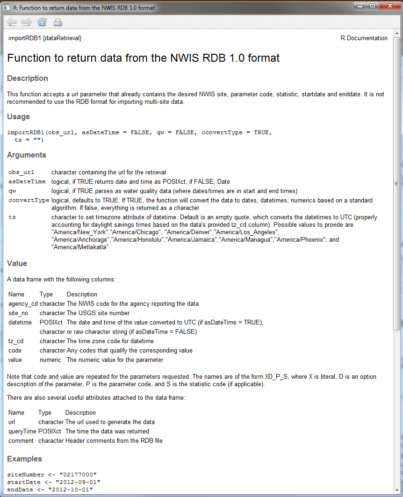

```{r setup, include=FALSE, message=FALSE}
library(knitr)
library(dataRetrieval)

options(continue = " ")
options(width = 60)
knitr::opts_chunk$set(
  echo = TRUE,
  warning = FALSE,
  message = FALSE,
  fig.height = 7,
  fig.width = 7
)
```

The `dataRetrieval` package was created to simplify the process of loading hydrologic data into the R environment. It is designed to retrieve the major data types of U.S. Geological Survey (USGS) hydrologic data that are available on the Web, as well as data from the Water Quality Portal (WQP), which currently houses water quality data from the Environmental Protection Agency (EPA), U.S. Department of Agriculture (USDA), and USGS. Direct USGS data is obtained from a service called the National Water Information System (NWIS). 

For information on getting started in R and installing the package, see [Getting Started](#getting-started-in-r). Any use of trade, firm, or product names is for descriptive purposes only and does not imply endorsement by the U.S. Government.

A quick workflow for USGS `dataRetrieval` functions:

```{r workflow, echo=TRUE,eval=FALSE}
library(dataRetrieval)
# Choptank River near Greensboro, MD
siteNumber <- "USGS-01491000"
ChoptankInfo <- read_waterdata_monitoring_location(siteNumber)
parameterCd <- "00060"

# Raw daily data:
rawDailyData <- read_waterdata_daily(monitoring_location_id = siteNumber,
                                     parameter_code = parameterCd,
                                     time = c("1980-01-01", "2010-01-01"))


pCode <- read_waterdata_parameter_codes(parameter_code = parameterCd)
```

USGS data are made available through the National Water Information System (NWIS).

Table 1 describes the functions available in the `dataRetrieval` package.

```{r echo=FALSE}
Functions <- c(
  "read_waterdata",
  "read_waterdata_daily",
  "readNWISuv",
  "readNWISrating",
  "read_waterdata_field_measurements",
  "readNWISpeak",
  "read_waterdata_field_measurements",
  "readNWISuse",
  "read_waterdata_stats_por, read_waterdata_stats_daterange",
  "read_waterdata_parameter_codes",
  "read_waterdata_monitoring_location",
  "read_waterdata_samples",
  "summarize_waterdata_samples",
  "whatNWISsites",
  "read_waterdata_ts_meta",
  "readWQPdata",
  "readWQPqw",
  "whatWQPsites",
  "whatWQPdata",
  "readWQPsummary",
  "whatWQPmetrics",
  "whatWQPsamples"
)

Description <- c(
  "Time series data using user-specified queries", # readNWISdata
  "Daily values", # readNWISdv
  "Instantaneous values", # readNWISuv
  "Rating table for active streamgage", # readNWISrating
  "Surface-water measurements", # readNWISmeas
  "Peak flow", # readNWISpeak
  "Groundwater levels", # readNWISgwl
  "Water use", # readNWISuse
  "Statistical service", # readNWISstat
  "Parameter code information", # read_waterdata_parameter_codes
  "Site information", # read_waterdata_monitoring_location
  "Discrete UGSS water quality data", # read_waterdata_samples
  "Discrete USGS water quality summary",
  "Site search using user-specified queries",
  "Data availability",
  "User-specified queries",
  "Water quality data",
  "Site search",
  "Data availability",
  "Summary data",
  "Metric availability",
  "Sample availability"
)
Source <- c("USGS Water Data API",
            "USGS Water Data API",
            rep("NWIS",2),
            "USGS Water Data API",
            "NWIS",
            "USGS Water Data API",
            rep("NWIS",2),
            "USGS Water Data API",
            "USGS Water Data API",
            "USGS Samples Data",
            "USGS Samples Data",
            "NWIS",
            "USGS Water Data API",
            rep("WQP", 7))


data.df <- data.frame(
  Name = Functions,
  `Data Returned` = Description,
  Source, stringsAsFactors = FALSE
)

kable(data.df,
  caption = "Table 1: dataRetrieval functions"
)
```

The arguments `startDate` and `endDate` have defaults to request the maximum data.

# USGS Web Retrievals

In this section we'll show how to get raw data into R. This data includes [site information](#site-information), measured [parameter information](#parameter-information), historical [daily values](#daily-data), [unit values](#unit-data) (which include real-time data but can also include other sensor data stored at regular time intervals), [groundwater level data](#groundwater-level-data), [peak flow data](#peak-flow-data), [rating curve data](#rating-curve-data),  [surface-water measurement data](#surface-water-measurement-data), [water use data](#water-use-data), and [statistics data](#statistics-data). The section [Embedded Metadata](#embedded-metadata) shows instructions for getting metadata that is attached to each returned data frame.

The USGS organizes hydrologic data in a standard structure.  Streamgages are located throughout the United States, and each streamgage has a unique ID (referred in this document and throughout the `dataRetrieval` package as `siteNumber`).  Often (but not always), these ID's are 8 digits for surface-water sites and 15 digits for groundwater sites.  The first step to finding data is discovering this `siteNumber`. There are many ways to do this, one is the [National Water Information System: Mapper](https://maps.waterdata.usgs.gov/mapper/index.html).

Once the `siteNumber` is known, the next required input for USGS data retrievals is the "parameter code".  This is a 5-digit code that specifies the measured parameter being requested.  For example, parameter code 00631 represents "Nitrate plus nitrite, water, filtered, milligrams per liter as nitrogen", with units of "mg/l as N". 

Not every station will measure all parameters. A short list of commonly measured parameters is shown in Table 2.

```{r tableParameterCodes, echo=FALSE}


pCode <- c("00060", "00065", "00010", "00045", "00400")
shortName <- c(
  "Discharge [ft<sup>3</sup>/s]",
  "Gage height [ft]",
  "Temperature [C]",
  "Precipitation [in]",
  "pH"
)

data.df <- data.frame(pCode, shortName, stringsAsFactors = FALSE)

kable(data.df,
  caption = "Table 2: Common USGS Parameter Codes"
)
```

Two output columns that may not be obvious are "srsname" and "casrn". Srsname stands for "Substance Registry Services". Casrn stands for "Chemical Abstracts Service (CAS) Registry Number". 

For unit values data (sensor data measured at regular time intervals such as 15 minutes or hourly), knowing the parameter code and `siteNumber` is enough to make a request for data.  For most variables that are measured on a continuous basis, the USGS also stores the historical data as daily values.  These daily values are statistical summaries of the continuous data, e.g. maximum, minimum, mean, or median. The different statistics are specified by a 5-digit statistics code.  

Some common codes are shown in Table 3.

```{r tableStatCodes, echo=FALSE}
StatCode <- c("00001", "00002", "00003", "00008")
shortName <- c("Maximum", "Minimum", "Mean", "Median")

data.df <- data.frame(StatCode, shortName, stringsAsFactors = FALSE)

kable(data.df,
  caption = "Table 3: Commonly used USGS Stat Codes"
)
```

Examples for using these site numbers, parameter codes, and statistic codes will be presented in subsequent sections.

There are occasions where NWIS values are not reported as numbers, instead there might be text describing a certain event such as "Ice".  Any value that cannot be converted to a number will be reported as NA in this package (not including remark code columns), unless the user sets an argument `convertType` to `FALSE`. In that case, the data is returned as a data frame that is entirely character columns.

## Site Information


### read_waterdata_monitoring_location

Use the `read_waterdata_monitoring_location` function to obtain all of the information available for a particular USGS site (or sites) such as full station name, drainage area, latitude, and longitude. `read_waterdata_monitoring_location` can also access information about multiple sites with a vector input.


```{r getSite, echo=TRUE, eval=FALSE}
siteNumbers <- c("USGS-01491000", "USGS-01645000")
siteINFO <- read_waterdata_monitoring_location(siteNumbers)
```

Site information is obtained from:
<https://api.waterdata.usgs.gov/ogcapi/v0/collections/monitoring-locations>

### read_waterdata_ts_meta

To discover what time series data is available for a particular USGS site, including measured parameters, period of record, and number of samples (count), use the `read_waterdata_ts_meta` function. 

In the following example, we limit the retrieved data to only daily data. 


```{r getSiteExtended, echo=TRUE, eval=FALSE}
# Continuing from the previous example:
# This pulls out just the daily, mean data:

dailyDataAvailable <- read_waterdata_ts_meta(
  monitoring_location_id = siteNumbers, 
  computation_period_identifier = "Daily",
  statistic_id = "00003"
)
```

```{r echo=FALSE, eval=FALSE}

tableData <- dailyDataAvailable[c("monitoring_location_id",
                         "parameter_description",
                         "unit_of_measure",
                         "begin", "end")]

tableData$begin <- as.Date(tableData$begin)
tableData$end <- as.Date(tableData$end)
tableData <- sf::st_drop_geometry(tableData)


knitr::kable(tableData,
             caption = "Table 4: Reformatted version of output from the whatNWISdata function for the Choptank River near Greensboro, MD, and from Seneca Creek at Dawsonville, MD from the daily values service [Some columns deleted for space considerations]")


# nolint end
```

Table 4: Reformatted version of output from the whatNWISdata function for the Choptank River near Greensboro, MD, and from Seneca Creek at Dawsonville, MD from the daily values service [Some columns deleted for space considerations]

|monitoring_location_id |parameter_description                                                                                                                               |unit_of_measure |begin      |end        |
|:----------------------|:---------------------------------------------------------------------------------------------------------------------------------------------------|:---------------|:----------|:----------|
|USGS-01491000          |Specific conductance, water, unfiltered, microsiemens per centimeter at 25 degrees Celsius                                                          |uS/cm           |2010-10-01 |2012-05-09 |
|USGS-01491000          |Dissolved oxygen, water, unfiltered, milligrams per liter                                                                                           |mg/l            |2023-04-21 |2025-06-15 |
|USGS-01491000          |Discharge, cubic feet per second                                                                                                                    |ft^3/s          |1948-01-01 |2025-06-15 |
|USGS-01645000          |Discharge, cubic feet per second                                                                                                                    |ft^3/s          |1930-09-26 |2025-06-15 |
|USGS-01491000          |Suspended sediment concentration, milligrams per liter                                                                                              |mg/l            |1980-10-01 |1991-09-29 |
|USGS-01491000          |Suspended sediment discharge, short tons per day                                                                                                    |tons/day        |1980-10-01 |1991-09-29 |
|USGS-01491000          |Nitrate plus nitrite, water, in situ, milligrams per liter as nitrogen                                                                              |mg/l            |2023-08-02 |2025-06-14 |
|USGS-01491000          |Temperature, water, degrees Celsius                                                                                                                 |degC            |2023-04-21 |2025-06-15 |
|USGS-01491000          |Turbidity, water, unfiltered, monochrome near infra-red LED light, 780-900 nm, detection angle 90 +-2.5 degrees, formazin nephelometric units (FNU) |_FNU            |2023-04-21 |2025-06-14 |
|USGS-01491000          |Temperature, water, degrees Celsius                                                                                                                 |degC            |2010-10-01 |2012-05-09 |
|USGS-01491000          |Specific conductance, water, unfiltered, microsiemens per centimeter at 25 degrees Celsius                                                          |uS/cm           |2023-04-21 |2025-06-14 |


## Parameter Information

To obtain all of the available information concerning a measured parameter (or multiple parameters), use the `read_waterdata_parameter_codes` function:

```{r label=getPCodeInfo, echo=TRUE, eval=FALSE}
# Using defaults:
parameterCd <- "00618"
parameterINFO <- read_waterdata_parameter_codes(parameter_code = parameterCd)
```


## Daily Data

To obtain daily records of USGS data, use the `readNWISdv` function. The arguments for this function are `siteNumbers`, `parameterCd`, `startDate`, `endDate`, and `statCd` (defaults to "00003").  If you want to use the default values, you do not need to list them in the function call. Daily data is pulled from [https://waterservices.usgs.gov/docs/dv-service/](https://waterservices.usgs.gov/docs/dv-service/).

The dates (start and end) must be in the format "YYYY-MM-DD" (note: the user must include the quotes).  Setting the start date to "" (no space) will prompt the program to ask for the earliest date, and setting the end date to "" (no space) will prompt for the latest available date.

```{r label=getNWISDaily, echo=TRUE, eval=FALSE}

# Choptank River near Greensboro, MD:
siteNumber <- "USSG-01491000"
parameterCd <- "00060" # Discharge
startDate <- "2009-10-01"
endDate <- "2012-09-30"

discharge <- read_waterdata_daily(monitoring_location_id = siteNumber,
                                  parameter_code = parameterCd, 
                                  time = c(startDate, endDate))
```

The column "time" in the returned data frame is automatically imported as a variable of class "Date" in R. 

Another example would be a request for mean and maximum daily temperature and discharge in early 2012:

```{r label=getNWIStemperature, echo=TRUE, eval=FALSE}
siteNumber <- "USGS-01491000"
parameterCd <- c("00010", "00060") # Temperature and discharge
statCd <- c("00001", "00003") # Mean and maximum
startDate <- "2012-01-01"
endDate <- "2012-05-01"

temperatureAndFlow <- read_waterdata_daily(monitoring_location_id = siteNumber,
                                  parameter_code = parameterCd, 
                                  statistic_id = statCd,
                                  time = c(startDate, endDate))
```

```{r label=getNWIStemperature2, echo=FALSE, eval=TRUE}
filePath <- system.file("extdata", package = "dataRetrieval")
fileName <- "temperatureAndFlow.RData"
fullPath <- file.path(filePath, fileName)
load(fullPath)
```


An example of plotting the above data:

```{r}

temperature <- temperatureAndFlow[temperatureAndFlow$parameter_code == "00010",]
temperature <- temperature[temperature$statistic_id == "00001",]

flow <- temperatureAndFlow[temperatureAndFlow$parameter_code == "00060",]

par(mar = c(5, 5, 5, 5)) # sets the size of the plot window

plot(temperature$time, temperature$value,
  ylab = "Maximum Temperture [C]",
  xlab = ""
)
par(new = TRUE)
plot(flow$time,
  flow$value,
  col = "red", type = "l",
  xaxt = "n", yaxt = "n",
  xlab = "", ylab = "",
  axes = FALSE
)
axis(4, col = "red", col.axis = "red")
mtext("Discharge [ft3/s]", side = 4, line = 3, col = "red")
title("CHOPTANK RIVER NEAR GREENSBORO, MD")
legend("topleft", unique(temperatureAndFlow$unit_of_measure),
  col = c("black", "red"), lty = c(NA, 1),
  pch = c(1, NA)
)
```


## Unit Data

Any data collected at regular time intervals (such as 15-minute or hourly) are known as "unit values". Many of these are delivered on a real time basis and very recent data (even less than an hour old in many cases) are available through the function `readNWISuv`.  Some of these unit values are available for many years, and some are only available for a recent time period such as 120 days.  Here is an example of a retrieval of such data.  

```{r label=readNWISuv, eval=FALSE}

parameterCd <- "00060" # Discharge
startDate <- "2012-05-12"
endDate <- "2012-05-13"
dischargeUnit <- readNWISuv(siteNumber, parameterCd, startDate, endDate)
dischargeUnit <- renameNWISColumns(dischargeUnit)
```

The retrieval produces a data frame that contains 96 rows (one for every 15 minute period in the day).  They include all data collected from the `startDate` through the `endDate` (starting and ending with midnight locally-collected time). The dateTime column is converted to UTC (Coordinated Universal Time), so midnight EST will be 5 hours earlier in the dateTime column (the previous day, at 7pm).

To override the UTC timezone, specify a valid timezone in the tz argument. Default is "", which will keep the dateTime column in UTC. Other valid timezones are:

```
America/New_York
America/Chicago
America/Denver
America/Los_Angeles
America/Anchorage
America/Honolulu
America/Jamaica
America/Managua
America/Phoenix
America/Metlakatla
```

Data are retrieved from [https://waterservices.usgs.gov/docs/instantaneous-values/](https://waterservices.usgs.gov/docs/instantaneous-values/). There are occasions where NWIS values are not reported as numbers, instead a common example is "Ice".  Any value that cannot be converted to a number will be reported as NA in this package. Site information and measured parameter information is attached to the data frame as attributes. This is discussed further in [metadata](#embedded-metadata) section.

## Groundwater Level Data

Groundwater level measurements can be obtained with the `readNWISgwl` function. Information on the returned data can be found with the `comment` function, and attached attributes as described in the [metadata](#embedded-metadata) section.

```{r gwlexample, echo=TRUE, eval=FALSE}
siteNumber <- "USGS-434400121275801"
groundWater <- read_waterdata_field_measurements(monitoring_location_id = siteNumber)
```


## Peak Flow Data

Peak flow data are instantaneous discharge or stage data that record the maximum values of these variables during a flood event.  They include the annual peak flood event but can also include records of other peaks that are lower than the annual maximum. Peak discharge measurements can be obtained with the `readNWISpeak` function. Information on the returned data can be found with the `comment` function and attached attributes as described in the [metadata](#embedded-metadata) section.

```{r peakexample, echo=TRUE, eval=FALSE}
siteNumber <- "01594440"
peakData <- readNWISpeak(siteNumber)
```


## Rating Curve Data

Rating curves are the calibration curves that are used to convert measurements of stage to discharge.  Because of changing hydrologic conditions these rating curves change over time. Information on the returned data can be found with the `comment` function and attached attributes as described in the [metadata](#embedded-metadata) section.

Rating curves can be obtained with the `readNWISrating` function.

```{r ratingexample, echo=TRUE, eval=FALSE}
ratingData <- readNWISrating(siteNumber, "base")
attr(ratingData, "RATING")
```


## Surface-Water Measurement Data

These data are the discrete measurements of discharge that are made for the purpose of developing or revising the rating curve.  Information on the returned data can be found with the `comment` function and attached attributes as described in the [metadata](#embedded-metadata) section.

Surface-water measurement data can be obtained with the `readNWISmeas` function.

```{r surfexample, echo=TRUE, eval=FALSE}
surfaceData <- read_waterdata_field_measurements(monitoring_location_id = "USGS-01594440")
```


## Water Use Data
Retrieves water use data from USGS Water Use Data for the Nation.  See [https://waterdata.usgs.gov/nwis/wu](https://waterdata.usgs.gov/nwis/wu) for more information.  All available use categories for the supplied arguments are retrieved. 

```{r eval=FALSE}
allegheny <- readNWISuse(
  stateCd = "Pennsylvania",
  countyCd = "Allegheny"
)


national <- readNWISuse(
  stateCd = NULL,
  countyCd = NULL,
  transform = TRUE
)
```

## Statistics Data
Retrieves site statistics from the [USGS Water Data Statistics API](https://api.waterdata.usgs.gov/statistics/v0/docs). 
The `read_waterdata_stats_por` function retieves day-of-year and month-of-year daily data statistics from the `observationNormals` endpoint.
The `read_waterdata_stats_daterange` function retieves calendar month, calendar year, and water year daily data statistics from the `observationIntervals` endpoint.

```{r eval=FALSE}
discharge_stats_por <- read_waterdata_stats_por(
  monitoring_location_id = "USGS-05428500",
  parameter_code = "00060"
)

discharge_stats_daterange <- read_waterdata_stats_daterange(
  monitoring_location_id = "USGS-05428500",
  parameter_code = "00060"
)
```


# Water Quality Portal Web Retrievals

Water quality data sets available from the [Water Quality Data Portal](https://www.waterqualitydata.us/).  These data sets can be housed in either the STORET database (data from EPA) and NWIS database (data from USGS).  Because only USGS uses parameter codes, a "characteristic name" must be supplied.  The `readWQPqw` function can take either a USGS parameter code, or a more general characteristic name in the parameterCd input argument. The Water Quality Data Portal includes data discovery tools and information on characteristic names. The following example retrieves specific conductance from a DNR site in Wisconsin. 


```{r label=getQWData, echo=TRUE, eval=FALSE}
specificCond <- readWQPqw(
  "WIDNR_WQX-10032762",
  "Specific conductance",
  "2011-05-01", "2011-09-30"
)
```


# Generalized Retrievals

The previous examples all took specific input arguments: `siteNumber`, `parameterCd` (or characteristic name), `startDate`, `endDate`, etc. However, the Web services that supply the data can accept a wide variety of additional arguments. 

## NWIS 

### Sites: whatNWISsites

The function `whatNWISsites` can be used to discover NWIS sites based on any query that the NWIS Site Service offers. This is done by using the `...` argument, which allows the user to use any arbitrary input argument. We can then use the service [here](https://waterservices.usgs.gov/docs/site-service) to discover many options for searching for NWIS sites. For example, you may want to search for sites in a lat/lon bounding box, or only sites tidal streams, or sites with water quality samples, sites above a certain altitude, etc. The results of this site query generate a URL. For example, the tool provided a search within a specified bounding box, for sites that have daily discharge (parameter code = 00060) and temperature (parameter code = 00010). The generated URL is:

[https://waterservices.usgs.gov/nwis/site/?format=rdb&bBox=-83.0,36.5,-81.0,38.5&parameterCd=00010,00060&hasDataTypeCd=dv](https://waterservices.usgs.gov/nwis/site/?format=rdb&bBox=-83.0,36.5,-81.0,38.5&parameterCd=00010,00060&hasDataTypeCd=dv)

The following `dataRetrieval` code can be used to get those sites:

```{r siteSearch, eval=FALSE}
sites <- whatNWISsites(
  bBox = c(-83.0, 36.5, -81.0, 38.5),
  parameterCd = c("00010", "00060"),
  hasDataTypeCd = "dv"
)
```

### Data: readNWISdata

For NWIS data, the function `readNWISdata` can be used. The argument listed in the R help file is `...` and `service` (only for data requests). Table 5 describes the services are available.

```{r echo=FALSE}
# nolint start
Service <- c("dv", "iv", "gwlevels", "measurements", "peak", "stat")
Description <- c("Daily", "Instantaneous", "Groundwater Levels", "Surface Water Measurements", "Peak Flow", "Statistics Service")
URL <- c(
  "<a href='https://waterservices.usgs.gov/docs/dv-service/' target='_blank'>https://waterservices.usgs.gov/docs/dv-service/<a>",
  "<a href='https://waterservices.usgs.gov/docs/instantaneous-values/' target='_blank'>https://waterservices.usgs.gov/docs/instantaneous-values/<a>",
  "<a href='https://waterservices.usgs.gov/docs/groundwater-levels/' target='_blank'>https://waterservices.usgs.gov/docs/groundwater-levels/<a>",
  "<a href='https://waterdata.usgs.gov/nwis/measurements/' target='_blank'>https://waterdata.usgs.gov/nwis/measurements/<a>",
  "<a href='https://nwis.waterdata.usgs.gov/usa/nwis/peak/' target='_blank'>https://nwis.waterdata.usgs.gov/usa/nwis/peak/<a>",
  "<a href='https://waterservices.usgs.gov/docs/statistics/' target='_blank'>https://waterservices.usgs.gov/docs/statistics/<a>"
)

tableData <- data.frame(Service,
  Description,
  URL,
  stringsAsFactors = FALSE
)


kable(tableData,
  caption = "Table 5: NWIS general data calls"
)
# nolint end
```


The `...` argument allows the user to create their own queries based on the instructions found in the web links above. The links provide instructions on how to create a URL to request data. Perhaps you want sites only in Wisconsin, with a drainage area less than 50 mi<sup>2</sup>, and the most recent daily discharge data. That request would be done as follows:

```{r dataExample, eval=FALSE}
dischargeWI <- readNWISdata(
  service = "dv",
  stateCd = "WI",
  parameterCd = "00060",
  drainAreaMin = "50",
  statCd = "00003"
)

siteInfo <- attr(dischargeWI, "siteInfo")
```


## WQP 

Just as with NWIS, the Water Quality Portal (WQP) offers a variety of ways to search for sites and request data. The possible Web service arguments for WQP site searches is found [here](https://www.waterqualitydata.us/webservices_documentation).

### Sites: whatWQPsites

To discover available sites in the WQP in New Jersey that have measured Chloride, use the function `whatWQPsites`.

```{r NJChloride, eval=FALSE}

sitesNJ <- whatWQPsites(
  statecode = "US:34",
  characteristicName = "Chloride"
)
```


### Data: readWQPdata

To get data from the WQP using generalized Web service calls, use the function `readWQPdata`. For example, to get all the pH data in Wisconsin:

```{r phData, eval=FALSE}
dataPH <- readWQPdata(
  statecode = "US:55",
  characteristicName = "pH"
)
```


### Availability: whatWQPdata

The function `whatWQPdata` returns a data frame with information on the amount of data collected at a site. For example:

```{r eval=FALSE}
type <- "Stream"
sites <- whatWQPdata(countycode = "US:55:025", siteType = type)
```

This returns a data frame with all of the sites that were measured in streams in Dane County, WI. Also, in that table, there is a measure of `activityCount` (how often the site was sampled), and `resultCount` (how many individual results are available).

### Samples: whatWQPsamples

The function `whatWQPsamples` returns information on the individual samples collected at a site. For example:

```{r eval=FALSE}
site <- whatWQPsamples(siteid = "USGS-01594440")
```

This returns one row for each instance that a sample was collect.

### Metrics: whatWQPmetrics

The function `whatWQPmetrics` provides metric information. This is only currently available for STORET data:

```{r eval=FALSE}
type <- "Stream"
sites <- whatWQPmetrics(countycode = "US:55:025", siteType = type)
```


# Getting Started in R

This section describes the options for downloading and installing the `dataRetrieval` package.

## New to R?
 
If you are new to R, you will need to first install the latest version of R, which can be found [here] (www.R-project.org).

At any time, you can get information about any function in R by typing a question mark before the functions name.  This will open a file (in RStudio, in the Help window) that describes the function, the required arguments, and provides working examples. This will open a help file similar to the image below. To see the raw code for a particular code, type the name of the function, without parentheses.


```
?read_waterdata_parameter_codes
```





Additionally, many R packages have vignette files attached (such as this paper). To see the list of vignettes in a package:
```{r seeVignette,eval = FALSE}
# to see all available vignettes:
vignette(package="dataRetrieval")

#to open a specific vignette:
vignette(topic = "qwdata_changes", package = "dataRetrieval")
```


# Citations

## Citing the dataRetrieval package

```{r cite, eval=TRUE}
citation(package = "dataRetrieval")
```

## Citing NWIS data

The requested format is: 

U.S. Geological Survey, 2023, National Water Information System data available on the World Wide Web (USGS Water Data for the Nation), accessed [April 26, 2023], at https://waterdata.usgs.gov/nwis/. https://dx.doi.org/10.5066/F7P55KJN

This can be created from the attributes of the data using the `create_NWIS_bib` function:


```{r nwisCite, eval=FALSE}

dv <- readNWISdv("09010500", "00060")

NWIScitation <- create_NWIS_bib(dv)
NWIScitation
```

```
U.S. Geological Survey (2024). _National Water Information
System data available on the World Wide Web (USGS Water Data
for the Nation)_. doi:10.5066/F7P55KJN
<https://doi.org/10.5066/F7P55KJN>, Accessed Feb 09, 2024,
<https://waterservices.usgs.gov/nwis/dv/?site=09010500&format=waterml,1.1&ParameterCd=00060&StatCd=00003&startDT=1851-01-01>.
```
Alternative output is available:

```{r show1, eval=FALSE}
print(NWIScitation, style = "Bibtex")
```

```
@Manual{,
  title = {National Water Information System data available on the World Wide Web (USGS Water Data for the Nation)},
  author = {{U.S. Geological Survey}},
  doi = {10.5066/F7P55KJN},
  note = {Accessed Feb 09, 2024},
  year = {2024},
  url = {https://waterservices.usgs.gov/nwis/dv/?site=09010500&format=waterml,1.1&ParameterCd=00060&StatCd=00003&startDT=1851-01-01},
}
```

```{r show2, eval=FALSE}
print(NWIScitation, style = "citation")
```

```
U.S. Geological Survey, 2024, National Water Information System
data available on the World Wide Web (USGS Water Data for the
Nation), accessed Feb 09, 2024, at
https://waterservices.usgs.gov/nwis/dv/?site=09010500&format=waterml,1.1&ParameterCd=00060&StatCd=00003&startDT=1851-01-01,
https://dx.doi.org/10.5066/F7P55KJN

A BibTeX entry for LaTeX users is

  @Manual{,
    title = {National Water Information System data available on the World Wide Web (USGS Water Data for the Nation)},
    author = {{U.S. Geological Survey}},
    doi = {10.5066/F7P55KJN},
    note = {Accessed Feb 09, 2024},
    year = {2024},
    url = {https://waterservices.usgs.gov/nwis/dv/?site=09010500&format=waterml,1.1&ParameterCd=00060&StatCd=00003&startDT=1851-01-01},
  }
```


## Citing WQP data

Citations for specific datasets should use this format:

National Water Quality Monitoring Council, YYYY, Water Quality Portal, accessed mm, dd, yyyy, hyperlink_for_query, https://doi.org/10.5066/P9QRKUVJ.

This can be obtained using the `create_WQP_bib` function:

```{r WQPcite, eval=FALSE}
SC <- readWQPqw(siteNumbers = "USGS-05288705",
                parameterCd = "00300")

WQPcitation <- create_WQP_bib(SC)
WQPcitation
```

```
National Water Quality Monitoring Council (2024). _ Water
Quality Portal_. doi:10.5066/P9QRKUVJ
<https://doi.org/10.5066/P9QRKUVJ>, Accessed Feb 09, 2024,
<https://www.waterqualitydata.us/data/Result/search?siteid=USGS-05288705&pCode=00300&mimeType=tsv&zip=yes>.
```

```{r show3, eval=FALSE}
print(WQPcitation, style = "Bibtex")
```

```
@Manual{,
  title = { Water Quality Portal},
  author = {{National Water Quality Monitoring Council}},
  doi = {10.5066/P9QRKUVJ},
  note = {Accessed Feb 09, 2024},
  year = {2024},
  url = {https://www.waterqualitydata.us/data/Result/search?siteid=USGS-05288705&pCode=00300&mimeType=tsv&zip=yes},
}
```

```{r show4, eval=FALSE}
print(WQPcitation, style = "citation")
```

```
National Water Quality Monitoring Council, 2024, Water Quality
Portal, accessed 02, 09, 2024,
https://www.waterqualitydata.us/data/Result/search?siteid=USGS-05288705&pCode=00300&mimeType=tsv&zip=yes,
https://doi.org/10.5066/P9QRKUVJ.

A BibTeX entry for LaTeX users is

  @Manual{,
    title = { Water Quality Portal},
    author = {{National Water Quality Monitoring Council}},
    doi = {10.5066/P9QRKUVJ},
    note = {Accessed Feb 09, 2024},
    year = {2024},
    url = {https://www.waterqualitydata.us/data/Result/search?siteid=USGS-05288705&pCode=00300&mimeType=tsv&zip=yes},
  }
```

## Citing Water Quality Portal itself

General Water Quality Portal citations should use the following:

Water Quality Portal. Washington (DC): National Water Quality Monitoring Council, United States Geological Survey (USGS), Environmental Protection Agency (EPA); 2021. https://doi.org/10.5066/P9QRKUVJ.


# Disclaimer
This information is preliminary and is subject to revision. It is being provided to meet the need for timely best science. The information is provided on the condition that neither the U.S. Geological Survey nor the U.S. Government may be held liable for any damages resulting from the authorized or unauthorized use of the information.


