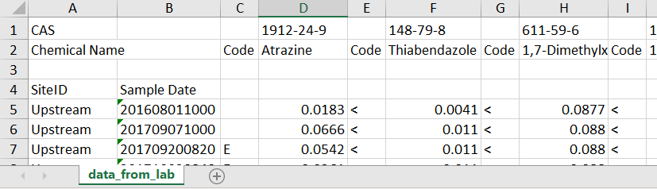

```{r setup, include=FALSE, message=FALSE}
library(knitr)
library(dataRetrieval)
library(dplyr)

options(continue = " ")
options(width = 60)
knitr::opts_chunk$set(
  echo = TRUE,
  warning = FALSE,
  message = FALSE,
  fig.height = 7,
  fig.width = 7
)
```

This article will show an example of how to pivot data from "long" water quality results to a "wide" data frame, and another example of how to convert "wide" data to "long".

Generally "long" data frames are preferred for R analysis. However, there are situations where one needs to make a "wide" table. 

First, what do we mean? Here is an example of a "long" table:

```{r longEx, echo=FALSE}
long <- tibble(site = c(rep("A", 4), rep("B", 4)),
               day = c(rep(c(1, 1, 2, 2), 2)),
               param = c(rep(c("Atrazine", "Metolachlor"), 4)),
               value = c(0.1, 0.25, 0.13, 0.38,
                         0.14, 0.38, 0.15, 0.40))
knitr::kable(long)
```

Here is an example with the exact same data, but instead formatted in a "wide" table:

```{r wideEx, echo=FALSE}
wide <- tidyr::pivot_wider(long, 
                           names_from = param,
                           values_from = value)

knitr::kable(wide)
```

The "long" table has one measurement per row, which means there is an additional column that defines the parameter. The "wide" table on the other hand has many measurements per row, but only 1 date/site.

##  Water quality example: Long to Wide

Let's grab data from 2 sites that measured 2 nutrients.

```{r twoSites}

sites <- c("USGS-04027000", "USGS-04063700")
characteristic_names <- c("Phosphorus as phosphorus, water, filtered",
                          "Orthophosphate as phosphorus, water, filtered" )

nutrient_data <- read_waterdata_samples(monitoringLocationIdentifier = sites,
                                   characteristicUserSupplied = characteristic_names,
                                   dataProfile = "basicphyschem")

```

The data comes back with `r ncol(nutrient_data)` columns, let's pull out the ones we decide are important for our analysis. We'll rename the columns so they are easier to read on the screen, however the rename is not necessary. Your own pivots may need many more columns!

```{r}

nutrient_data_slim <- nutrient_data |> 
  select(date = Activity_StartDateTime,
         site = Location_Identifier,
         param = USGSpcode,
         activity_type = Activity_TypeCode,
         cond = Result_ResultDetectionCondition,
         val = Result_Measure,
         det_va = DetectionLimit_MeasureA,
         units = Result_MeasureUnit,
         det_units = DetectionLimit_MeasureUnitA) |> 
    mutate(val = case_when(!is.na(cond) ~ det_va,
                            TRUE ~ val),
           units = case_when(!is.na(cond) ~ det_units, 
                             TRUE ~ units),
           cond = case_when(!is.na(cond) ~ "<", 
                              .default = "")) |> 
  filter(!is.na(date), 
         activity_type == "Sample - Routine, regular") |> 
  select(-det_units, -det_va, -activity_type)

knitr::kable(head(nutrient_data_slim))

```

For this analysis, each parameter needs individual detection conditions, values, units, and detection limits. Using the `tidyr` package, we can run the `pivot_wider` function and get a table with all the required columns. 

```{r}
library(tidyr)

nutrients_wide <- nutrient_data_slim |> 
  pivot_wider(names_from = c(param, units),
              values_from = c(cond, val))

knitr::kable(head(nutrients_wide))
```

Often users want a table that is sorted by parameter. Interleave columns can be done directly in the pivot using the `build_wider_spec` function. In this example, the columns will come back grouped by parameter and unit:

```{r}
spec <- nutrient_data_slim |> 
  build_wider_spec(
    names_from = c(param), 
    values_from = c(cond, val), 
    names_glue = "{.value}_{param}") |> 
  arrange(param, .value) 

nutrients_wide2 <- nutrient_data_slim |> 
  pivot_wider_spec(spec)

knitr::kable(head(nutrients_wide2))

```

# Wide to Long

It is common for environmental chemistry data to come back from the laboratory in a "wide" format. A wide format typically has a few "header" columns such as site and date with additional columns representing a single chemical per column and possibly a remark code for each chemical as a separate column. The remark column could indicate censored data (ie "below detection limit") or some information about the sampling conditions. 

Let's start with the most simple case, a wide data frame with no remark codes. In this simple example, column "Phosphorus" represents measured phosphorus values, and column "Nitrate" represents measured nitrate values:

```{r easyPeasy}
df_simple <- data.frame(
  site = c("A","A","B","B"),
  date = as.Date(Sys.Date():(Sys.Date()-3),
                 origin = "1970-01-01"),
  Phosphorus = c(1:4),
  Nitrate = c(4:1),
  stringsAsFactors = FALSE
)

```

```{r easyPeasyDisplay, echo=FALSE}
kable(df_simple)
```

The "long" version of this data frame will still have the "site" and "date" columns, but instead of "Phosphorus", "Nitrate" (and potentially many many more...), it will now have "Chemical" and "Value". To do this programatically, we can use the `pivot_longer` function in `tidyr`:

```{r simplePivot}
library(tidyr)
library(dplyr)

df_simple_long <- df_simple %>%
  pivot_longer(cols = c(-site, -date),
               names_to = "Chemical",
               values_to = "Value")

```


```{r simplePivotDisplay, echo=FALSE}
kable(df_simple_long)
```


The "names_to" argument is the name given to the column that is populated from the wide column names (so, the chemical names). The "values_to" is the column name for the values populated from the chemical columns.

Let's make a more complicated wide data that now has the "Phosphorus" and "Nitrate" measured values, but also has "Phosphorus" and "Nitrate" remark codes:

```{r setupData}
df_with_rmks <- data.frame(
  site = c("A","A","B","B"),
  date = as.Date(Sys.Date():(Sys.Date()-3),
                 origin = "1970-01-01"),
  Phosphorus_value = c(1:4),
  Phosphorus_rmk = c("<","","",""),
  Nitrate_value = c(4:1),
  Nitrate_rmk = c("","","","<"),
  stringsAsFactors = FALSE
)


```

```{r setupDataDisplay, echo=FALSE}
kable(df_with_rmks)
```


We can use the "pivot_longer" function again to make this into a long data frame with the columns: site, date, Chemical, value, remark:

```{r pivot1}
library(tidyr)
df_long_with_rmks <- df_with_rmks %>%
  pivot_longer(cols = c(-site, -date),
               names_to = c("Chemical", ".value"),
               names_pattern = "(.+)_(.+)")

```


```{r pivot1Display, echo=FALSE}
kable(df_long_with_rmks)
```


This time, the "names_to" argument is a vector. Since it's going to produce more than a simple name/value combination, we need to tell it how to make the name/value/remark combinations. We do that using the "names_pattern" argument. In this case, `tidyr` is going to look at the column names (excluding site and date...since we negate those in the "cols" argument), and try to split the names by the "\_" separator. This is a very powerful tool...in this case we are saying anything in the first group (on the left of the "\_") is the "Chemical" and every matching group on the right of the "\_" creates new value columns. So with the columns are: Phosphorus_value, Phosphorus_rmk, Nitrate_value, Nitrate_rmk - we get a column of chemicals (Phosphorus & Nitrate), a column of "rmk" values, and a column of "value" values.

What if the column names didn't have the "_value" prepended? This is more common in our raw data:

```{r setupData2}
data_example2 <- data.frame(
  site = c("A","A","B","B"),
  date = as.Date(Sys.Date():(Sys.Date()-3),
                 origin = "1970-01-01"),
  Phos = c(1:4),
  Phos_rmk = c("<","","",""),
  Nitrate = c(4:1),
  Nitrate_rmk = c("","","","<"),
  Chloride = c(3:6),
  Chloride_rmk = rep("",4),
  stringsAsFactors = FALSE
)

```

```{r setupData2Display, echo=FALSE}
kable(data_example2)
```


The easiest way to do that would be to add that "\_value". Keeping in the "tidyverse" (acknowledging there are other base-R ways that work well too for the column renames):

```{r change_names}
library(dplyr)

data_renamed <- data_example2 %>%
  rename_if(!grepl("_rmk", names(.)) &
              names(.) != c("site","date"),
            list(~ sprintf('%s_value', .)))
```


```{r changed_namesDisplay, echo=FALSE}
kable(data_renamed)
```


```{r make_long_again}
data_long_2 <- data_renamed %>%
  pivot_longer(cols = c(-site, -date),
               names_to = c("Chemical", ".value"),
               names_pattern = "(.+)_(.+)")

```

The top 6 rows are now:

```{r make_long_againDisplay, echo=FALSE}
kable(head(data_long_2))
```


## Real-world example

To open an Excel file in R, use the `readxl` package. There are many different configurations of Excel files possible.

As one example, let's say the lab returned the data looking like this:

```{r echo=FALSE}

```


Let's break down the issues:

* Top row contains the CAS
* 2nd row basically contains the useful column headers
* Need to skip a random 3rd row
* 4th row has 2 column headers for the first 2 columns
* The data starts in row 5, in a "wide" format
* The date format is unusual

In this example, we'll work through these spacing and header issues to get us to a wide data frame that we can then pivot to a long data frame as described in the next section.

First, let's just get the data with no column names:

```{r basicData}
library(readxl)
data_no_header <- read_xlsx("Wide_data_example.xlsx",
                            sheet = "data_from_lab",
                            skip = 4, col_names = FALSE)

```

`data_no_header` is now a data frame with accurate types (except for dates...we'll get that later!), but no column names. We know the first 2 columns are site and date, so we can name those easily:

```{r basicDataFirstNames}
names(data_no_header)[1:2] <- c("SiteID", "Sample Date")
```

Now we need to get the CAS values for the column names:

```{r secondPart}
headers <- read_xlsx("Wide_data_example.xlsx",
                     sheet = "data_from_lab",
                     n_max = 1)
# Get rid or first 2 columns:
headers <- headers[,-1:-2]

```

It would be nice to use the first row as the column names in "data_no_header", but then it would be very confusing what "Code" means (since it's repeated). So, let's remove the "Code", and just repeat the chemical names:

```{r cleanupNames}
headers <- headers[,which(as.character(headers[1,]) != "Code")]

chem_names <- as.character(headers[1,])

column_names <- rep(chem_names, each = 2)
column_names <- paste0(column_names, c("_code","_Value"))
head(column_names)
```

Now, we can assign the "column_names" to the "data_no_header":

```{r almostThere}
names(data_no_header)[-1:-2] <- column_names
```

Before we pivot this data to the long format (as described above), let's transform the "Sample Date" column to an R date time format:

```{r dateStuff}
data_no_header$`Sample Date` <- as.POSIXct(data_no_header$`Sample Date`,
                                format = "%Y%m%d%H%M")

```

Now let's pivot this to the long format:

```{r pivotReal}
cleaned_long <- data_no_header %>%
  pivot_longer(cols = c(-SiteID, -`Sample Date`),
               names_to = c("Chemical", ".value"),
               names_pattern = "(.+)_(.+)")

```

The top 6 rows are now:

```{r pivorRealDisplay, echo=FALSE}
kable(head(cleaned_long))
```

## Save to Excel

The package `openxlsx` can be used to export Excel files. Create a named list in R, and each of those parts of the list become a Worksheet in Excel:

```{r finalForm, eval=FALSE}

to_Excel <- list(Data = cleaned_long)

library(openxlsx)
write.xlsx(to_Excel,
           file = "cleanedData.xlsx")

```

# Disclaimer

Any use of trade, firm, or product names is for descriptive purposes only and does not imply endorsement by the U.S. Government.


