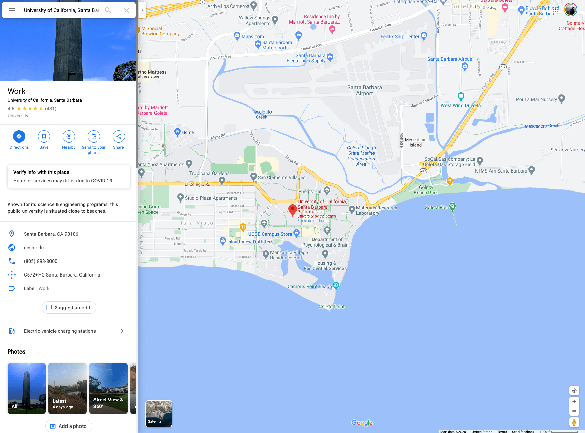
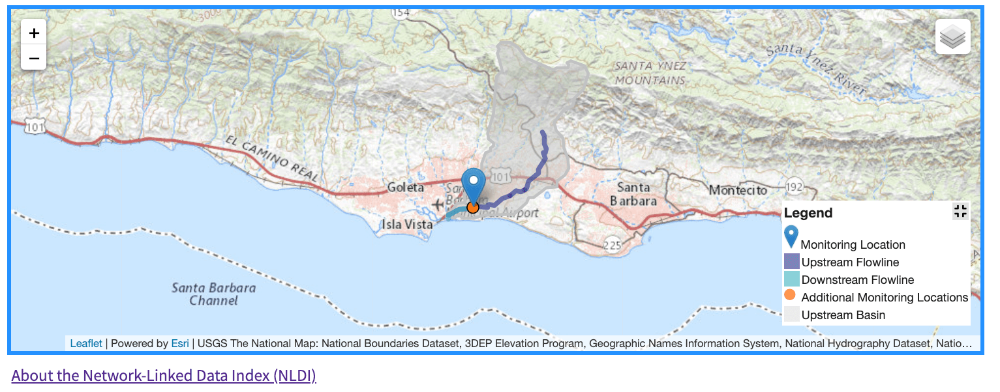

```{r setup, include=FALSE}
library(knitr)
library(dataRetrieval)

opts_chunk$set(warning = FALSE, message = FALSE, out.width = "75%", fig.align = 'center', comment  = "#>")
```

This post will demonstrate `dataRetrieval` functions to query the [Network Linked Data Index](https://labs.waterdata.usgs.gov/about-nldi/index.html) (NLDI).

The NLDI provides a information backbone to navigate the NHDPlusV2 network and discover features indexed to the network. This process of feature discovery is very natural. In fact, many of us use it every day. 

***** 

## Navigation Analogy

Imagine you want to know where UCSB is. For this we might use Google Maps. In asking about the entity 'UCSB' we get information related to the feature (links, operating hours, photos) and things nearby.

<br><br>

```{r, fig.cap = "UCSB via Google Maps",  echo = FALSE}

```
<br><br>

Imagine then that you want to travel from UCSB to UCLA and know you need gas along the way. In Google Maps you might use UCSB at your **origin** and ask for directions to UCLA that include gas stations along your route.

<br><br>
```{r, fig.cap = "Gas stations between UCSB and UCLA",  echo = FALSE}
include_graphics("nldi-gas-station-example.png")
```
<br><br>


The NLDI works in a very similar way allowing users to discover known features, navigate from those along a route, and find other features on that route. The primary difference being navigation occurs over the hydrologic network rather then a transportation network. As such routes are not free-form an instead based on hydrologic topology - that is you can travel "up" or "down" stream.

The NLDI is becoming a more robust (in terms of performance) and ubiquitous tool. Notably it is driving the mapping interface of the of NWIS "Next Generation Station Pages" (see below), and provides a way to interface with "big" data through web-based retrievals. This service is now available as part of the `dataRetrieval` package through the `findNLDI` function.

<br><br>

```{r, fig.cap = "NLDI in the Next Generation Station Pages",echo = FALSE}

```

<br><br>

There are three type of information you can provide the `findNLDI` function to discover hydrologic features and navigate the network,

(1) a feature/origin to discover 
(2) direction(s) to travel from that origin 
(3) features to search for along the navigation 

Each of these is discussed below:

******

# What's available? 

The NLDI works across the NHDPlusV2 network. Features that have been _indexed_ to this network (e.g. _this_ feature is on _that_ flowline) can be found in the same way "UCSB" or the gas stations can be found on a route. Again, only features that have been indexed to the network (or are part of the network) can be discovered. The most current offerings can be found with the `nldi_offerings` function, and new features are regularly being added: 

```{r, message = FALSE, warning=FALSE, eval = FALSE}
library(dataRetrieval)

nldi_offerings()
```

```{r, message = FALSE, warning=FALSE, echo = FALSE}
kable(nldi_offerings())
```

At the time of writing (`r Sys.Date()`), `r nrow(nldi_offerings())` datasets have been indexed to the NHDPlus and cataloged in the NLDI.


# Feature/Origin discovery

Features can be discovered in three broad ways:

(1) a feature _of_ the network
(2) a feature _on_  the network
(3) a spatial location (lng, lat)

### "Of" network features

A network feature is a feature of the NHDPlusV2 defined by the common identifier (COMID) in the NHDPlusV2 dataset. 

The `comid` argument of `findNLDI` can be used to specify a specific COMID. `findNLDI` always returns a named list of data.frames. 
To keep `dataRetrieval` lightweight, the simple features `sf` package is not a dependency. However, if it is installed on your machine, it can be leveraged to create "spatial-ready" outputs. 

```{r message=FALSE}
(c101 = findNLDI(comid = 101))

str(c101)
```

In the above example, the returned object is a `list` of length 1 containing a `data.frame` describing the feature requested (`comid=101`). All NLDI features are have attribute information related to the data source and the identifier within that resource (`sourceName` and `identifer`). 

If `sf` is installed locally, then `sf::read_sf` is used to parse the geojson returned from the NLDI. When this is the case, a `sfc` (simple feature geometry column) column is added to the returned `data.frame`. In the example above, we see the geometry column is of type `LINESTRING` made of 54 points (each with an X and Y coordinate). If a `data.frame` with an `sfc` column is returned it can easily made spatial see the [section](#sf) on sf.

If `sf` is not installed locally - or `no_sf = TRUE` - then only the _sourceName_ ad _identifier_ will be returned for LINESTRING objects.

```{r}
(c101 = findNLDI(comid = 101, no_sf = TRUE))
```

### "On" network features

Features indexed to the NHDPlus are returned as `POINT` objects. If `sf` is enabled, then the _sourceName_, _identifier_, _X_, _Y_ and _geometry_ (`sfc`) are returned. If `sf` is not locally available, the geometry is dropped but the X and Y values are are retained. 

For example we can return the NLDI representation of USGS NWIS gage [11120000](https://waterdata.usgs.gov/monitoring-location/11120000/#parameterCode=00060) in both an `sf` facilitated and "non-sf" way:

```{r}
# local sf installation
findNLDI(nwis = 11120000)

# co
findNLDI(nwis = 11120000, no_sf = TRUE)
```

The core feature set of NLDI include the USGS `NWIS` locations, EPA `WQP` locations, and `HUC12` pour points. Each of these available as arguments in `findNLDI` and can be used to request a feature object. Any NLDI feature can be requested by passing a `type`/`ID` pair as a list to the `origin` argument. This will allow the networking capabilities offered in `dataRetrieval` to grow naturally with the NLDI itself.

For example, we can identify both "core", and "non-core" features using the origin argument:

```{r}
# COMID 101
findNLDI(origin = list("comid" = '101'))

# Water Data Exchange 2.0 Site CA_45206
findNLDI(origin = list("wade" = 'CA_45206'))
```

Again, network features are returned as `LINESTRING`s, indexed features are returned as `POINT`s. If `sf` is enabled, both come with geometries. If `sf` is not enabled, `POINT` objects are returned with their X,Y coordinates and `LINESTRING` (and later `POLYOGON`) geometries only retain the source and ID.

### Location (longitude/latitude)

If you don't know a network or feature ID, a `longitude`/`latitude` (XY) pair can be passed to the `location` argument as a numeric vector (length 2). Doing so will identify the NHDPlus catchment the coordinates fall within and will returned the associated NHDPlusV2 flowline feature.

```{r}
findNLDI(location = c(-115, 40))
```

# Navigation

From any feature (`comid`, `huc12`, `nwis`, `wqp`,`origin`) or `location`, four modes of navigation are available including: 

(1) **UT**: Upper Tributary
(2) **UM**: Upper Mainstream
(3) **DM**: Downstream Tributary
(4) **DD**: Downstream Diversions

A example view of these navigation types can be seen below for NWIS site 11109000.

```{r, echo = FALSE, fig.cap= "NLDI Navigation Options"}
library(ggplot2)
library(dplyr)

x = findNLDI(nwis = 11109000, nav = c("UT", "DM", "UM", "DD")) %>% 
  lapply(sf::st_as_sf)

ggplot() +
  geom_sf(data = x$UT, aes(color = "UT")) +
  geom_sf(data = x$UM,  aes(color  = "UM")) +
  geom_sf(data = x$DD,  aes(color = "DD")) +
  geom_sf(data = x$DM,   aes(color = "DM")) + 
  geom_sf(data = x$origin, col = "green", size = 2) + 
  geom_sf_label(data = x$origin, aes(label = x$origin$identifier),
                nudge_x = -.08,
                nudge_y = .03,) + 
  theme_void() + 
  scale_color_manual(name = "Navigation Direction",
                        breaks = c("UT", "UM", "DD", "DM"),
                        values = c(UT = "blue", "UM" = "red", "DM" = "orange", "DD" = "purple") ) + 
  theme(
           legend.position = c(.05, .7), 
      legend.justification = c(0, 0)
  )
  
```


One or more modes of navigation can be supplied to the `findNLDI` `nav` argument. For example we can ask to navigate along the upper mainstem from COMID 101.

```{r}
str(findNLDI(comid = 101, nav = "UM"), max.level = 2)
```

Here the returned named list includes the origin (comid 101, with sourceName, identifier, and  geometry) and the upper mainstem (UM) which is comprised of 14 NHDPlus features (each with an identifier and `LINESTRING` geometry).

More then one navigation direction can be requested, for example, the upper mainstem _and_ upper tributary of COMID 101.

```{r}
str(findNLDI(comid = 101, nav = c("UM", "DM")), max.level = 1)
```

Here, in addition the features above, we have added the downward mainstem to the returned list which is comprised of 156 NHDPlus features (each with an identifier and `LINESTRING` geometry).

# Searching along the Route

With a route defined by an origin and a direction(s), related features can be discovered. Two types of features can be discovered including indexed features and the upstream basin boundary of the origin feature. The set of the desired features can be passed to the `findNLDI` `find` argument as a vector.

### Finding indexed features

Any of the features listed in `nlid_offerings` can be found, for example, we can find all NWIS gages, on the upper tributary, of COMID 101.

```{r}
str(findNLDI(comid = 101, nav = "UT", find = "nwis"), max.level = 1)
```

Here the returned list again includes the origin feature, the navigated network, and now the identified NWIS sites on the UT navigation (7 in total). 

More than one resource can be requested, for example, lets replicate the previous search, this time adding Water Quality Points to the returned list:

```{r}
str(findNLDI(comid = 101, nav = "UT", find = c("nwis", "wqp")), max.level = 1)
```

In total we find 167 WQP along the upper tributary of comid 101.

### Basin

The Upstream Basin Boundary of any features can be found by adding "basin" to the vector of objects to find. Returned basins are only geometries and do not have specific attribute data. Therefore basins can only be returned if `sf` is installed locally. If it is not, the result will be a 0 column `data.frame`

```{r}
# with sf
str(findNLDI(comid = 101, find = "basin"))
```

```{r}
# No sf
str(findNLDI(comid = 101, find = "basin", no_sf = TRUE))
```

### Distance Control

In some cases, particularly for DM and DD navigation, the network can extend for hundreds of kilometers. You can limit the distance of your search using the `distance_km` argument. As the name implies the value provided should be the maximum kilometers you want to search for features along.

To illustrate, lets search the downstream mainstem for COMID 101 with and without a distance threshold:

```{r}
str(findNLDI(comid = 101, nav = "DM", find = c("nwis", "wqp")), max.level = 1)
str(findNLDI(comid = 101, nav = "DM", find = c("nwis", "wqp"), distance_km = 100), max.level = 1)
```

The result, is that the navigation path and the number of returned features in the second request have been reduced as expected.

# Basic `sf` integration {#sf}

While not necessary having a local install of `sf` will enhance the usability of the NLDI data:

```{r, eval = FALSE}
install.packages('sf')
```


We've seen the NLDI wrapper can provide `sf` "ready" objects if `sf` is installed. If you want to work with the spatial representations you can do so using the `sf::st_as_sf` to convert your list of `data.frame`s to a list of spatial `sf` features. For this `lapply` is a helpful tool:  

```{r}
library(sf)
query <- findNLDI(nwis = '11120000', nav = c("UT", "UM"), find = c("nwis", "wqp", "basin"))
features  <- lapply(query, st_as_sf)
```

Doing so allows for spatial as simple as length, area, and plotting, or more complex calculations. 

```{r, fig.cap = "NLDI Spatial Feature map"}
plot(features$basin, border = "black", lwd = 4)
plot(features$UT$geometry, col = "blue", add = TRUE)
plot(features$UM$geometry, col = "red", lwd = 3, add = TRUE)
plot(features$origin, col = "orange", lwd = 4, add = TRUE)

plot(features$UM_WQP, col = "purple", pch = 16,,cex = .5, add = TRUE)
plot(features$UT_nwissite, col = "darkgreen", pch = 16,  add = TRUE)
```

# Basic `dataRetrieval` integration

Last, as this functionality is being added to the `dataRetrieval` package, lets see a basic example of how the NLDI tools provide a discovery mechanism for working with the NWIS data retrieval tools. Here we will take a location that is near [Fountain Creek in Colorado Springs, Colorado](https://www.google.com/maps/place/Colorado+Springs,+CO/@38.7864572,-104.7829507,17z).

In this example we will use that location as the origin, activate upstream along the mainstem, and search for NWIS gages. We will then make all returned features spatial and use the identified upstream NWIS ids to query streamflow records for from January 1^st^ 2020 to the current data. 

From this data will will make a side by side hydrograph and map of the basin.

```{r, fig.cap = "Integrating the NLDI and NWIS data retrieval systems"}
library(gridExtra)

# Spatial upstream nwis, basin
fountainCreek <- findNLDI(location = c(-104.780837, 38.786796), 
                          nav = "UM", 
                          find = c("nwis", "basin")) %>% 
  lapply(st_as_sf)


Q <- readNWISdv(fountainCreek$UM_nwissite$identifier, 
                parameterCd = "00060", 
                startDate = "2020-01-01") %>% 
  renameNWISColumns()

hydro <- ggplot() + 
  geom_line(data = Q, aes(x = Date, y = Flow, col = site_no), size = .5) + 
  facet_wrap(~site_no, nrow = 4) + 
  theme_linedraw() + 
  scale_color_brewer(palette = "Set1") +
  theme(legend.position = "none")

map <- ggplot() + 
  geom_sf(data = fountainCreek$basin, col = NA) + 
  geom_sf(data = fountainCreek$UM, col = "blue", alpha = .5) + 
  geom_sf(data = fountainCreek$UM_nwissite, aes(col = identifier)) + 
  scale_color_brewer(palette = "Set1") +
  theme_void() +
  labs(title = "2020 Streamflow",
       caption = "Fountain Creek, Colorado") + 
  theme(legend.position = "none",
         plot.title = element_text(face = "bold", hjust = .5))

grid.arrange(hydro, map, nrow = 1)
```


