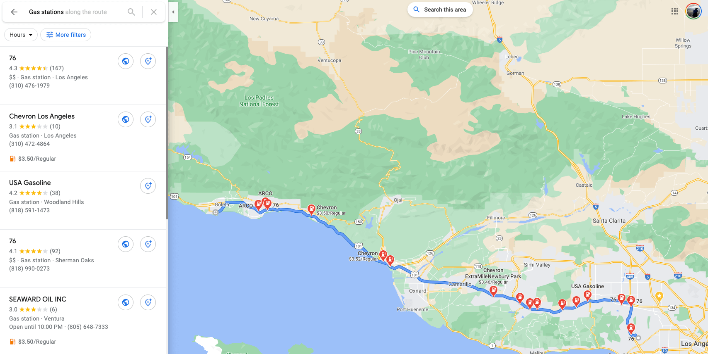

```{r setup, include=FALSE}
library(knitr)
library(dataRetrieval)

opts_chunk$set(warning = FALSE, 
               message = FALSE, 
               out.width = "75%",
               fig.align = 'center',
               comment  = "#>")
```

This post will demonstrate `dataRetrieval` functions to query the [Network Linked Data Index](https://labs.waterdata.usgs.gov/about-nldi/index.html) (NLDI).

The NLDI provides a information backbone to navigate the NHDPlusV2 network and discover features indexed to the network. This process of feature discovery is very natural and mirrors web-based navigation tools like Google Maps, OpenStreetMap, and HERE.

***** 

## Navigation Analogy

Imagine you want to know where UCSB is. For this we might use Google Maps. In asking about the entity 'UCSB' we get information related to the feature (links, operating hours, photos) and things nearby.

<br><br>

```{r, fig.cap = "UCSB via Google Maps",  echo = FALSE}
knitr::include_graphics("ucsb.png")
```
<br><br>

Imagine then that you want to travel from UCSB to UCLA and know you need gas along the way. In Google Maps you might use UCSB at your **origin** and ask for directions to UCLA that include gas stations along your route.

<br><br>
```{r, fig.cap = "Gas stations between UCSB and UCLA",  echo = FALSE}

```
<br><br>

The NLDI works to provide the same functionality for the hydrologic network allowing users to _discover_ known features, _navigate_ from those along a route, and _find_ other features on that route. The primary difference being navigation occurs over the hydrologic network rather then a transportation network. This service is now available as part of the `dataRetrieval` package through the `findNLDI` function.

Like any routing service, there are three types of information you can provide `findNLDI`. These include:

(1) a feature to discover 
(2) direction(s) to travel from that feature 
(3) types of features to search for along the way 

Each of these is discussed below:

******

# What's available? 

First, we need to know what features are currently indexed in the NLDI. The NLDI works across the NHDPlusV2 network and features that have been _indexed_ to this network (e.g. _this_ feature is on _that_ flowline) can be found in the same way "UCSB" or the gas stations can be found on a route. 

Only features that have been indexed to the network (or are part of the network) can be discovered. The most current offerings can be found using `get_nldi_sources`, and new features are regularly being added: 

```{r, eval = FALSE}
library(dataRetrieval)

get_nldi_sources()
```

```{r, echo = FALSE}
kable(get_nldi_sources())
```


At the time of writing (`r Sys.Date()`), `r nrow(get_nldi_sources())` datasets have been indexed to the NHDPlus and cataloged in the NLDI.

******

# Feature/Origin discovery

Features can be discovered in three broad ways:

(1) a feature _of_ the network
(2) a feature _on_  the network
(3) a spatial location (lng, lat)

### "Of" network features

A network feature is a hydrographic feature of the NHDPlusV2, defined by an NHDPlusV2 common identifier (COMID). 

The `comid` argument of `findNLDI` can be used to specify a specific COMID. `findNLDI` always returns a named list of `data.frames`. 
To keep `dataRetrieval` lightweight, the simple features `sf` package is not a dependency. However, if it is installed on your machine, it can be leveraged to create "spatial-ready" outputs. 

```{r message=FALSE}
c101 = findNLDI(comid = 101)
```

In the above example, the returned object is a `list` of length 1 containing a `data.frame` describing the feature requested (`comid=101`). All NLDI features have attribute information related to the data source and the identifier within that resource (`sourceName` and `identifer`). If `sf` is installed locally, an `sfc` (simple feature geometry column) column is added to the returned `data.frame`. 

```{r}
str(c101)
```

In the example above, we see the geometry column is of type `LINESTRING` and made of 54 points (each with an X and Y coordinate). 

If `sf` is not installed locally - or `no_sf = TRUE` - then only the _sourceName_ and _identifier_ will be returned for `LINESTRING` objects.

```{r}
c101 = findNLDI(comid = 101, no_sf = TRUE)
```

### "On" network features

Features indexed to the NHDPlus are returned as `POINT` objects. If `sf` is enabled,  the _sourceName_, _identifier_, _X_, _Y_ and _geometry_ (`sfc`) are returned. If `sf` is not locally available, the _geometry_ is dropped but the _X_ and _Y_ values are are retained. 

The core feature set of the NLDI include the USGS `NWIS` locations, `WQP` locations, and `HUC12` pour points. Each of these are available as arguments in `findNLDI` and can be used to request a feature object. For example, we can request the NLDI representation of USGS NWIS gage [11120000](https://waterdata.usgs.gov/monitoring-location/11120000) in both a `sf` and "non-sf" way:

```{r}
# local sf installation
findNLDI(nwis = "11120000")

# No sf use/installation
findNLDI(nwis = "11120000", no_sf = TRUE)
```

****

Any NLDI feature found with `get_nldi_source` can be requested by passing a `type`/`ID` pair as a list to the `origin` argument. This will allow the networking capabilities offered in `dataRetrieval` to grow naturally with the NLDI itself. For example, we can use the origin argument to identify both "core" and "non-core" datasets:

```{r}
# COMID 101
findNLDI(origin = list("comid" = '101'))

# Water Data Exchange 2.0 Site CA_45206
findNLDI(origin = list("wade" = 'CA_45206'))
```

Again, network features are returned as `LINESTRING`s, indexed features are returned as `POINT`s. If `sf` is enabled, both come with geometries. If `sf` is not enabled, `POINT` objects are returned with their X,Y coordinates and `LINESTRING` geometries only retain the _sourceName_ and _identifier_.

### Location (longitude/latitude)

If you don't know a network or feature identifier, a `longitude`/`latitude` (XY) pair can be passed to the `location` argument as a numeric vector (length 2). Doing so will identify the NHDPlus catchment the coordinates fall within and will return the associated NHDPlusV2 flowline feature.

```{r}
findNLDI(location = c(-115, 40))
```

# Navigation

From any feature (`comid`, `huc12`, `nwis`, `wqp`,`origin`) or `location`, four modes of navigation are available and include: 

(1) **UT**: Upper Tributary
(2) **UM**: Upper Mainstream
(3) **DM**: Downstream Tributary
(4) **DD**: Downstream Diversions

A example view of these navigation types can be seen below for NWIS site [11109000](https://waterdata.usgs.gov/monitoring-location/11109000).

```{r, echo = FALSE, fig.cap= "NLDI Navigation Options"}
library(ggplot2)

x = lapply(findNLDI(nwis = 11109000,
                    nav = c("UT", "DM", "UM", "DD")),
           sf::st_as_sf)

ggplot() +
  geom_sf(data = x$UT, aes(color = "UT")) +
  geom_sf(data = x$UM,  aes(color  = "UM")) +
  geom_sf(data = x$DD,  aes(color = "DD")) +
  geom_sf(data = x$DM,   aes(color = "DM")) + 
  geom_sf(data = x$origin, col = "green", size = 2) + 
  geom_sf_label(data = x$origin, 
                aes(label = x$origin$identifier),
                nudge_x = -.08,
                nudge_y = .03) + 
  theme_void() + 
  scale_color_manual(name = "Navigation Direction",
                     breaks = c("UT", "UM", "DD", "DM"),
                     values = c("UT" = "blue", 
                                "UM" = "red", 
                                "DM" = "orange", 
                                "DD" = "purple")) + 
  theme(legend.position = c(.05, .7), 
        legend.justification = c(0, 0))
  
```


One or more modes of navigation can be supplied to the `findNLDI` `nav` argument. For example we can ask to navigate along the upper mainstem from COMID 101.

```{r}
str(findNLDI(comid = 101,
             nav = "UM"), 
    max.level = 2)
```

Or along the upper mainstem _and_ upper tributary of COMID 101.

```{r}
str(findNLDI(comid = 101, 
             nav = c("UM", "DM")), 
    max.level = 1)
```

In both cases the returned named list includes the origin and the requested navigation. If `sf` is not enabled, the returned object for a flowpath navigation is a vector of COMIDs.

```{r}
str(findNLDI(comid = 101, 
             nav = c("UM", "DM"), no_sf = TRUE),
    max.level = 1)
```


# Searching along the Navigation

Two types of features can be discovered along a navigation including indexed features and the upstream basin boundary of the origin feature. The desired feature(s) can be passed as a vector to the `find` argument.

### Finding Features

Any of the features listed in `get_nldi_sources` can be searched for along the network, for example, we can find all NWIS gages, on the upper tributary, of COMID 101.

```{r}
str(findNLDI(comid = 101,
             nav = "UT", find = "nwis"), 
    max.level = 1)
```

Here the returned list includes the origin feature, the navigated network, and the identified NWIS sites on the UT navigation (2 in total). 

More than one resource can be requested, for example, lets replicate the previous search, this time adding Water Quality Points to the returned list:

```{r}
str(findNLDI(comid = 101,
             nav = "UT",
             find = c("nwis", "wqp")),
    max.level = 1)
```

In total we find 29 WQP along the upper tributary of comid 101.

### Upstream Basin Boundary

The Upstream Basin Boundary of any features can be found by adding "basin" to the vector of objects to find. Returned basins are only geometries and do not have specific attribute data. Therefore basins can only be returned if `sf` is installed locally. If it is not, the result will be a 0 column `data.frame`

```{r}
# with sf
str(findNLDI(comid = 101, find = "basin"))
```

```{r}
# No sf
str(findNLDI(comid = 101, find = "basin", no_sf = TRUE))
```

### Distance Constraints

In some cases, particularly for DM and DD navigation, the network can extend for hundreds of kilometers. You can limit or extend the distance of your search using the `distance_km` argument. As the name implies the value provided should be the maximum kilometers you want to search for features. The default for `distance_km` is 100.

To illustrate, lets search the downstream mainstem for COMID 101 with a varying distance threshold:

```{r}
# Default 100 km
str(findNLDI(comid = 101, nav = "DM",
             find = c("nwis", "wqp")),
    max.level = 1)

# Extended 200 km search
str(findNLDI(comid = 101, nav = "DM", 
             find = c("nwis", "wqp"), 
             distance_km = 200),
    max.level = 1)
```

The result, is that the navigation path and the number of returned features in the second request have expanded as expected.

# Basic `sf` integration {#sf}

While not necessary, having a local installation of [`sf`](https://r-spatial.github.io/sf/index.html) will enhance the usability of the NLDI data:

```{r, eval = FALSE}
install.packages('sf')
```


We've seen the NLDI wrapper can provide `sf` "ready" objects if `sf` is installed. If you want to work with the spatial representations you can do so using the [`sf::st_as_sf`](https://r-spatial.github.io/sf/reference/st_as_sf.html) to convert your list of `data.frame`s to a list of spatial `sf` features. For this [`lapply`](https://www.rdocumentation.org/packages/base/versions/3.6.2/topics/lapply) is a helpful tool:  

```{r}
library(sf)
query <- findNLDI(nwis = '11120000', 
                  nav = c("UT", "UM"), 
                  find = c("nwis", "wqp", "basin"))
features  <- lapply(query, st_as_sf)
```

Doing so allows for spatial as simple as length, area, and plotting, or more complex calculations. 

```{r, fig.cap = "NLDI Spatial Feature map"}
plot(features$basin, border = "black", lwd = 4)
plot(features$UT$geometry, col = "blue", add = TRUE)
plot(features$UM$geometry, col = "red", lwd = 3, add = TRUE)
plot(features$origin$geometry, col = "orange", 
     lwd = 4, add = TRUE)
plot(features$UM_WQP$geometry, col = "purple", 
     pch = 16, cex = .5, add = TRUE)
plot(features$UT_nwissite$geometry, col = "darkgreen", 
     pch = 16,  add = TRUE)
```

# Basic `dataRetrieval` integration

Last, as this functionality is being added to the `dataRetrieval` package, lets see a basic example of how the NLDI tools provide a discovery mechanism for working with the NWIS data retrieval tools. Here we will take a location that is near [Fountain Creek in Colorado Springs, Colorado](https://www.google.com/maps/place/Colorado+Springs,+CO/@38.7864572,-104.7829507,17z).

In this example we will use that location as the origin, navigate upstream along the mainstem, and search for NWIS gages. We will then make all returned features spatial and use the identified upstream NWIS siteIDs to query streamflow records for from January 1^st^ 2020 to the current data. 

```{r, fig.cap = "Integrating NLDI and NWIS data retrieval tools"}
library(gridExtra)

# Spatial upstream nwis, basin
fountainCreek <- findNLDI(location = c(-104.780837, 38.786796), 
                          nav = "UM", 
                          find = c("nwis", "basin")) %>% 
  lapply(st_as_sf)

# Extract Streamflow for identified sites
Q <- readNWISdv(fountainCreek$UM_nwissite$identifier, 
                parameterCd = "00060", 
                startDate = "2020-01-01") %>% 
  renameNWISColumns()

# Plot! 
hydro <- ggplot() + 
  geom_line(data = Q, aes(x = Date, y = Flow, col = site_no),
            size = .5) + 
  facet_wrap(~site_no, nrow = 4) + 
  theme_minimal() + 
  scale_color_brewer(palette = "Set1") +
  theme(legend.position = "none")

map <- ggplot() + 
  geom_sf(data = fountainCreek$basin, col = NA) + 
  geom_sf(data = fountainCreek$UM, col = "blue", alpha = .5) + 
  geom_sf(data = fountainCreek$UM_nwissite, 
          aes(col = identifier)) + 
  scale_color_brewer(palette = "Set1") +
  theme_void() +
  labs(title = "2020 Streamflow",
       caption = "Fountain Creek, Colorado") + 
  theme(legend.position = "none",
         plot.title = element_text(face = "bold", hjust = .5))

grid.arrange(hydro, map, nrow = 1)
```


