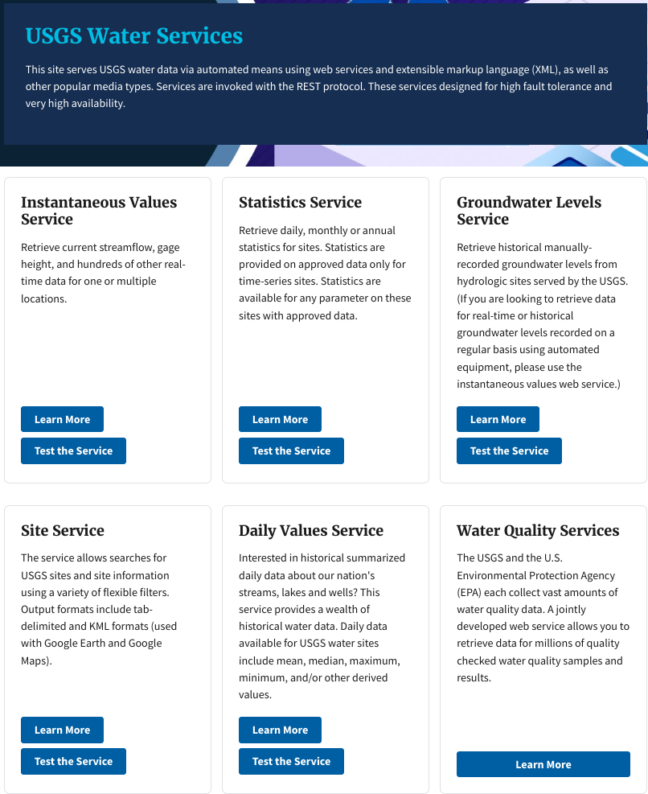

```{r setup, include=FALSE}
knitr::opts_chunk$set(
  echo = FALSE,
  message = FALSE,
  warning = FALSE,
  fig.height = 7,
  fig.width = 7
)
library(dplyr)
```

This article will describe the R-package "dataRetrieval" which simplifies the process of finding and retrieving water data from the U.S. Geological Survey and other agencies.

# Package Overview

`dataRetrieval` is available on Comprehensive R Archive Network (CRAN).

```{r echo=TRUE, eval=FALSE}
install.packages("dataRetrieval")
```

Once the `dataRetrieval` package has been installed, it needs to be loaded in order to use any of the functions:

```{r echo=TRUE, eval=TRUE}
library(dataRetrieval)
```

There are several vignettes  included within the `dataRetrieval` package. The following command will open the main package introduction:

```{r echo=TRUE, eval=FALSE}
vignette("dataRetrieval", package = "dataRetrieval")
```

Additionally, each function has a help file. These can be accessed by typing a question mark, followed by the function name in the R console:

```{r echo=TRUE, eval=FALSE}
?readNWISuv
```

Each function's help file has working examples to demonstrate the usage. The examples may have comments "## Not run". These examples CAN be run, they just are not run by the CRAN maintainers due to the external service calls.

Finally, if there are still questions that the vignette and help files don't answer, please post an issue on the `dataRetrieval` GitHub page:

[https://github.com/USGS-R/dataRetrieval/issues](https://github.com/USGS-R/dataRetrieval/issues)

# Orientation

`dataRetrieval` provides US water data via 2 sources: National Water Information System (NWIS) and Water Quality Portal (WQP). WQP is the service for all discrete water quality data (USGS and other). NWIS is the service for all other hydrologic data in `dataRetrieval`.

Functions in `dataRetrieval` look like `readNWISdv`, `readNWISuv`, `readWQPqw`, `whatNWISdata`, etc. What does that mean? The functions are generally structured with a prefix, middle, and suffix:

* Prefix: "read" or "what"
    + Functions that start with "read" will get full data sets
    + Functions that start with "what" will get data availability
* Middle: "NWIS" or "WQP":
    + NWIS functions get data from NWIS web services.
    + WQP functions are for all discrete water-quality data
* Suffix: "data" or other:
    + Functions that end in "data": These are flexible, powerful functions that allow complex user queries.
    + Functions that don't end with "data" are user-friendly functions that assume site, code, and start/end dates are known.

USGS water data comes from the National Water Information System (NWIS). As of March 2024, all discrete water quality USGS data should be obtained from the [Water Quality Portal](https://www.waterqualitydata.us/) (WQP). WQP retrievals will be covered below. Lots of changes are happening with USGS water quality data and Water Quality Portal data formatting. For current information, see the status page:

[Water Quality Status Page](https://doi-usgs.github.io/dataRetrieval/articles/Status.html)

# National Water Information System (NWIS) 

There are many types of data served from NWIS. To understand how the services are separated, it's helpful to understand the terms here:

```{r}
df <- data.frame(
  Type = c("Unit", "Daily", "Discrete"),
  Description = c(
    "Regular frequency data reported from a sensor (e.g. 15 minute interval). This data can include 'real-time' data",
    "Data aggregated to a daily statistic such as mean, min, or max.",
    "Data collected at non-regular times."
  ),
  service = c(
    "uv (or iv)", "dv",
    "groundwater (gwlevel), rating curves (rating), peak flow (peak), surfacewater (meas)"
  )
)

knitr::kable(df)
```


## USGS Basic Retrievals

The USGS uses various codes for basic retrievals. These codes can have leading zeros, therefore they need to be a character ("01234567").

* Site ID (often 8 or 15-digits)
* Parameter Code (5 digits)
    + Full list: `readNWISpCode("all")`
* Statistic Code (for daily values)
    + Full list:
    + <http://help.waterdata.usgs.gov/code/stat_cd_nm_query?stat_nm_cd=%25&fmt=html/>


Here are some examples of a few common parameter codes:


```{r echo=FALSE, eval=TRUE}
library(knitr)

df <- data.frame(
  pCode = c("00060", "00065", "00010", "00400"),
  shName = c("Discharge", "Gage Height", "Temperature", "pH")
)

names(df) <- c("Parameter Codes", "Short Name")

knitr::kable(df)
```


```{r echo=FALSE, eval=TRUE}
df <- data.frame(
  pCode = c("00001", "00002", "00003", "00008"),
  shName = c("Maximum", "Minimum", "Mean", "Median")
)

names(df) <- c("Statistic Codes", "Short Name")

knitr::kable(df)
```


Use the `readNWISpCode` function to get information on USGS parameter codes. You can use "all" to get a full list. Then use your favorite data analysis methods to pull out what you need. Here is one example to find all the phosphorous parameter codes:

```{r echo=TRUE, eval=TRUE}
pcode <- readNWISpCode("all")

phosCds <- pcode[grep("phosphorus",
  pcode$parameter_nm,
  ignore.case = TRUE
), ]

```

Explore the wide variety of parameters that contain "phosphorus" in the parameter_nm:

```{r echo=FALSE, eval=TRUE}
library(DT)
datatable(phosCds[, c("parameter_cd", "parameter_nm", "parameter_units")],
  rownames = FALSE, options = list(pageLength = 4)
)
```

### User-friendly retrievals: NWIS

Sometimes, you know exactly what you want. If you know:

1. The type of data (groundwater, unit values, daily values,  etc..)
2. USGS site number(s)
3. USGS parameter code(s)
4. Time frame (start and end date)

You can use the "user-friendly" functions. These functions take the same 4 inputs (sites, parameter codes, start date, end date), and deliver data from the different NWIS services:

```{r echo=FALSE, eval=TRUE}

df <- data.frame(
  functionName = c(
    "readNWISuv", "readNWISdv",
    "readNWISgwl", "readNWISmeas", "readNWISpeak",
    "readNWISrating", "readNWISuse",
    "readNWISstat"
  ),
  service = c(
    "Unit", "Daily", "Groundwater Level",
    "Surface-water", "Peak Flow",
    "Rating Curves",
    "Water Use", "Statistics"
  ),
  stringsAsFactors = FALSE
)

names(df) <- c("Function Name", "Data")

knitr::kable(df)
```

Let's start by asking for discharge (parameter code = 00060) at a site right next to the old USGS office in Wisconsin (Pheasant Branch Creek). 

```{r echo=TRUE, eval=TRUE}
siteNo <- "05427948"
pCode <- "00060"
start.date <- "2017-10-01"
end.date <- "2018-09-30"

pheasant <- readNWISuv(
  siteNumbers = siteNo,
  parameterCd = pCode,
  startDate = start.date,
  endDate = end.date
)
```

From the Pheasant Creek example, let's look at the data. The column names are:

```{r echo=TRUE, eval=TRUE}
names(pheasant)
```


The names of the columns are based on the parameter and statistic codes. In many cases, you can clean up the names with the convenience function `renameNWISColumns`:

```{r echo=TRUE, eval=TRUE}
pheasant <- renameNWISColumns(pheasant)
names(pheasant)
```

The returned data also has several attributes attached to the data frame. To see what the attributes are:

```{r echo=TRUE, eval=TRUE}
names(attributes(pheasant))
```

Each `dataRetrieval` return should have the attributes: url, siteInfo, and variableInfo. Additional attributes are available depending on the data service.

To access the attributes:

```{r echo=TRUE, eval=TRUE}
url <- attr(pheasant, "url")
url
```

[Raw Data](`r url`)

Make a simple plot to see the data:

```{r echo=TRUE, eval=TRUE, fig.height=3.5}
library(ggplot2)
ts <- ggplot(
  data = pheasant,
  aes(dateTime, Flow_Inst)
) +
  geom_line()
ts
```

Then use the attributes attached to the data frame to create better labels:


```{r echo=TRUE, eval=TRUE, fig.height=3.5}
parameterInfo <- attr(pheasant, "variableInfo")
siteInfo <- attr(pheasant, "siteInfo")

ts <- ts +
  xlab("") +
  ylab(parameterInfo$variableDescription) +
  ggtitle(siteInfo$station_nm)
ts
```

## Known USGS site, unknown service/pcode

The most common question the dataRetrieval team gets is:

"I KNOW this site has data but it's not coming out of dataRetrieval! Where's my data?"

The best way to verify you are calling your data correctly, use the `whatNWISdata` function to find out the data_type_cd (which will tell you the service you need to call), the parameter/stat codes available at that site, and the period of record. All rows that have "qw" in the column data_type_cd will come from the Water Quality Portal. 

```{r echo=TRUE}
library(dplyr)

site <- "05407000"
data_available <- whatNWISdata(siteNumber = site) 

data_available_NWIS <- data_available |> 
  select(data_type_cd, parm_cd, stat_cd, 
         begin_date, end_date, count_nu) |> 
  filter(!data_type_cd %in% c("qw", "ad")) |> 
  arrange(data_type_cd)
```

This is the only available data from NWIS for site `r site`. 

```{r echo=FALSE}
datatable(data_available_NWIS,
  rownames = FALSE, options = list(pageLength = 20,
                                   lengthChange = FALSE,
                                   searching = FALSE,
                                   paging = FALSE)
)

```

The data_type_cd can be used to figure out where to request data:

```{r echo=FALSE}
df <- data.frame(data_type_cd = c("dv", "uv", "pk", "sv", "gwl"),
                 readNWIS = c("readNWISdv", "readNWISuv",
                                "readNWISpeak", "readNWISmeas", "readNWISgwl"),
                 readNWISdata = c('readNWISdata(..., service = "dv")',
                                  'readNWISdata(..., service = "iv")',
                                  'readNWISdata(..., service = "peak")',
                                  'Not available',
                                  'readNWISdata(..., service = "gwlevels")'))
knitr::kable(df)
```
So to get all the NWIS data from the above site:

```{r eval=FALSE, echo=TRUE}
dv_pcodes <- data_available_NWIS$parm_cd[data_available_NWIS$data_type_cd == "dv"]
stat_cds <- data_available_NWIS$stat_cd[data_available_NWIS$data_type_cd == "dv"]

dv_data <- readNWISdv(siteNumbers = site,
                      parameterCd = unique(dv_pcodes),
                      statCd = unique(stat_cds))

uv_pcodes <- data_available_NWIS$parm_cd[data_available_NWIS$data_type_cd == "uv"]

uv_data <- readNWISuv(siteNumbers = site,
                      parameterCd = unique(uv_pcodes))

peak_data <- readNWISpeak(site)

```

# Water Quality Portal (WQP)

`dataRetrieval` also allows users to access data from the [Water Quality Portal](http://www.waterqualitydata.us/). The WQP houses data from multiple agencies; while USGS data comes from the NWIS database, EPA data comes from the STORET database (this includes many state, tribal, NGO, and academic groups). The WQP brings data from all these organizations together and provides it in a single format that has a more verbose output than NWIS. 

The single user-friendly function is `readWQPqw`. This function will take a site or vector of sites in the first argument "siteNumbers". USGS sites need to add "USGS-" before the site number. 

The 2nd argument "parameterCd". Although it is called "parameterCd", it can take EITHER a USGS 5-digit parameter code OR a characterisitc name (this is what non-USGS databases use). Leaving "parameterCd" as empty quotes will return all data for a site. 

So we could get all the water quality data for site `r site` like this:

```{r eval=FALSE, echo=TRUE}
qw_data_all <- readWQPqw(siteNumbers = paste0("USGS-", site),
                     parameterCd = "")
```

or 1 parameter code:

```{r eval=FALSE, echo=TRUE}
qw_data_00095 <- readWQPqw(siteNumbers = paste0("USGS-", site),
                           parameterCd = "00095")
```

or 1 characteristic name:

```{r eval=FALSE, echo=TRUE}
qw_data_sp <- readWQPqw(siteNumbers = paste0("USGS-", site),
                           parameterCd = "Specific conductance")
```


#  Discover Data

This is all great when you know your site numbers. What do you do when you don't?

There are 2 `dataRetrieval` functions that help with discover in NWIS:

*  `whatNWISsites` finds sites within a specified filter (quicker)
*  `whatNWISdata` summarizes the data within the specified filter (more information)

And 2 functions that help with discover in WQP:

*  `readWQPsummary` summarizes the data available within the WQP by year.
*  `whatWQPdata` summarizes the data available within the WQP.

There are several ways to specify the requests. The best way to discover how flexible the USGS web services are is to click on the links and see all of the filtering options:
[http://waterservices.usgs.gov/](http://waterservices.usgs.gov/)

```{r echo=FALSE, out.width = "500px"}

```

Available geographic filters are individual site(s), a single state, a bounding box, or a HUC (hydrologic unit code). See examples for those services by looking at the help page for the `readNWISdata` and `readWQPdata` functions:

Here are a few examples:

```{r eval=FALSE}
# Daily temperature in Ohio
dataTemp <- readNWISdata(
  stateCd = "OH",
  parameterCd = "00010",
  service = "dv"
)

# Real-time discharge at a site
instFlow <- readNWISdata(
  sites = "05114000",
  service = "iv",
  parameterCd = "00060",
  startDate = "2014-05-01T00:00Z",
  endDate = "2014-05-01T12:00Z",
  tz = "America/Chicago"
)

# Temperature within a bounding box:
bBoxEx <- readNWISdata(
  bBox = c(-83, 36.5, -81, 38.5),
  parameterCd = "00010"
)

# Groundwater levels within a HUC:
groundwaterHUC <- readNWISdata(
  huc = "02070010",
  service = "gwlevels"
)
```
  

### Arizona Example

For example, let's see which sites ever measured phosphorus at least 100 times over at least 20 years in Arizona. Water quality data is exclusively found in WQP functions. 

```{r az, echo=TRUE}
AZ_sites <- readWQPsummary(
  statecode = "AZ",
  siteType = "Stream"
)

az_phos_summary <- AZ_sites |> 
  mutate(ResultCount = as.numeric(ResultCount),
         Lat = as.numeric(MonitoringLocationLatitude),
         Lon = as.numeric(MonitoringLocationLongitude)) |> 
  rename(Site = MonitoringLocationIdentifier) |> 
  group_by(Site, Lat, Lon) |> 
  summarise(min_year = min(YearSummarized),
            max_year = max(YearSummarized),
            count = sum(ResultCount)) |> 
  mutate(POR = max_year - min_year) |> 
  filter(count > 100,
         POR >= 20) |> 
  arrange(desc(count)) |> 
  ungroup()

```


```{r echo=TRUE, eval=TRUE, fig.height=4}
library(leaflet)

leaflet(data = az_phos_summary) %>%
  addProviderTiles("CartoDB.Positron") %>%
  addCircleMarkers(~Lon, ~Lat,
    color = "red", radius = 3, stroke = FALSE,
    fillOpacity = 0.8, opacity = 0.8,
    popup = ~Site
  )
```


#  Time/Time zone discussion

* The arguments for all `dataRetrieval` functions concerning dates (startDate, endDate) can be R Date objects, or character strings, as long as the string is in the form "YYYY-MM-DD".

* For functions that include a date and time, `dataRetrieval` will take that information and create a column that is a POSIXct type. By default, this date/time POSIXct column is converted to "UTC". In R, one vector (or column in a data frame) can only have __ONE__ timezone attribute.

    + Sometimes in a single state, some sites will acknowledge daylight savings and some don't
    + `dataRetrieval` queries could easily span multiple timezones (or switching between daylight savings and regular time)

* The user can specify a single timezone to override UTC. The allowable tz arguments are `OlsonNames` (see also the help file for `readNWISuv`). 


# Large Data Requests

It is increasingly common for R users to be interested in large-scale `dataRetrieval` analysis. You can use a loop of either state codes (`stateCd$STATE`) or HUCs to make large requests. BUT without careful planning, those requests could be too large to complete. Here are a few tips to make those queries manageable:

* Please do NOT use multi-thread processes and simultaneously request hundreds or thousands of queries.

* Take advantage of the `whatWQPdata` and `whatNWISdata` functions to filter out sites you don't need before requesting the data. Use what you can from these faster requests to filter the full data request as much as possible. 

* Think about using `tryCatch`, saving the data after each iteration of the loop, and/or using a make-like data pipeline (for example, see the `drake` package). This way if a single query fails, you do not need to start over.

* The WQP doesn't always perform that well when there are a lot of filtering arguments in the request. Even though those filters would reduce the amount of data needed to transfer, that sometimes causes the pre-processing of the request to take so long that it times-out before returning *any* data. It's a bit counterintuitive, but if you are having trouble getting your large requests to complete, remove arguments such as Sample Media, Site Type, these are things that can be filtered in a post-processing script. Another example: sometimes it is slower and error-prone requesting data year-by-year instead of requesting the entire period of record. 

* Pick a single state/HUC/bbox to practice your data retrievals before looping through larger sets, and optimize ahead of time as much as possible.

There are two examples [scripting](https://doi-usgs.github.io/dataRetrieval/articles/wqp_large_pull_script.html) and [pipeline](https://doi-usgs.github.io/dataRetrieval/articles/wqp_large_pull_targets.html) that go into more detail.

# But wait, there's more!

There are two services that also have functions in `dataRetrieval`, the National Groundwater Monitoring Network (NGWMN) and Network Linked Data Index (NLDI). These functions are not as mature as the WQP and NWIS functions. A future blog post will bring together these functions. 

## National Groundwater Monitoring Network (NGWMN)

Similar to WQP, the NGWMN brings groundwater data from multiple sources into a single location. There are currently a few `dataRetrieval` functions included:


*  `readNGWMNsites()`
*  `readNGWMNlevels()`
*  `readNGWMNdata()`.

## Network Linked Data Index (NLDI)

The NLDI provides a information backbone to navigate the NHDPlusV2 network and discover features indexed to the network. For an overview of the NLDI, see: [https://rconnect.usgs.gov/dataRetrieval/articles/nldi.html](https://rconnect.usgs.gov/dataRetrieval/articles/nldi.html)


