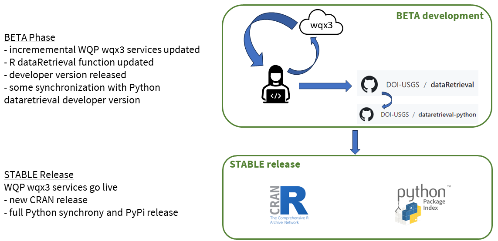

```{r setup, include=FALSE, message=FALSE}
library(knitr)
#library(dataRetrieval)

options(continue = " ")
options(width = 60)
knitr::opts_chunk$set(
  echo = TRUE,
  warning = FALSE,
  message = FALSE,
  fig.height = 7,
  fig.width = 7
)
```

This presentation describes the changes happening right now to R dataRetrieval for accessing water quality and discrete sample data. It was originally presented during the WaterSciCon24 meeting in St. Paul, Minnesota.


```{r echo=FALSE, fig.alt = "Title slide including author email address and team contact information.", out.width = "675px", fig.align = "center"}
knitr::include_graphics("dataretrieval_discrete_changes_images/Slide1.PNG")
```


If you are viewing this page then you are already familiar with dataRetrieval, but just to summarize, the package started around 2013 with a version in R. It is a software package created and maintained by the USGS and enables searching, filtering and downloading water data from the USGS and the multi-agency water quality portal. There is a stable release available on CRAN as well as a developer version available on GitHub. At its core the software relies on USGS and WQP web services. The R version has become popular for users who want easy access to water data in the U.S.

```{r echo=FALSE, fig.alt = "Slide summarizing the core functionality of the dataRetrieval R package and history.", out.width = "675px", fig.align = "center"}
knitr::include_graphics("dataretrieval_discrete_changes_images/Slide2.PNG")
```

dataRetrieval is a community resource. It is open source and we actively respond to user input. We generally follow Agile principles for software development by making incremental updates and releasing updates frequently to ensure that the software remains relevant and is responsive to user feedback. 

```{r echo=FALSE, fig.alt = "Slide containing text describing the code development approach with screenshots illustrating three examples of supporting package documentation.", out.width = "675px", fig.align = "center"}
knitr::include_graphics("dataretrieval_discrete_changes_images/Slide3.PNG")
```

And just a quick reminder that we now offer a suite of data retrieval software that includes a python and an (experimental) Julia version! 

```{r echo=FALSE, fig.alt = "Slide containing text describing the code development approach with screenshots illustrating three examples of supporting package documentation.", out.width = "675px", fig.align = "center"}
knitr::include_graphics("dataretrieval_discrete_changes_images/Slide4.PNG")
```

The changes result from a couple of relatively major updates to how both the USGS and the WQP deliver discrete water quality and sample data. Discrete data from USGS are now being delivered in the Water Quality Exchange (or WQX) format. Previously, these data were available using a set of NWIS functions, e.g. `readNWISqw()`. The NWIS data format was specific to USGS data and relied on codes for describing the metadata. Now, USGS data will be formatted in the same way as the data published by other providers on the Water Quality Portal. This change will make it easier for users to combine USGS data with data from these other sources.

How will this impact data delivery? For dataRetrieval, this means that there is a new USGS web service that is available for us to build new functionality. However, there are changes that will require some adjustment. Some of the existing USGS NWIS services that we’ve relied on for years are reaching their end of life and will soon become deprecated. The services for pulling discrete WQ data still work, however they are delivering STALE data. As of March 11, 2024, all queries to the legacy NWIS qw data sources will pull the same data regardless of whether there are new data, and no changes to the data delivered from these functions is going to happen moving forward.

```{r echo=FALSE, fig.alt = "Slide containing text describing the code development approach with screenshots illustrating three examples of supporting package documentation.", out.width = "675px", fig.align = "center"}
knitr::include_graphics("dataretrieval_discrete_changes_images/Slide5.PNG")
```

The second significant update is happening on the Water Quality Portal. We recently released a test ("beta") version of a new WQP web service that delivers data in the new WQX v3.0 format. The services are still under development and when completed all metadata will be available in WQX v3.0 format. The current WQP functions in dataRetrieval pull data in v2.2 of the WQX format. Using the new WQX v3.0 services, users will have access to more metadata fields than before. The new data profiles, which are simply subsets of the hundreds of metadata fields available in the WQX v3.0 schema, have been redesigned to make it easier for users to get the data they want in a single download so that users don't need to join data tables and to figure out how to correctly merge datasets.

The plus side of this change is that we now have access to a new WQP web service for us to build new functionality. The downside is that the current WQP services will experience the same problem as the USGS legacy web services: they will pull STALE data from the USGS. For users who are not concerned with USGS data, the data from other providers will be current and up to date. Until the new WQX v3.0 services are complete and stabilized, data will continue to be delivered in the current WQX v2.2 format.

In summary, these 2 separate updates are happening at the same time, which means that there are lots of changes happening all at once that impact dataRetrieval functionality in different ways. We are doing our best to make thoughtful decisions about how to update dataRetrieval to deliver as much data as possible as soon as possible.

```{r echo=FALSE, fig.alt = "Slide containing text describing the web services updates and impacts to dataRetrieval.", out.width = "675px", fig.align = "center"}
knitr::include_graphics("dataretrieval_discrete_changes_images/Slide6.PNG")
```

Our implementation approach is to develop incrementally along with the developing web services so that users have access to the most recent and most complete discrete data available. When the WQX v3.0 services are updated, we will update the R dataRetrieval functions and push out those changes to the developer version on GitHub. We’ll also update Python dataretrieval on GitHub shortly afterwards. Once the WQX v3.0 services stabilize, we will put out new software releases for R and Python on CRAN and PyPi, respectively.

```{r echo=FALSE, fig.alt = "Slide with text describing how code updates will be rolled out and a schematic of the planned workflow for pushing code changes to the developer and stable releases for R and Python dataRetrieval.", out.width = "675px", fig.align = "center"}

```

What changes can users expect? Here’s what we know for now, starting with the R dataRetrieval functions, although these are analogous to changes in Python as well.

  * All of the functions that pull USGS real-time, continuous data, such as flow or water quality, are not changing. These functions typically include NWIS in their names and use services such as ‘iv’ or ‘dv’.
  
  * If you are pulling water quality data using readWQPdata() or readWQPqw(), expect to see some minor changes in function behavior. For instance, readWQPdata has new ‘service’ options, and by default it will pull result-level data from the new WQX v3.0 web services. 
  
  * readWQPqw() now has an added argument, called ‘legacy’, which allows the user to select whether or not to use the current v2.2 services or the new v3.0 services.
  
  * There is at least one breaking change that will prevent full backwards compatibility for R dataRetrieval. The readNWISqw function still works, however it is using the legacy NWIS qw services and therefore the data are *stale* as of March 11, 2024. Eventually this function will be deprecated. Users may have noticed that there is a warning on that particular function. We encourage users to switch to the WQP functions for retrieving USGS discrete water quality data.
Or, users could wait until we build new functions using the new samples-data web services for accessing discrete water quality and sample data.

```{r echo=FALSE, fig.alt = "Slide with text and icons describing changes to existing dataRetrieval functions.", out.width = "675px", fig.align = "center"}
knitr::include_graphics("dataretrieval_discrete_changes_images/Slide8.PNG")
```

In addition to the function-level changes, users will need to update their discrete water quality data workflows to the new WQX v3.0 format. Nearly all of the field names have changed between the WQX v2.2 and v3.0 formats. This is a pretty big deal, and we are working to minimize the impact on users. For example, dataRetrieval is being updated to work with the new field names. Users can also access [schema files](https://www.epa.gov/waterdata/water-quality-portal-quick-reference-guide) that map the v2.2 names to v3.0.

Another big change is that the USGS updates to the new WQX format also changed the way that censored data are delivered. Censored data in the new format will be more consistent with how other data providers are doing it. Consistency is a good thing, but this is a change compared to how those data are delivered in the current WQP functions. The dataRetrieval documentation provides guidance on how users can update their workflows.

```{r echo=FALSE, fig.alt = "Slide with text and icons describing changes to existing dataRetrieval workflows.", out.width = "675px", fig.align = "center"}
knitr::include_graphics("dataretrieval_discrete_changes_images/Slide9.PNG")
```

We will provide updated documentation to describe how to use the new and updated functionality, and will also retain documentation for the current stable CRAN release. Our plan is to keep the function help pages on GitHub updated with the most recent functionality. Users of the stable CRAN release should use the documentation available on CRAN, or pull up the function help pages in their R console.

```{r echo=FALSE, fig.alt = "Slide with screenshots indicating where users can obtain updated and stable documentation.", out.width = "675px", fig.align = "center"}
knitr::include_graphics("dataretrieval_discrete_changes_images/Slide10.PNG")
```

If you want to follow along with us and have access to the most recent USGS discrete water quality data or WQP functions, then follow the installation instructions available on our DOI-USGS GitHub accounts. For those who prefer to wait for a stable software release or who don’t need the most updated USGS data or WQP functions, then simply wait until we roll out these changes to CRAN and PyPi some time later this year.

```{r echo=FALSE, fig.alt = "Slide with text and screenshots explaining how to download and install the developer version of R or Python dataRetrieval.", out.width = "675px", fig.align = "center"}
knitr::include_graphics("dataretrieval_discrete_changes_images/Slide11.PNG")
```

There are a lot of changes coming and the best way to stay up to speed is by visiting our dataRetrieval [Status](https://doi-usgs.github.io/dataRetrieval/articles/Status.html
) page. We'll continue to update this page as development continues.

```{r echo=FALSE, fig.alt = "Slide showing a screenshot of the dataRetrieval Status page.", out.width = "675px", fig.align = "center"}
knitr::include_graphics("dataretrieval_discrete_changes_images/Slide12.PNG")
```


